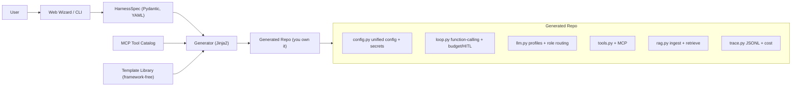

# HarnessForge

> **Forge your own agent harness.** A config-to-code generator that scaffolds a standalone, **framework-free** agent harness you fully own — no LangGraph, no LangChain, no lock-in.

[](./LICENSE)


> **Status:** Design / planning phase. The plan is finalized; implementation has not started yet. See [`docs/`](./docs/) for the full project plan and research.

---

## What is this?

In 2026 the field converged on one equation: **`Agent = Model + Harness`**. The model reasons; the *harness* is everything else that makes it actually work — the loop, tool execution, context management, guardrails, and observability.

**HarnessForge** is `create-next-app`, but for agent harnesses. You describe what you want through a lightweight web wizard or CLI, and it generates a **standalone Python repo that you own and can edit freely** — not a framework you import and pray to.

### Three things that make it different

- **Framework-free** — generated code has **zero** LangGraph/LangChain dependency. The loop is yours.
- **Own your code (eject by default)** — output is a readable, deletable, customizable repo. No runtime lock-in.
- **Config-to-code** — a web wizard / CLI captures a `HarnessSpec`, then renders the whole thing in one shot.

## What it generates (MVP)

A self-contained `framework-free` harness with:

- **Native function-calling loop** — TAO/ReAct semantics via the API's `tool_calls`, with stop conditions, max-steps, and error handling.
- **Multiple LLM profiles + role routing** — bind different models to `generation` / `compaction` / `embedding` roles. Built on the OpenAI SDK + `base_url` (provider-agnostic).
- **Secure secrets** — API keys never touch `config.yaml`, the spec snapshot, or git. Stored in `.env` (gitignored, `0600`) or OS keyring; the web config panel is write-only and masks secrets on read.
- **Configurable context management** — `max_context_tokens` plus a strategy: `truncate` / `summarize` (via the compaction model) / `offload`.
- **MCP tools** — pick from a curated catalog, both `stdio` (local) and `HTTP/SSE` (remote) transports, with an allowlist.
- **Optional RAG** — a minimal ingest loop (chunk → embed → store → retrieve) on local `sqlite-vec`.
- **Unified config + hot reload** — one `config.yaml`, a `/config` web panel to view/edit/hot-reload at runtime.
- **Lightweight guardrails & observability** — human-in-the-loop confirmation for risky tools, per-run step/time/cost budgets, and a JSONL trace with token/cost counts.
- **Two interfaces** — a Typer CLI (`run` + `ingest`) and a FastAPI web app (`/chat` SSE + `/config`).
- **Built to extend** — clear module boundaries, a tool registry, lifecycle hooks, Protocol interfaces, and an `AGENTS.md` extension guide.

## Planned usage

> Not yet implemented — this is the target developer experience.

```bash
# One-shot, no install (like create-next-app)
uvx harnessforge new my-agent

# Or open the web wizard to configure interactively
harnessforge wizard

# Generate from a preset or an existing spec
harnessforge new my-agent --preset coding-assistant
harnessforge new my-agent --spec ./harness.spec.yaml
```

The generated `my-agent/` repo then runs on its own:

```bash
cd my-agent
uv sync
cp .env.example .env          # add your API keys here
uv run my-agent run           # chat in the terminal
uv run my-agent ingest ./docs # optional: build the RAG store
uv run my-agent serve         # web chat + config panel
```

## Architecture



## Documentation

- [docs/00-research-and-feasibility.md](./docs/00-research-and-feasibility.md) — what an agent harness is (2026), competitive landscape, feasibility.
- [docs/01-project-plan.md](./docs/01-project-plan.md) — positioning, MVP scope, design principles, architecture, acceptance criteria, roadmap.

## 中文简介

HarnessForge 是一个"配置即生成"的代码生成器:通过 Web 向导 / CLI 采集需求,产出一套**不依赖 LangGraph/LangChain**、你完全拥有可删改的独立 agent harness 代码仓库,并自带 CLI + Web 调用接口。三个差异点:**framework-free**、**own-your-code(eject 即所得)**、**配置即生成**。当前处于规划阶段,详见 [`docs/`](./docs/)。

## License

[MIT](./LICENSE) © 2026 EpisodeYu
