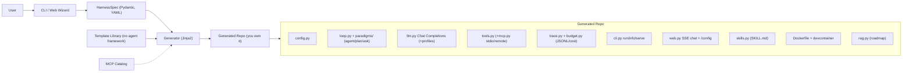

# HarnessForge

> **Forge your own agent harness.** A config-to-code generator that scaffolds a standalone agent harness you fully own — **no agent-framework lock-in** (no LangGraph, no LangChain, no ADK), and no dependency on HarnessForge after it's generated.

[](./LICENSE)


> **Status:** The MVP (Slices 0–7) is complete and the founding hypothesis is signed off. `harnessforge new` generates a thin, framework-free harness — native function-calling loop, multi-paradigm runtime (`agent`/`plan`/`ask`), tool registry, opt-in MCP (stdio + remote) and FastAPI web chat + `/config`, Agent Skills, combinable budgets, and a JSONL trace — that locks its deps, smoke-tests itself, and runs a mock function-calling turn (CLI + Docker). A single-page spec wizard is included. **Next (v1):** session persistence / resume and cross-session memory are in; next up checkpoints, tool-call HITL, RAG. Pre-release (v0.1.0) — install from a clone until it's published to PyPI. See [`docs/`](./docs/) for the full plan.

---

## What is this?

In 2026 the field converged on one equation: **`Agent = Model + Harness`**. The model reasons; the *harness* is everything else that makes it actually work — the loop, tool execution, context management, guardrails, and observability.

**HarnessForge** is `create-next-app`, but for agent harnesses. You describe what you want through a lightweight web wizard or CLI, and it generates a **standalone Python repo that you own and can edit freely** — not a framework you import and pray to.

### Three things that make it different

- **No agent-framework lock-in** (not "dependency-free") — generated code has **zero** LangChain/LangGraph/ADK *agent-framework* dependency; the loop is yours. It still uses ordinary libraries (OpenAI SDK, Pydantic, Typer) — those aren't agent frameworks.
- **Own your code (eject by default)** — output is a readable, deletable, customizable repo. No runtime lock-in, and no dependency on HarnessForge after generation.
- **Config-to-code** — a web wizard / CLI captures a `HarnessSpec`, then renders the whole thing in one shot.

## What it generates

The default product is a **thin, fully-runnable harness**. Heavy features are generated only when you toggle them in the spec — so you depend only on what you actually use.

**Always generated — the thin core (L1):**

- **Native function-calling loop** — TAO/ReAct semantics via the API's `tool_calls`, with stop conditions, max-steps, and error handling. Built on the OpenAI SDK + `base_url` using the **Chat Completions API** (provider-agnostic; works with vLLM / together / groq / Anthropic-compatible endpoints / etc.).
- **Multi-paradigm runtime** — `agent` (the default ReAct loop) plus optional read-only `plan` / `ask` modes, switched per-turn at runtime (`--mode`). Paradigms live in a thin registry you extend with `@register_paradigm` — built-ins stay self-contained, no orchestration framework.
- **Tool registry** — add a tool = write a function + register it, no loop changes. Risky tools (shell / file-write) are off by default, allowlist-only.
- **Combinable budgets + JSONL trace** — per-run stop conditions (`max_steps` / `max_seconds` / `max_tokens` / `max_cost`) combined with `or`/`and`, optional tumbling-window rates, and a user-extensible condition registry; every run writes a JSONL trace with token/cost counts.
- **Always-apply project rules** — `AGENTS.md` / `CLAUDE.md` / `.cursor/rules`-style markdown injected into every system prompt.
- **CLI** (Typer) — `run` a turn, `info` to introspect the registries, `test-llm` to probe the configured model, `set-key` to write a key into `.env` without it touching git.
- **Runnable anywhere** — ships `uv.lock` + `.python-version` (uv auto-manages Python and an isolated venv), a default **Dockerfile + devcontainer**, a `requirements.txt` pip fallback, and the generator **smoke-tests the new repo** (`uv sync` + `pytest` + a mock run) before declaring it runnable.
- **Built to extend** — clear module boundaries, lifecycle hooks, Protocol interfaces, and an `AGENTS.md` extension guide.

Secrets never touch `config.yaml`, the spec snapshot, or git — `config.yaml` holds only env-var *names*; real values live in `.env` (gitignored).

**Spec-toggled — generated only when you turn it on (L2, built):**

- **MCP tools** — `stdio` (local) **and** remote HTTP/SSE transports, a curated catalog (`fetch` / `ddg-search` / `git` / …) prefilled into runtime config, with an allowlist and risk flags. Off = zero trace of `mcp` in your deps.
- **Web chat + runtime `/config`** — a minimal FastAPI + SSE chat page (token-level streaming) and a paged, bilingual (en/zh) runtime config panel. Off = no `fastapi`/`uvicorn` in your deps.
- **Multiple LLM profiles + role routing** — named profiles resolved by role (`generation` / `compaction` / `embedding`).
- **Context strategies** — `truncate` / `summarize` / `none` with combinable triggers (`max_tokens` / `max_turns`), extensible via `@register_strategy`.
- **Agent Skills** — the open `SKILL.md` standard with progressive disclosure; no framework pulled in.

**Built since (v1):** session persistence / `--resume` + `chat` REPL, and **cross-session long-term memory** (a self-maintained note injected each turn, with a thin `@register_memory` backend registry — opt-in via the spec, zero footprint when off).

**Roadmap (v1, not yet built):** checkpoints (git snapshot + one-click revert), interactive tool-call confirmation (HITL), RAG ingest on `sqlite-vec`, OS keyring secrets, online MCP registry, and `forge add` incremental regeneration.

## Usage

```bash
# Pre-release (v0.1.0): not on PyPI yet — run from a clone of this repo
uv run harnessforge new my-agent --preset coding-assistant   # from a bundled preset
uv run harnessforge new my-agent --spec ./harness.spec.yaml  # from your own spec
uv run harnessforge wizard                                   # single-page spec wizard ([wizard] extra)
uv run harnessforge doctor                                   # preflight your tooling
uv run harnessforge new my-agent -p coding-assistant --no-verify  # skip the post-gen smoke check (e.g. offline)

# Once published, the same works install-free, create-next-app style:
# uvx harnessforge new my-agent --preset coding-assistant
```

**One-click wizard:** prefer not to type? Double-click **`HarnessForge.bat`**
(Windows) or run **`./HarnessForge.sh`** (macOS / Linux) — it launches the spec
wizard and opens it in your browser. No `uv` installed yet? The launcher offers
to install it for you (user-level, no admin — uv bundles its own Python), then
continues. Each generated repo ships the same kind of one-click launcher, named
after its display name (e.g. `My Coding Assistant.bat`).

The generated `my-agent/` repo then runs on its own:

```bash
cd my-agent
uv sync                                  # uv installs the right Python + an isolated venv
cp .env.example .env                     # add your API keys here…
uv run my-agent set-key OPENAI_API_KEY   # …or write one in without it touching git
uv run my-agent test-llm                 # probe the configured model
uv run my-agent run                      # chat in the terminal

# or run in a fully sealed environment (generated by default):
docker build -t my-agent . && docker run --rm -it my-agent

# if the spec enabled the web interface:
uv run my-agent serve                    # FastAPI + SSE web chat + /config panel
```

## Architecture



## Documentation

- [docs/00-research-and-feasibility.md](./docs/00-research-and-feasibility.md) — what an agent harness is (2026), competitive landscape, feasibility.
- [docs/01-project-plan.md](./docs/01-project-plan.md) — positioning, target users & success metrics, layered MVP scope, design principles, architecture, key decisions, runnability guarantees, acceptance criteria, vertical-slice roadmap.
- [docs/02-development/00-overview.md](./docs/02-development/00-overview.md) — vertical-slice roadmap and per-slice completion status (the source of truth for what's built).

## 中文简介

HarnessForge 是一个"配置即生成"的代码生成器:通过 CLI / Web 向导采集需求,产出一套**不绑定 agent 编排框架(LangChain/LangGraph/ADK)**、你完全拥有可删改的独立 agent harness 代码仓库,生成后不再依赖 HarnessForge。三个差异点:**无 agent 框架锁定(不是"无依赖")**、**own-your-code(eject 即所得)**、**配置即生成**。MVP(切片 0–7)已完成:黄金路径(原生 function-calling + 工具注册表 + 可组合预算 + JSONL trace + uv/Docker 可运行性保障)之上,MCP(stdio/远程)、多 LLM profile + 角色路由、Web chat + 运行期 `/config`、多范式(agent/plan/ask)运行期可切、Agent Skills、单页生成向导均已落地。v1 已落地会话持久化与跨会话长期记忆(自维护笔记 + 薄 `@register_memory` 后端注册表,spec 开关、关闭零痕迹),后续推进 checkpoints / 工具调用 HITL 确认 / RAG。预发布版本(v0.1.0),发布到 PyPI 前从源码运行,详见 [`docs/`](./docs/)。

## License

[MIT](./LICENSE) © 2026 EpisodeYu
