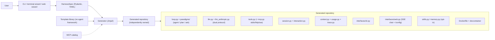

# HarnessSmith

> **Forge your own agent harness.** A config-to-code generator that produces a standalone, framework-free agent harness you fully own — no LangChain, no LangGraph, no ADK, and no dependency on HarnessSmith after generation.

[](./LICENSE)


**English** | [中文](#中文)

---

## Overview

The contemporary consensus is captured by one equation: **`Agent = Model + Harness`**. The model reasons; the harness is everything else that makes an agent work in practice — the orchestration loop, tool execution, context management, session state, guardrails, and observability.

HarnessSmith is a generator for that harness, in the spirit of `create-next-app`. A specification (`HarnessSpec`) is captured through a web wizard, an interactive terminal wizard, a preset, or a hand-written YAML file; HarnessSmith then renders a **complete, independent Python repository** — readable, editable, testable, and runnable on its own. The generated project is not a consumer of HarnessSmith: once generated, it has zero relationship with the generator.

### Design positioning

- **No agent-framework lock-in.** The generated code has zero dependency on any agent-orchestration framework. The loop is plain Python that you own. Ordinary general-purpose libraries (OpenAI SDK, Pydantic, Typer, FastAPI) are used as libraries, not as frameworks that own your control flow.
- **Own your code.** The output is a self-contained repository with its own tests, lockfile, Dockerfile, and documentation. Every line can be read, changed, or deleted.
- **Config-to-code.** Capabilities are selected at generation time; the generator renders only what was selected. A feature that is switched off leaves no trace — no module, no dependency, no dead code.
- **Thin by default.** The default product is a minimal, fully runnable harness whose core loop stays in the low hundreds of lines. Heavier capabilities (MCP, web interface, skills, memory) are opt-in spec toggles.

## Highlights

- **Native function calling** — the loop drives the model through the API's `tool_calls` (TAO/ReAct semantics), not through text parsing.
- **Dual LLM protocol, runtime-switchable** — every product ships both an OpenAI Chat Completions client (provider-agnostic via `base_url`: vLLM, Together, Groq, LiteLLM, any compatible endpoint) and a native Anthropic Messages client. Each LLM profile selects its `provider` in runtime configuration; no regeneration required.
- **Reasoning streams as a first-class signal** — thinking/reasoning deltas are surfaced live (a status line in the CLI; a collapsible reasoning panel in the web UI), and `reasoning_content` is preserved across tool-calling turns for models that require it.
- **Multi-paradigm runtime** — `agent` (default tool-calling loop), `plan` and `ask` (both read-only), selectable per turn (`--mode` / web dropdown). Paradigms live in a thin registry; users add their own with `@register_paradigm` without touching the built-ins.
- **Sessions and resumption** — every conversation persists locally; resume with `--continue` / `--resume <id>`, in the multi-turn `chat` REPL, or from the web session sidebar (automatic titling, rename, delete). Interrupted runs are crash-safe: state is checkpointed at message boundaries and repaired on resume.
- **Stop / continue / re-ask** — a run can be cancelled mid-turn (cooperative cancellation that also terminates streaming), continued later with full context, or — in the web UI — re-asked by editing any earlier prompt and regenerating from that point.
- **Human-in-the-loop** — a built-in `ask_question` tool lets the model ask the user structured clarifying questions, and tool-call confirmation (`allow once / reject / allow for session / allow always`) gates risky tools. Non-interactive contexts fail closed.
- **Persistent per-LLM cost accounting** — a usage ledger accumulates token counts per LLM profile across runs; cost is derived from per-profile prices, and a per-profile `cost_limit` blocks the model before the next call once reached. Managed from the web Budget page or the `usage` CLI.
- **Context management** — combinable triggers (`window_pct`, `max_tokens`, `max_turns`; driven by real token usage) select when to compact; strategies (`truncate`, `summarize`, `none`) define how; both are user-extensible registries. Oversized tool results are clipped before entering history, and overflow recovery compacts on demand.
- **Tool ecosystem without built-in bloat** — a decorator-based tool registry with per-tool risk levels, plus an opt-in MCP client (stdio, HTTP, and SSE transports) with a curated catalog (web search, fetch, git, time, Desktop Commander). MCP servers are managed at runtime: health status, add/edit/remove, and hot reconnection from the web panel; `mcp status` from the CLI.
- **Agent Skills** — opt-in support for the open `SKILL.md` standard with progressive disclosure; skills are plain files, no framework involved.
- **Cross-session memory** — an opt-in, self-maintained long-term note injected each turn, written through tools, consolidated by a dedicated LLM role at session boundaries, and replaceable via a thin `@register_memory` backend registry.
- **Always-applied project rules** — markdown rule files (`AGENTS.md` / `CLAUDE.md` / `.cursor/rules` conventions) injected into every system prompt.
- **Full observability** — a JSONL trace per run with token/cost accounting, and an opt-in, local-only debug log that records lifecycle events (names, counts, durations) and never message content, tool arguments, or secrets.
- **Verified runnable before handover** — the generator locks dependencies and smoke-tests every new repository (`uv sync`, import check, a mock function-calling turn, `pytest`) before declaring it ready.

## What gets generated

### Core (always present)

| Capability | Description |
|---|---|
| Agent loop | Native function-calling loop with paradigm dispatch, lifecycle hooks, and graceful stop conditions |
| LLM layer | Profile registry with role routing (`generation`, `compaction`, plus optional `title` / `memory` roles), per-profile sampling parameters, timeout/retry/fallback, and dual-protocol clients (OpenAI-compatible + native Anthropic) |
| Tool registry | Decorator-registered tools with risk levels; high-risk tools disabled by default, allowlist-only |
| Sessions | Local JSON persistence, `--continue` / `--resume`, `chat` REPL, crash-safe checkpointing |
| Interaction | `ask_question` structured clarification + HITL tool confirmation, shared CLI/web infrastructure |
| Context | Trigger/strategy compaction registries, tool-result clipping, overflow recovery |
| Budget | Persistent per-LLM cost ledger with per-profile prices and hard cost limits |
| Prompts | System prompt assembly with always-applied rule-file injection |
| Observability | JSONL trace + token/cost counts; opt-in local-only debug log |
| CLI | `run`, `chat`, `info`, `test-llm`, `set-key`, `usage` (plus `serve`, `mcp`, `memory` when the matching modules are enabled) |
| Runnability | `uv.lock` + `.python-version`, Dockerfile + `.dockerignore` + devcontainer, `requirements.txt` pip fallback, mock-LLM test suite, one-click launcher script |

### Optional modules (spec toggles; disabled = absent from code and dependencies)

| Module | Description |
|---|---|
| Web interface | FastAPI + SSE chat with token-level streaming, collapsible reasoning and tool-call panels, session sidebar, and a paged bilingual (en/zh) `/config` panel — LLM, Context, Tools, MCP, Paradigms, Prompts, Budget, Observability, and System tabs. Edits apply live and are written back to `config.yaml` with comments preserved |
| MCP tools | Model Context Protocol client over stdio / HTTP / SSE, allowlist and risk flags, curated catalog prefill, runtime server management with health probes and hot reconnect |
| Agent Skills | `SKILL.md` discovery, metadata injection, and on-demand loading |
| Long-term memory | Self-maintained markdown note with tool-driven writes, policy shaping, consolidation, and a pluggable backend registry |

## Architecture



The generator and its output are strictly separated layers. The spec decides **structure** (which capabilities are compiled in); the generated product's `config.yaml` is the **runtime authority** for behavior (models, prompts, tool allowlists, context parameters, prices and limits) — all adjustable without regeneration.

## Technology stack

**Generator**

- Python ≥ 3.11, managed end-to-end with [uv](https://docs.astral.sh/uv/)
- [Typer](https://typer.tiangolo.com/) (CLI), [questionary](https://github.com/tmbo/questionary) (interactive terminal wizard)
- [Jinja2](https://jinja.palletsprojects.com/) (template rendering)
- [Pydantic v2](https://docs.pydantic.dev/) + PyYAML (`HarnessSpec` validation and serialization)
- FastAPI + uvicorn (web wizard, optional `[wizard]` extra — never shipped into products)

**Generated product**

- Runtime: `openai` (Chat Completions, provider-agnostic via `base_url`), `anthropic` (native Messages), `pydantic` + `pydantic-settings`, `pyyaml`, `typer`
- Web interface (when enabled): `fastapi`, `uvicorn`, `ruamel.yaml` (comment-preserving config write-back); the UI is a single static page (Tailwind CSS via CDN, no build step)
- MCP (when enabled): the official `mcp` SDK
- Tests: `pytest` with an offline mock LLM (dev dependency group; not a runtime dependency)
- Environment contract: uv (`uv.lock` + `.python-version`) with Docker and `requirements.txt` fallbacks

The generated `pyproject.toml` contains no agent-orchestration framework, and the test suite asserts it.

## Getting started

### Prerequisites

- [uv](https://docs.astral.sh/uv/getting-started/installation/) (uv provisions the correct Python automatically; no system Python required)
- Docker (optional, for containerized runs)

### Installation

HarnessSmith v0.1.0 is a pre-release and is not yet published to PyPI. Run it from a clone:

```bash
git clone https://github.com/EpisodeYu/HarnessSmith.git
cd HarnessSmith
uv sync
```

Once published, the same commands will work installation-free via `uvx harnessmith …`.

### Generating a harness

```bash
uv run harnessmith new my-agent --preset coding-assistant   # from a bundled preset
uv run harnessmith new my-agent --spec ./harness.spec.yaml  # from a hand-written spec
uv run harnessmith new                                      # interactive terminal wizard
uv run harnessmith wizard                                   # web wizard (uv sync --extra wizard)
uv run harnessmith doctor                                   # preflight check of the local toolchain
```

- The **terminal wizard** (`new` with no `--spec` / `--preset`) and the **web wizard** (`wizard`) collect the same structural choices — display name, paradigms, web interface, MCP, skills, memory — and apply identical defaults; they are suited to headless servers and desktops respectively.
- Alternatively, the repository root provides one-click launchers — `HarnessSmith.bat` (Windows) and `HarnessSmith.sh` (macOS / Linux) — which offer a choice between the web and terminal wizards and can install uv on first use.
- After rendering, the generator locks dependencies and runs a smoke verification (`uv sync`, import check, one mock function-calling turn, `pytest`). Pass `--no-verify` to skip it, for example when offline.
- Secrets are never collected by any wizard and never enter the spec, the generated `config.yaml`, or git.

### Running the generated harness

```bash
cd my-agent
uv sync                                  # uv provisions Python + an isolated venv
uv run my-agent set-key OPENAI_API_KEY   # write the API key into .env (never echoed, never in git)
uv run my-agent test-llm                 # probe each configured model
uv run my-agent chat                     # multi-turn conversation in the terminal
uv run my-agent run "Summarize ./notes"  # single turn; add --mode plan|ask, --stream
uv run my-agent serve --open             # web chat + /config panel (web-enabled products)

# fully containerized alternative (generated by default):
docker build -t my-agent . && docker run --rm -it my-agent
```

Model and endpoint are configured in `config.yaml` (or on the web `/config` LLM tab): set `model`, point `base_url_env` / `api_key_env` at the appropriate environment variables, and choose `provider: openai` or `provider: anthropic` per profile. An offline trial without any key is available via `--mock` on `run`, `chat`, and `serve`.

Each generated repository also ships its own one-click launcher named after its display name (e.g. `My Coding Assistant.bat` / `.sh`).

### Product CLI reference

| Command | Purpose |
|---|---|
| `run [PROMPT]` | Execute one turn. Options: `--mode agent\|plan\|ask`, `--stream`, `--continue`, `--resume <id>`, `--role`, `--mock` |
| `chat` | Multi-turn REPL with persistent sessions; `Ctrl-D` or `/exit` to quit |
| `serve` | Start the web interface (`--host`, `--port`, `--open`); web-enabled products |
| `info` | Introspect registered tools, paradigms, context strategies, and conditions |
| `test-llm` | Connectivity and capability probe for each configured LLM profile |
| `set-key <ENV_NAME>` | Write a secret into `.env` without echoing it or touching git |
| `usage` | Inspect or clear the persistent per-LLM cost ledger |
| `memory show\|clear\|path\|consolidate` | Manage the long-term memory note; memory-enabled products |
| `mcp status` / `mcp warm` | Probe MCP server health / pre-warm launchers; MCP-enabled products |

### Configuration model

| Layer | File | Role |
|---|---|---|
| Generation-time spec | `harness.spec.yaml` | The recipe: which capabilities are compiled into the product, plus initial values. A snapshot is kept in the generated repository |
| Runtime configuration | `config.yaml` | The authority for behavior: LLM profiles and roles, prompts and rule files, tool allowlist, context strategy, MCP servers, prices and cost limits, observability. Editable by hand or via the web `/config` panel (live application + comment-preserving write-back) |
| Secrets | `.env` (gitignored) | The only location for real credentials. `config.yaml` and the spec reference environment-variable *names* only |

Structural changes (adding or removing an interface or module) require regeneration; behavioral changes never do.

## Security model

- **Secrets never enter git.** Real values live exclusively in the gitignored `.env`; all other files reference environment-variable names. `set-key` and the web panel's key writer are write-only and never echo values. Traces and the debug log record no secrets.
- **High-risk tools are off by default.** Shell and file-writing tools ship disabled and require explicit allowlisting; the runtime allowlist can only narrow the set compiled in at generation time, never extend it.
- **Human-in-the-loop confirmation** (`tools.confirm: none|high|all|<tool names>`) intercepts risky tool calls with `allow once / reject / allow for session / allow always`; non-interactive contexts reject by default. Confirmation is a guardrail for trusted operators, not a security boundary — hard isolation belongs to Docker or to excluding the capability at generation time.
- **The web interface targets local, trusted use.** The `/config` panel and the MCP management page can modify runtime behavior and launch local processes; do not expose them to untrusted networks.

## License

[MIT](./LICENSE) © 2026 EpisodeYu

---

# 中文

> **锻造你自己的 agent harness。** 一个"配置即生成"的代码生成器,产出一套你完全拥有的独立 agent harness 代码仓库——不绑定任何 agent 编排框架(无 LangChain、LangGraph、ADK),生成后不再依赖 HarnessSmith。

[English](#harnessmith) | **中文**

## 概述

当下的共识可以浓缩为一个等式:**`Agent = Model + Harness`**。模型负责推理;harness 是让 agent 真正可用的其余一切——编排循环、工具执行、上下文管理、会话状态、护栏与可观测性。

HarnessSmith 是这层 harness 的生成器,定位类似 `create-next-app`。通过 Web 向导、终端交互向导、preset 或手写 YAML 采集一份规格(`HarnessSpec`),HarnessSmith 据此渲染出一个**完整、独立的 Python 代码仓库**——可读、可改、可测试、可独立运行。生成的项目与 HarnessSmith 没有任何运行期关系:生成即脱离。

### 设计定位

- **无 agent 框架锁定。** 生成代码对任何 agent 编排框架零依赖,循环是属于你的普通 Python 代码。通用库(OpenAI SDK、Pydantic、Typer、FastAPI)只作为库使用,不接管控制流。
- **代码归你所有。** 产出是带有自有测试、锁文件、Dockerfile 与文档的自包含仓库,每一行都可以阅读、修改或删除。
- **配置即生成。** 能力在生成期选择,生成器只渲染被选中的部分;关闭的功能不留任何痕迹——没有模块、没有依赖、没有死代码。
- **默认极薄。** 默认产物是最小但完整可跑的 harness,核心循环维持在数百行以内;较重的能力(MCP、Web 界面、技能、记忆)均为 spec 开关式可选项。

## 亮点

- **原生 function calling** —— 循环通过 API 的 `tool_calls`(TAO/ReAct 语义)驱动模型,而非文本解析。
- **双 LLM 协议,运行期可切** —— 每个产物同时内置 OpenAI Chat Completions 客户端(经 `base_url` 对接 vLLM、Together、Groq、LiteLLM 等任意兼容端点)与原生 Anthropic Messages 客户端;每个 LLM profile 在运行期配置中选择 `provider`,无需重新生成。
- **推理过程一等公民** —— thinking/reasoning 增量实时呈现(CLI 状态行、Web 可折叠推理面板),并在工具调用多轮间保留 `reasoning_content`,兼容有此要求的模型。
- **多范式运行时** —— `agent`(默认工具调用循环)、`plan` 与 `ask`(均只读),每轮可切(`--mode` / Web 下拉)。范式存放于薄注册表,用户以 `@register_paradigm` 自行扩展,不触碰内置实现。
- **会话持久化与续聊** —— 每次对话本地落盘;以 `--continue` / `--resume <id>`、多轮 `chat` REPL 或 Web 会话侧栏(自动起标题、重命名、删除)续聊。中断的运行具备崩溃安全:状态在消息边界写入检查点,恢复时自动修复。
- **停止 / 继续 / 重问** —— 回合中途可取消(协作式取消,流式输出一并终止),之后携带完整上下文继续;Web 界面支持就地编辑任一历史提问并从该点重新生成。
- **人在环交互** —— 内置 `ask_question` 工具让模型向用户提出结构化澄清问题;工具调用确认(`允许一次 / 拒绝 / 本会话允许 / 永久允许`)拦截高风险工具,非交互场景默认拒绝。
- **按 LLM 持久成本核算** —— 用量账本按 LLM profile 跨运行累计 token;成本由各 profile 单价派生,达到 `cost_limit` 即在下次调用前阻止该模型。经 Web Budget 页或 `usage` CLI 管理。
- **上下文管理** —— 可组合触发条件(`window_pct`、`max_tokens`、`max_turns`,以真实 token 用量驱动)决定何时压缩;策略(`truncate`、`summarize`、`none`)决定如何压缩;两者均为用户可扩展的注册表。超大工具结果在入历史前截断,溢出时按需强制压缩。
- **不臃肿的工具生态** —— 装饰器注册的工具注册表带按工具风险分级,另有可选 MCP 客户端(stdio、HTTP、SSE 三种传输)与精选 catalog(网页搜索、fetch、git、时间、Desktop Commander)。MCP server 运行期管理:健康状态、增删改、热重连(Web 面板),CLI 侧 `mcp status`。
- **Agent Skills** —— 可选支持开放的 `SKILL.md` 标准与渐进披露;技能是纯文件,不引入框架。
- **跨会话记忆** —— 可选的自维护长期笔记,每轮注入系统提示,经工具写入,在会话边界由专用 LLM 角色整理,并可通过薄 `@register_memory` 注册表替换后端。
- **全局规则常驻注入** —— markdown 规则文件(`AGENTS.md` / `CLAUDE.md` / `.cursor/rules` 惯例)注入每轮系统提示。
- **完整可观测性** —— 每次运行产出 JSONL trace 与 token/成本计数;可选的仅本地 debug 日志记录生命周期事件(名称、计数、耗时),绝不记录消息内容、工具参数或密钥。
- **交付前验证可运行** —— 生成器锁定依赖并对每个新仓库执行冒烟验证(`uv sync`、import 检查、一次 mock function-calling、`pytest`),全绿才视为就绪。

## 生成内容

### 核心(始终生成)

| 能力 | 说明 |
|---|---|
| Agent 循环 | 原生 function-calling 循环,含范式分发、生命周期 hook 与优雅停止 |
| LLM 层 | profile 注册表 + 角色路由(`generation`、`compaction`,以及可选 `title` / `memory` 角色),按 profile 的采样参数、超时/重试/fallback,双协议客户端(OpenAI 兼容 + 原生 Anthropic) |
| 工具注册表 | 装饰器注册 + 风险分级;高风险工具默认关闭,仅 allowlist 显式开启 |
| 会话 | 本地 JSON 持久化、`--continue` / `--resume`、`chat` REPL、崩溃安全检查点 |
| 交互层 | `ask_question` 结构化澄清 + HITL 工具确认,CLI/Web 共用同一套底座 |
| 上下文 | 触发条件/策略双注册表、工具结果截断、溢出自救 |
| 预算 | 按 LLM 持久成本账本,按 profile 设单价与硬性成本上限 |
| 提示词 | 系统提示拼装 + 规则文件常驻注入 |
| 可观测性 | JSONL trace + token/成本计数;可选仅本地 debug 日志 |
| CLI | `run`、`chat`、`info`、`test-llm`、`set-key`、`usage`(启用对应模块时另有 `serve`、`mcp`、`memory`) |
| 可运行性 | `uv.lock` + `.python-version`、Dockerfile + `.dockerignore` + devcontainer、`requirements.txt` pip 兜底、mock LLM 测试套件、一键启动脚本 |

### 可选模块(spec 开关;关闭 = 代码与依赖中均不存在)

| 模块 | 说明 |
|---|---|
| Web 界面 | FastAPI + SSE 聊天,token 级流式、可折叠推理与工具调用面板、会话侧栏,以及分页双语(中/英)`/config` 面板——LLM、Context、Tools、MCP、Paradigms、Prompts、Budget、Observability、System 各 tab。修改即时生效并回写 `config.yaml`(保留注释) |
| MCP 工具 | Model Context Protocol 客户端(stdio / HTTP / SSE),allowlist 与风险标记,精选 catalog 预填,运行期 server 管理(健康探测 + 热重连) |
| Agent Skills | `SKILL.md` 发现、元数据注入与按需加载 |
| 长期记忆 | 自维护 markdown 笔记,工具驱动写入、策略塑形、整理压缩,后端可插拔 |

## 架构

生成器与产物是严格分离的两层。spec 决定**结构**(哪些能力被编译进产物);产物的 `config.yaml` 是行为的**运行期权威**(模型、提示词、工具 allowlist、上下文参数、单价与限额)——全部可在不重新生成的前提下调整。架构图见英文部分 [Architecture](#architecture)。

## 技术栈

**生成器**

- Python ≥ 3.11,全链路使用 [uv](https://docs.astral.sh/uv/) 管理
- [Typer](https://typer.tiangolo.com/)(CLI)、[questionary](https://github.com/tmbo/questionary)(终端交互向导)
- [Jinja2](https://jinja.palletsprojects.com/)(模板渲染)
- [Pydantic v2](https://docs.pydantic.dev/) + PyYAML(`HarnessSpec` 校验与序列化)
- FastAPI + uvicorn(Web 向导,可选 `[wizard]` extra——绝不进入产物)

**生成产物**

- 运行期:`openai`(Chat Completions,经 `base_url` 对接任意兼容端点)、`anthropic`(原生 Messages)、`pydantic` + `pydantic-settings`、`pyyaml`、`typer`
- Web 界面(启用时):`fastapi`、`uvicorn`、`ruamel.yaml`(保留注释的配置回写);前端为单一静态页面(Tailwind CSS CDN,无构建步骤)
- MCP(启用时):官方 `mcp` SDK
- 测试:`pytest` + 离线 mock LLM(dev 依赖组,非运行期依赖)
- 环境契约:uv(`uv.lock` + `.python-version`),Docker 与 `requirements.txt` 兜底

生成的 `pyproject.toml` 不含任何 agent 编排框架,且测试套件对此作出断言。

## 使用指南

### 前置条件

- [uv](https://docs.astral.sh/uv/getting-started/installation/)(uv 会自动下载匹配的 Python,无需预装系统 Python)
- Docker(可选,用于容器化运行)

### 安装

HarnessSmith v0.1.0 为预发布版本,尚未发布到 PyPI,需从源码运行:

```bash
git clone https://github.com/EpisodeYu/HarnessSmith.git
cd HarnessSmith
uv sync
```

发布到 PyPI 后,同样的命令可经 `uvx harnessmith …` 免安装使用。

### 生成 harness

```bash
uv run harnessmith new my-agent --preset coding-assistant   # 使用内置 preset
uv run harnessmith new my-agent --spec ./harness.spec.yaml  # 使用手写 spec
uv run harnessmith new                                      # 终端交互向导
uv run harnessmith wizard                                   # Web 向导(uv sync --extra wizard)
uv run harnessmith doctor                                   # 本机工具链预检
```

- **终端向导**(`new` 不带 `--spec` / `--preset`)与 **Web 向导**(`wizard`)采集同一组结构选项——显示名、范式、Web 界面、MCP、技能、记忆——并应用一致的默认值;前者适合无图形界面的服务器,后者适合桌面环境。
- 也可使用仓库根目录的一键启动器——`HarnessSmith.bat`(Windows)与 `HarnessSmith.sh`(macOS / Linux)——它会让你在 Web 向导与终端向导之间选择,并可在首次使用时代为安装 uv。
- 渲染完成后,生成器锁定依赖并执行冒烟验证(`uv sync`、import 检查、一次 mock function-calling、`pytest`);离线等场景可用 `--no-verify` 跳过。
- 任何向导都不采集密钥;密钥不会进入 spec、生成的 `config.yaml` 或 git。

### 运行生成的 harness

```bash
cd my-agent
uv sync                                  # uv 自动准备 Python 与隔离 venv
uv run my-agent set-key OPENAI_API_KEY   # 把 API key 写入 .env(不回显、不进 git)
uv run my-agent test-llm                 # 探测各配置模型
uv run my-agent chat                     # 终端多轮对话
uv run my-agent run "总结 ./notes"        # 单轮;可加 --mode plan|ask、--stream
uv run my-agent serve --open             # Web 聊天 + /config 面板(启用 Web 的产物)

# 完全容器化的替代方案(默认生成):
docker build -t my-agent . && docker run --rm -it my-agent
```

模型与端点在 `config.yaml`(或 Web `/config` 的 LLM tab)配置:设置 `model`,将 `base_url_env` / `api_key_env` 指向对应环境变量,并为每个 profile 选择 `provider: openai` 或 `provider: anthropic`。`run`、`chat`、`serve` 均支持 `--mock`,可在没有任何 key 的情况下离线试用。

每个生成的仓库同样附带以其显示名命名的一键启动器(如 `My Coding Assistant.bat` / `.sh`)。

### 产物 CLI 参考

| 命令 | 用途 |
|---|---|
| `run [PROMPT]` | 执行一轮。选项:`--mode agent\|plan\|ask`、`--stream`、`--continue`、`--resume <id>`、`--role`、`--mock` |
| `chat` | 多轮 REPL,会话自动持久化;`Ctrl-D` 或 `/exit` 退出 |
| `serve` | 启动 Web 界面(`--host`、`--port`、`--open`);启用 Web 的产物 |
| `info` | 内省已注册的工具、范式、上下文策略与触发条件 |
| `test-llm` | 对每个 LLM profile 做连通性与能力探测 |
| `set-key <ENV_NAME>` | 将密钥写入 `.env`,不回显、不触碰 git |
| `usage` | 查看或清空按 LLM 的持久成本账本 |
| `memory show\|clear\|path\|consolidate` | 管理长期记忆笔记;启用记忆的产物 |
| `mcp status` / `mcp warm` | 探测 MCP server 健康 / 预热启动器;启用 MCP 的产物 |

### 配置模型

| 层 | 文件 | 角色 |
|---|---|---|
| 生成期 spec | `harness.spec.yaml` | 配方:哪些能力被编译进产物,以及初始值;快照保留在生成的仓库中 |
| 运行期配置 | `config.yaml` | 行为的权威来源:LLM profile 与角色、提示词与规则文件、工具 allowlist、上下文策略、MCP server、单价与成本上限、可观测性。可手改,也可经 Web `/config` 面板修改(即时生效 + 保留注释回写) |
| 密钥 | `.env`(gitignored) | 真实凭证的唯一存放处;`config.yaml` 与 spec 仅引用环境变量*名称* |

结构性变更(增删接口或模块)需要重新生成;行为性变更永远不需要。

## 安全模型

- **密钥不入 git。** 真实值仅存于 gitignored 的 `.env`;其余文件只引用环境变量名。`set-key` 与 Web 面板的密钥写入均为只写、不回显;trace 与 debug 日志不记录密钥。
- **高风险工具默认关闭。** shell 与写文件类工具默认禁用,需显式 allowlist 开启;运行期 allowlist 只能在生成期编译进的集合内收窄,永远不能扩张。
- **人在环确认**(`tools.confirm: none|high|all|<工具名>`)以"允许一次 / 拒绝 / 本会话允许 / 永久允许"拦截高风险工具调用;非交互场景默认拒绝。确认机制是面向可信操作者的护栏,不是安全边界——硬隔离依靠 Docker,或在生成期就不编译该能力。
- **Web 界面面向本地可信使用。** `/config` 面板与 MCP 管理页可修改运行期行为并启动本地进程,请勿暴露给不可信网络。

## 许可

[MIT](./LICENSE) © 2026 EpisodeYu
