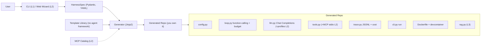

# HarnessForge

> **Forge your own agent harness.** A config-to-code generator that scaffolds a standalone agent harness you fully own — **no agent-framework lock-in** (no LangGraph, no LangChain, no ADK), and no dependency on HarnessForge after it's generated.

[](./LICENSE)


> **Status:** Design / planning phase. The plan is finalized; implementation has not started yet. See [`docs/`](./docs/) for the full project plan and research.

---

## What is this?

In 2026 the field converged on one equation: **`Agent = Model + Harness`**. The model reasons; the *harness* is everything else that makes it actually work — the loop, tool execution, context management, guardrails, and observability.

**HarnessForge** is `create-next-app`, but for agent harnesses. You describe what you want through a lightweight web wizard or CLI, and it generates a **standalone Python repo that you own and can edit freely** — not a framework you import and pray to.

### Three things that make it different

- **No agent-framework lock-in** (not "dependency-free") — generated code has **zero** LangChain/LangGraph/ADK *agent-framework* dependency; the loop is yours. It still uses ordinary libraries (OpenAI SDK, Pydantic, Typer) — those aren't agent frameworks.
- **Own your code (eject by default)** — output is a readable, deletable, customizable repo. No runtime lock-in, and no dependency on HarnessForge after generation.
- **Config-to-code** — a web wizard / CLI captures a `HarnessSpec`, then renders the whole thing in one shot.

## What it generates

The default product is a **thin, fully-runnable harness**. Heavy features are generated only when you toggle them in the spec — so you depend only on what you actually use.

**MVP golden path (L1 — always generated):**

- **Native function-calling loop** — TAO/ReAct semantics via the API's `tool_calls`, with stop conditions, max-steps, and error handling. Built on the OpenAI SDK + `base_url` using the **Chat Completions API** (provider-agnostic; works with vLLM / together / groq / etc.).
- **Tool registry** — add a tool = write a function + register it, no loop changes. Risky tools (shell / file-write) are off by default, allowlist-only.
- **Budget stop + JSONL trace** — per-run step/time/cost budgets and a JSONL trace with token/cost counts.
- **CLI** (Typer) — `run` a turn-based chat.
- **Runnable anywhere** — ships `uv.lock` + `.python-version` (uv auto-manages Python and an isolated venv), a default **Dockerfile + devcontainer**, a `requirements.txt` pip fallback, and the generator **smoke-tests the new repo** (`uv sync` + `pytest` + a mock run) before declaring it runnable.
- **Built to extend** — clear module boundaries, a tool registry, lifecycle hooks, Protocol interfaces, and an `AGENTS.md` extension guide.

Secrets never touch `config.yaml`, the spec snapshot, or git — `config.yaml` holds only env-var *names*; real values live in `.env` (gitignored).

**Optional, spec-toggled (not in the default product):**

- **L2** — MCP tools (local `stdio`), multiple LLM profiles + role routing (`generation` / `compaction` / `embedding`), a minimal FastAPI + SSE web chat, context strategies (`truncate` / `summarize`).
- **L3** — RAG ingest (chunk → embed → store → retrieve) on local `sqlite-vec`, a `/config` hot-reload panel, OS keyring secrets, full human-in-the-loop web flow, HTTP/SSE remote MCP, context offload.

## Planned usage

> Not yet implemented — this is the target developer experience.

```bash
# One-shot, no install (like create-next-app)
uvx harnessforge new my-agent

# Or open the web wizard to configure interactively
harnessforge wizard

# Generate from a preset or an existing spec
harnessforge new my-agent --preset coding-assistant
harnessforge new my-agent --spec ./harness.spec.yaml
```

The generated `my-agent/` repo then runs on its own:

```bash
cd my-agent
uv sync                       # uv installs the right Python + an isolated venv
cp .env.example .env          # add your API keys here
uv run my-agent run           # chat in the terminal (L1)

# or run in a fully sealed environment (generated by default):
docker build -t my-agent . && docker run --rm -it my-agent

# optional, only if enabled in the spec:
uv run my-agent serve         # web chat (L2)
uv run my-agent ingest ./docs # build the RAG store (L3)
```

## Architecture



## Documentation

- [docs/00-research-and-feasibility.md](./docs/00-research-and-feasibility.md) — what an agent harness is (2026), competitive landscape, feasibility.
- [docs/01-project-plan.md](./docs/01-project-plan.md) — positioning, target users & success metrics, layered MVP scope, design principles, architecture, key decisions, runnability guarantees, acceptance criteria, vertical-slice roadmap.

## 中文简介

HarnessForge 是一个"配置即生成"的代码生成器:通过 CLI / Web 向导采集需求,产出一套**不绑定 agent 编排框架(LangChain/LangGraph/ADK)**、你完全拥有可删改的独立 agent harness 代码仓库,生成后不再依赖 HarnessForge。三个差异点:**无 agent 框架锁定(不是"无依赖")**、**own-your-code(eject 即所得)**、**配置即生成**。MVP 先做"生成 → 跑通 → 易改"的黄金路径(L1),并随产物落地可运行性保障(uv 契约 + 默认 Docker + 生成后冒烟自检);MCP / 多 profile / Web chat 等为 L2/L3。当前处于规划阶段,详见 [`docs/`](./docs/)。

## License

[MIT](./LICENSE) © 2026 EpisodeYu
