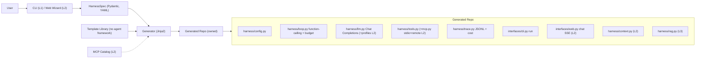

# HarnessForge 立项方案 (MVP)

> 配套背景见 [00-research-and-feasibility.md](./00-research-and-feasibility.md)。
>
> 本版相对初稿做了三件事:**收敛 MVP 到一条端到端黄金路径**、**路线图改为垂直切片**、**明确关键技术决策**。RAG / Web 配置热重载 / 联网 MCP registry / keyring 等降级为 MVP 后续增强(本地自用阶段不需要)。

## 1. 定位与差异化

一句话:**create-next-app for agent harnesses —— 无 agent 框架锁定 + own-your-code。**

调研结论(2026):harness = `Agent = Model + Harness` 里除模型外的一切(编排循环/上下文工程/工具执行/沙箱/记忆/护栏/可观测)。术语在 2026 年才标准化,趋势是"模型越强、harness 越薄"。

竞品空位:`create-agent-app` 绑 LangGraph、`create-google-adk-agent` 绑 ADK、`full-stack-ai-agent-template` 多框架且静态模板;无代码平台托管且隐藏 harness。**没有"无 agent 框架锁定 + 可视化配置 + 生成你拥有的薄 harness 代码"的对位项目。** 三个必须打透的差异点:
- **无 agent 框架锁定(不是"无依赖")**:生成代码零 LangChain/LangGraph/ADK 等 **agent 编排框架**依赖,循环是你自己的。底座只用通用库(openai SDK / pydantic / typer 等),这些不是 agent 框架,不构成锁定。
- **own-your-code(eject 即所得)**:产出独立仓库,可读可删改;**生成后不再依赖 HarnessForge**。
- **配置即生成**:CLI/向导采集 spec → 一键渲染。

> 措辞修正:初稿用 "framework-free" 容易被质疑"那 FastAPI/Pydantic 算不算框架"。真实主张是**不绑定 agent 编排框架**,故全文统一表述为"无 agent 框架锁定"。

## 2. 目标用户与成功指标

**目标用户(MVP 阶段)**:先服务**作者本人 / 独立开发者**——想从零拥有一份可读可改、不绑框架的 agent harness,本地自用为主。这一画像直接决定 MVP 取舍:**不需要** Web 配置面板、多人协作密钥管理、生产级权限;**需要**一条"几分钟生成 → 跑通 → 易改"的路径。AI infra / 内部工具团队是 v1 之后再考虑的扩展人群。

**成功指标(以"时间到价值 + 代码可拥有"衡量,而非"功能写完")**:
- `harnessforge new --preset coding-assistant` 后 **5 分钟内**:生成项目 → 配好一个 key → mock/真实跑通一次带工具调用的对话。
- 生成产物核心代码(`harness/` 目录)保持**精简可通读**(目标量级:核心循环 150–300 行,整体远小于一个框架)。
- 使用者能在 **30 分钟内新增一个自定义 tool 并跑通**(加函数 + 注册,不动循环)。
- 生成项目 `uv sync && pytest` 全绿;`pyproject.toml` 不含 langchain/langgraph/adk。

## 3. MVP 范围(分层)

把范围分三层。**MVP 完成 = L1 全做 + L2 尽量做**;L3 推迟到 v1+。

### L1 — 黄金路径(必做,决定立项能不能成立)
- **spec**:`HarnessSpec` Pydantic 模型 + YAML(带 `version`)。
- **generator**:Jinja2 加载 spec → 渲染 → 写出独立仓库 + 拷入 `harness.spec.yaml` + `git init`;重跑警告不覆盖。
- **薄模板核心(无 agent 框架)**:config / llm / loop / tools / prompts / trace。
- **原生 function-calling 循环**:用 API 的 `tool_calls`(TAO/ReAct 语义),含停止条件/最大步数/错误处理;**走 Chat Completions API**(见 §6)。
- **工具注册表**:装饰器注册,新增 tool = 加函数 + 注册,不改循环;含 1–2 个内置安全示例工具。
- **CLI(Typer)**:`run` 一问一答。
- **JSONL trace + token/成本计数**。
- **基础预算停止**:步数(轮次)/时间/**token**/成本超限即停(4 维,任意组合,命中第一个即停)。预算与按 token 计的单价均为**运行期可配**(`config.yaml`),"按费用"需配对应 LLM 的输入/输出单价。
- **mock LLM 测试** + README + AGENTS.md(扩展指南)+ LICENSE(MIT) + .env.example。
- **可运行性保障(详见 §7)**:uv 契约(随仓库带 `uv.lock` + `.python-version`,uv 自动下载匹配 Python + 隔离 venv)+ **默认生成 `Dockerfile`/`.devcontainer`**(前期即纳入)+ `requirements.txt` pip 兜底 + 生成器对新仓库**冒烟自检**。
- **1 个 preset**(coding-assistant)+ 空白示例 spec。

### L2 — MVP 后半段(适合做,锦上添花)
- **MCP 工具**:**stdio(本地)+ 远程 HTTP/SSE 传输**(人 2026-06-03 定向,取代原"仅 stdio")+ allowlist + 风险标记。**生成期只决定有无**(`spec.mcp.enabled` + `mcp` 依赖);**连哪些 server / 用哪些 tool / 用哪种传输全运行期** `config.yaml`(用户可自带 server)。catalog(预设便捷数据源)随 wizard(下条)做。**联网 MCP registry 仍推迟 v1+**。
- **第 2 个 preset**(rag-research 骨架,RAG 实现可桩)。
- **极简 Web chat**:FastAPI + SSE 流式聊天页(不含 `/config` 面板)。
- **多 LLM profile + 角色路由**:命名 profile + `generation`/`compaction`/`embedding` 角色,`client_for(role)` 解析。
- **上下文管理**:`max_context_tokens` + **truncate 或 summarize 二选一**(先做 truncate,summarize 用 compaction profile)。
- **生成期 Web wizard**:单页表单产出 spec(L1 先用 CLI + preset 顶替,这里再补 GUI)。

### L3 — 推迟到 v1+(明确不在 MVP)
- Web `/config` 运行期热重载面板、密钥只写不回显面板、**联网 MCP registry / `/config` 改 MCP server 热重连 / `forge add` 增量接 server**、完整 HITL Web 交互时序、**工具调用 HITL 确认**(allow/reject/always-allow;**今天已可经 `before_tool` hook `raise`-veto 自实现**,v1+ 做成内置;护栏非保证、非交互/Web 默认拒绝;据此把 shell 默认开 = 改 §6 口径需人签,人 2026-06-05 登记)、**MCP 状态自检/健康标注**(probe server 连通 + 工具计数 + 不可达标红,CLI `mcp status` + `/config` 健康视图,复用 `McpManager.errors`/`discovered`,人 2026-06-05 登记)、RAG 最小 ingest 闭环 + sqlite-vec、keyring 密钥后端、context offload(大输出落盘)。(注:**MCP 远程 HTTP/SSE 传输已于 2026-06-03 提前进 L2**,见 L2;此处仅余 registry / 热重连 / 增量接入。)
- **多范式 + 范式可扩展 + 一种 multi-agent**(候选,人已定向):wizard **生成期多选** + 产物侧**薄范式注册表**。**单 loop 范式集 Agent(默认)/ Plan / Ask**(人 2026-06-05 定向并落地,Slice 5;对齐 Cursor 三件套——初版 ReAct/Plan/Ask/Reflection 当日修订:`react`→`agent`、删独立 `reflection`,因 Cursor/Claude 无 reflection 开关、reflection 靠真实成功信号条件触发或被推理模型内化,Reflexion 改作用户扩展范例,详见 `02-development/06-slice-5-paradigms.md §4②′`)——生成期**多选**进产物**共存**,**产物运行期每轮选一种**(类 Cursor agent/ask/plan;CLI `--mode` + Web 下拉;运行期 `enabled`+`default` 进 `config.yaml`、首项种默认);**Plan/Ask 只读**(只 offer 只读/低风险工具、禁 write/shell;Plan 对齐 Cursor 只产只读计划不动手,Plan→执行的 Build 切换推迟 v1+)。**范式可扩展(核心卖点)**:产物 `harness/paradigms/` 持**与 tools 同款的薄注册表 + `@register_paradigm` 装饰器**,**运行期用户可自加范式**(写函数+注册+配 `enabled`);**内置范式各自自包含、互不 import**(改 agent 不影响 ask);**注册表始终存在**(默认产物不再与 Slice 1–4 逐字一致,门禁改"行为一致");此处**扩展性/解耦优先于薄**(人已定向)。运行期"每轮选范式" + "范式注册表"**实现为已注册模式集的写死按名分发(自有代码),不是被禁的"运行期范式抽象层"/动态图/DSL/编排引擎**。**一种 supervisor multi-agent**——以"agent 即 tool"(子 agent = 再跑一个 `run()`)固定拓扑生成为**自有代码**,opt-in,**排 v1+**;用户自写 multi-agent 范式属其 own-code。**禁**:通用多 agent 编排框架 / 工作流 DSL / 动态图引擎 / 运行期范式抽象层(见 §6)。**2026-06-05 拆片**:范式=Slice 5、工具基线+SKILL=Slice 6、wizard=Slice 7。详见 `02-development/06-slice-5-paradigms.md`。
- **工具基线(MCP 预设)+ 标准 SKILL**(Slice 6,人 2026-06-05 定向):产物无内置实用工具 → 基线能力**全由 MCP 预设提供、不自写 built-in**(`fetch` 默认开 / `git` 读开写关 / Desktop Commander 预填一键开,写/shell 默认关;离线靠生成期预热 + Docker 烤镜像;海量扩展走 marketplace 文档 + Composio 式 remote MCP,**不做联网 registry**)。并支持 **Agent Skills 开放标准**(`SKILL.md` 渐进披露:L1 发现+注入 → L2 文件工具/`read_skill` 读正文 → L3 脚本经工具跑),`spec.skills.enabled` 门控、不引框架、技能脚本=高风险默认关。详见 `02-development/07-slice-6-tools-and-skills.md`。
- **周期预算**(候选):per-run 4 维(步数/时间/token/费用)已在 L1;天/周/月配额做成 spec 勾选的可选**持久化**模块(本地 JSON,多进程/Web 再换 sqlite+锁),默认不生成。
- 原 v2 项:沙箱、tracing UI、跨会话记忆、评测 harness、联网 MCP registry、`forge add/regenerate`。

> 说明:RAG / MCP 双传输 / Web 配置这些是竞品已有的"通用能力",做得再好也证明不了差异化;先用 L1 证明"无框架 + own-your-code"跑得通,再纵向叠。

## 4. 设计原则:薄优先 + 可扩展 + 生成器/产物分离

**生成器能力 ≠ 默认产物模板**(化解"薄 harness"与"功能多"的张力):
- 默认产物模板保持**极薄**;RAG / MCP / context 高级策略 / Web 等通过 **spec 开关**按需生成,不塞进默认产物。
- 用户拿到的就是"够用且能通读"的最小 harness,高级件想要才有。

**可扩展(核心卖点,与无框架同级)**:
- 薄抽象、清晰模块边界:loop / llm / tools / context 各单一职责,可独立替换。
- 工具用注册表(装饰器)注册;新增 tool = 加函数 + 注册。
- **循环范式同走薄注册表(装饰器)**(Slice 5,人 2026-06-05 定向):新增范式 = 加函数 + `@register_paradigm` + 配 `config.yaml` 的 `enabled`,运行期经 `--mode`/Web 下拉每轮选;内置范式各自自包含、互不 import(改 agent 不影响 ask)。此扩展点**扩展性/解耦优先于薄**,但仍是 own-code 薄注册表,**非**运行期范式抽象层/编排引擎(守 §6 红线)。
- 生命周期 Hooks:`before_step / after_step / before_tool / after_tool / on_error`,挂护栏/日志不动核心。
- **标准 SKILL(Agent Skills 开放标准)**(Slice 6,人 2026-06-05 定向):放 `skills/<name>/SKILL.md`(渐进披露:L1 发现+注入 → L2 文件工具/`read_skill` 读正文 → L3 脚本经工具跑),`spec.skills.enabled` 门控、不引框架;与 Claude/Cursor 等 25+ 工具可移植。
- LLM / embedding / 向量存储走 Protocol 接口,可替换实现。
- 关键扩展点内联注释 + AGENTS.md 专章。

**统一配置(轻量版)**:
- 单一 `config.yaml`(非密钥:llms/roles/context/tools/interfaces)+ `.env`(密钥真值,gitignored);`config.yaml` 只存 env 引用名(如 `api_key_env: OPENAI_API_KEY`)。
- `harness/config.py` 启动加载 + Pydantic 校验,作为全局唯一入口。**运行期热重载推迟到 L3**(MVP 改配置后重启即可,本地自用足够)。
- 生成期 `HarnessSpec` 与运行期 `config.yaml` 字段对齐,降低认知负担。
- **配方 vs 活旗钮(控制面边界,人已定向)**:`spec` = 生成什么 + 初值;`config.yaml` = 运行期**权威**源,**行为性配置(模型/profile、prompt、预算数值、启用工具、context 参数、定价…)全部运行期可改**;**结构性配置**(有无某接口/模块、范式与拓扑 = 决定生成哪些**代码**)只能重新生成或将来 `forge add` 增量生成。运行期配置面板**生成进产物自身的 Web 接口**(产物自持),**HarnessForge 不做中心化配置管理/托管**——守"生成后不再依赖 HarnessForge"。故行为性字段尽量下沉到运行期,`spec` 仅作初值种子。

**权限与控制面:两轴划分(口径,人 2026-06-03 定向)** —— 把"配方 vs 活旋钮"显式拆成两条正交的轴,后续切片(尤其 Slice 4 工具 allowlist)按此归类,化解"配置越往运行期搬、生成器越像白写 harness"的焦虑:生成器的价值锚点在**结构轴(代码 / 能力的有无)**,不在行为轴的"值"。

- **结构轴(生成期 / 代码 / 生成器拥有 = 能力天花板)**:有没有某段能力代码——哪些工具被**编译进**产物、有无 `/config` 面板及其可编辑范围、接口 / 模块 / 范式拓扑。只能重新生成或将来 `forge add` 改,**运行期改不了**。**安全相关的"能力面"属于这一轴。**
- **行为轴(运行期 / 值 / `config.yaml` + `/config` 拥有 = 天花板内调参)**:同一段代码怎么调——prompt、预算数值、采样旋钮、定价、**已编译工具里此刻 enable 哪些**。可改,且改了**不构成安全边界**。
- **allowlist 只收窄、不扩张**:运行期 tool allowlist 只能在"已编译进的集合"内**收窄**,永远 enable 不了一段没生成进来的代码。"`/config` 关掉某工具"是便利收窄,**不是安全保证**。要锁死某能力 = 生成期就**不编译进去**(用"缺席"强制)。
- **天花板 vs 地板(own-your-code 的固有边界)**:生成器能设**能力天花板**("这份产物里没有 X 的代码",靠缺席强制);但设不了**地板**("无论谁跑都至少拦住 Y")——因为代码所有者可改源码。**own-your-code 与"对代码所有者强制权限"天然互斥。**
- **两种威胁模型,决定该靠谁**:
  - **A 护栏(可信但会手滑)**:生成期能力天花板 + 危险工具默认不编译 / 默认关 + 预算上限即可。**生成器负责,贴合本定位。**
  - **B 强制(不可信 / 对手)**:harness 自身做不到,须靠**外部沙箱 / 容器**(已有 Docker 一等公民)、**自托管**或**后端凭证作用域**。**守"不做生产级权限系统"红线**(§6)——生成器最多生成"可被沙箱化的产物 + 按工具发作用域凭证",不在产物里造权限系统。
- **部署拓扑决定运行期配置安不安全(人 2026-06-05 补)** —— "运行期配置可改"是否安全,取决于产物怎么交付:
  - **① 分发仓库**:把生成的仓库发给多人各自跑——每人都是代码所有者(模型 B),只有天花板没有地板。管理员**不**为每人单独配权限,只把**统一天花板**烤死进产物、人人同份;per-person 差异(各自 key / 数据目录)是该可改、改了也安全的运行期值。拦不住"收件人改源码",那属模型 B,交容器 / 托管 / 凭证作用域。
  - **② 管理员托管 + 接口发布(更常见;运行期配置在此完全成立)**:管理员跑一个实例、配好运行期配置,终端用户只透过 `/chat` 等接口访问,**够不着代码与 `config.yaml`**。此时**边界 = 网络接口**,用户在 API 另一侧 → 管理员能对终端用户**强制地板**,运行期配置可改也安全(只有管理员够得着)。**前提:管理面(尤其 `/config`)必须与公开面隔离**(鉴权 / 绑 localhost / 生成期开关),否则终端用户能 POST `/config` 改掉配置;且为**单租户**(全局 config/预算,无 per-user 隔离),公网鉴权 / TLS / 限流属 harness 外运维。落地见 `00-overview §2` Slice 8+ backlog。

## 5. 架构

两层:**生成器(HarnessForge 本体)** 与 **生成产物(独立 harness 仓库)**。

生成器目录(仓库根 `/home/s1yu/HarnessForge`,独立 git repo,MIT;支持 `uvx harnessforge new` 免安装一次性运行):
- `harnessforge/spec.py` — `HarnessSpec`(version/project_slug/llms/roles/prompts(`system`/`persona`/**`rules_files`**(Slice 6B,全局 rule 文件种子,渲染进运行期 `config.yaml`))/tools/**paradigms**(Slice 5,多选 `Literal["agent","plan","ask"]`,默认 `["agent"]`)/interfaces/**mcp.enabled**(Slice 4)/**skills.enabled**(Slice 6,标准 Agent Skills 开关;技能目录走运行期 `config.yaml skills.dirs`,不进 spec)/observability/budget;context/rag/secrets backend 字段预留但 MVP 不全实现)。
- `harnessforge/generator.py` — 渲染模板 → 写出仓库 + 拷入 `harness.spec.yaml` + `git init` + `uv lock` + 重跑警告不覆盖 + 生成后冒烟自检(`uv sync`+`pytest`+mock 跑一步)。
- `harnessforge/cli.py` — Typer 入口(`new`、`--spec`、`--preset`、交互模式、`doctor` 预检、`--no-verify` 关闭冒烟自检)。
- `harnessforge/catalog/mcp_servers.yaml` — 精选静态 MCP catalog(L2)。
- `harnessforge/presets/` — coding-assistant(L1)+ rag-research 骨架(L2)+ 空白示例。
- `harnessforge/templates/` — 生成产物 Jinja2 模板。
- `harnessforge/wizard/`(L2)— FastAPI + 单页静态表单。

生成产物仓库骨架(无 agent 框架):
- `pyproject.toml` — 最小依赖:`openai`、`pydantic`、`pydantic-settings`、`pyyaml`、`typer`;`fastapi`/`uvicorn`、`mcp`、`sqlite-vec`、`keyring` 按 spec 开关进 extra;**断言无 langchain/langgraph/adk**。
- `config.yaml` + `harness.spec.yaml` + `.env.example` + `LICENSE`(MIT)。
- **可运行性文件(§7)**:`uv.lock` + `.python-version` + `requirements.txt`(uv 导出兜底)+ `Dockerfile` + `.dockerignore` + `.devcontainer/devcontainer.json`(基于官方 `ghcr.io/astral-sh/uv` 镜像)。
- `src/<pkg>/harness/config.py` — 加载 `config.yaml`+`.env` + Pydantic 校验 + 密钥按 env 引用名解析。
- `src/<pkg>/harness/loop.py` — 原生 function-calling 循环(Chat Completions)+ Hooks 调用点 + 预算停止。**(Slice 5 起收为薄分发入口,按 `mode` 调 `paradigms/` 下对应范式)**。
- `src/<pkg>/harness/hooks.py` — 生命周期 hook 接口与默认空实现(扩展点)。
- `src/<pkg>/harness/llm.py` — openai SDK 适配(base_url,provider-agnostic);profile 注册表 + `client_for(role)`(L2)。
- `src/<pkg>/harness/tools.py` — 注册表(装饰器)+ 风险标记。
- `src/<pkg>/harness/mcp.py`(L2,Slice 4,opt-in)— MCP client(stdio + 远程 HTTP/SSE),把 MCP 工具注册进上面的注册表;仅 `spec.mcp.enabled` 时生成。Slice 6 起经 MCP 预设(`fetch`/`git`/Desktop Commander)做**工具基线**。
- `src/<pkg>/harness/paradigms/`(Slice 5,**始终生成**)— 范式注册表(`@register_paradigm` + `PARADIGMS` + `Paradigm` 契约 + 共享 plumbing)+ 内置范式 `agent`(默认,ReAct 式)/`plan`/`ask`(各自自包含、互不 import,按 `spec.paradigms` 渲染);运行期 `--mode`/`config.yaml paradigms.enabled` 选,用户可自加。事后反思(Reflexion)作 `AGENTS.md` 用户扩展范例(需真实成功信号),非内置范式。
- `src/<pkg>/harness/skills.py`(Slice 6,opt-in)— 标准 Agent Skills 支持(发现 `SKILL.md` + L1 元数据注入 + `read_skill` 读正文);仅 `spec.skills.enabled` 时生成。
- `src/<pkg>/harness/trace.py` — 每次 run 的 JSONL trace + token/成本计数。
- `src/<pkg>/harness/prompts.py` — 系统提示拼装(system+persona + **全局 rule 文件注入**(Slice 6B,`prompts.rules_files` 列出的 markdown 每轮注入,开放 `AGENTS.md`/`CLAUDE.md`/`.cursor/rules` 模式;空=零效果)+ skills/environment L2)。
- `src/<pkg>/harness/context.py`(L2)— truncate / summarize。
- `src/<pkg>/harness/rag.py`(L3)。
- `src/<pkg>/interfaces/cli.py` — `run`(L2 增 `ingest`)。
- `src/<pkg>/interfaces/web.py`(L2)— `/chat` SSE。
- `tests/` + `README.md` + `AGENTS.md`(扩展指南)+ `.env.example`。

## 6. 关键技术决策

已定(用户拍板):
- 名称 **HarnessForge**;生成器包/CLI `harnessforge`,产物默认包名 `agent_harness`(spec `project_slug` 可覆盖)。
- 仓库 `/home/s1yu/HarnessForge`,独立 git repo,**MIT**;GitHub `EpisodeYu/HarnessForge`。
- LLM 底座:**openai 官方 SDK + base_url**(provider-agnostic)。
- 循环:**原生 function-calling**(非文本解析 ReAct)。

本版新增/明确:
- **LLM API 面:走 Chat Completions + `tools`,不用 Responses API。** 理由:Responses 基本是 OpenAI 专属,而绝大多数第三方/本地 OpenAI 兼容端点(vLLM、together、groq 等)只实现 `/v1/chat/completions`;选 Chat Completions 才能兑现 provider-agnostic + base_url 的承诺。
- **安全(轻量,本地自用)**:MVP 不做沙箱/keyring/写不回显面板/全链路 redaction。只保两条硬约束——(1) **密钥不入 git**:`config.yaml`/`harness.spec.yaml` 只存 env 引用名,真值放 `.env`(gitignored);(2) **高风险工具(shell/写文件)默认不内置 / 默认关,仅 allowlist 显式开启**。HITL 确认与更强 redaction 推迟到有真实多环境/共享需求时再加。
- **API/SDK 版本与发布**:Python 3.11+;依赖 pin 版本;MCP/sqlite-vec 等仅在对应 L2/L3 模块引入并标平台要求;发布前查 PyPI 包名 `harnessforge` 是否重名;模板与产物的兼容靠 spec `version` 字段标注。
- **可运行性契约**:产物以 **uv** 为唯一环境契约(带 `uv.lock` + `.python-version`,uv 自动管 Python 与隔离 venv);**默认生成 `Dockerfile` + `.devcontainer`** 作为环境无关的运行保障(前期即纳入,非可选);生成器**默认对新仓库冒烟自检**(`uv sync` + `pytest` + mock 跑一步),`requirements.txt` 提供 pip 兜底。详见 §7。

自主细节(实现时可调):模板引擎 Jinja2;spec 用 Pydantic v2 + YAML;运行期配置 pydantic-settings;Web 无构建单页(Tailwind CDN);context 默认 `truncate`(summarize 为 L2 可选)。

**明确不做(保护定位)**:不做生产级权限系统、云托管、**通用多 agent 编排框架 / 工作流编排 DSL / 动态图引擎 / 运行期范式抽象层**、在线 MCP registry、沙箱、跨会话长期记忆、**HarnessForge 侧的中心化配置管理/托管**(产物自持配置,守"生成后不再依赖 HarnessForge")。

> **multi-agent 措辞细化(人已签,2026-06)**:红线是"**通用编排框架**",不是"≥2 个 agent"。**允许一个具体的、固定拓扑、生成为自有代码的 multi-agent 模式**(supervisor / "agent 即 tool",子 agent = 再跑一个 `run()`),**opt-in、排 v1+、不进默认产物**;它只是薄 loop 的组合,无运行期抽象层。详见 §3 L3 与 `02-development/00-overview.md §3` 决策表。

## 7. 生成产物可运行性保障

目标:让生成产物在用户各异的环境中**开箱即跑**,把环境配置负担降到最低,并由生成器**主动验证**可运行性。原则:**复用 uv + 容器两条成熟路径,不自造环境/依赖/版本管理层,也不为减依赖而手写 Web/SSE 轮子**。

1. **uv 作为唯一环境契约**:产物随仓库带 `pyproject.toml` + `uv.lock` + `.python-version`。uv 自动下载匹配的托管 Python(用户无需预装 3.11)、自动建隔离 venv(不污染全局)、`uv sync` 一键就绪。README 首条命令即 `uv sync` → `uv run <pkg> run`;生成器本体走 `uvx harnessforge new`,全链路 uv 一致。
2. **依赖最小化由 spec 决定**:默认产物只含纯 Python / 通用 wheel 依赖(`openai` / `pydantic` / `pydantic-settings` / `pyyaml` / `typer`),零编译、任意 OS 可装。Web(`fastapi`/`uvicorn`)、MCP(`mcp`)、RAG(`sqlite-vec`)、keyring 等按 spec 开关进 `optional-dependencies`,未启用则不安装——"生成什么才依赖什么"。
3. **生成期锁定**:生成器写完仓库后跑 `uv lock`(universal resolution,跨平台),用户拿到已解析好的确定依赖集,避免解析漂移。
4. **生成后冒烟自检(默认开)**:生成器对新仓库执行 `uv sync` → import 自检 → mock LLM 跑一步 function-calling → `pytest -q`,全绿才报"可运行",失败给可读错误与修复建议;`--no-verify` 可关。另提供 `harnessforge doctor` 预检(uv 是否在、网络是否通、磁盘/权限)。
5. **Docker 一等公民(默认生成,前期纳入)**:每个产物默认生成 `Dockerfile` + `.dockerignore` + `.devcontainer/`(基于官方 `ghcr.io/astral-sh/uv` 镜像)。`docker build && docker run` 即得到与宿主完全无关的确定运行环境;Web 接口暴露端口,CLI 可进容器交互。面向"环境实在各异 / 不想动本机"的用户,这是最强的可运行性兜底,故**不作为可选项,前期即随产物产出**。
6. **pip 兜底路径**:`uv export --format requirements-txt` 同时产出 `requirements.txt`,README 提供 `python -m venv` + `pip install -e .` 备选;主推 uv,但不强制用户安装 uv。
7. **原生依赖兜底(L3)**:`sqlite-vec` 落地时配 numpy 余弦的纯 Python 兜底,缺平台 wheel 也能跑 RAG。

不做:不自写依赖/虚拟环境/Python 版本管理器(交给 uv);不为省依赖而手写 Web/SSE(保留 FastAPI)。

## 8. 验证标准(分 blocker / non-blocker)

**Blocker(MVP 必过,对应 L1)**:
- 黄金快照:示例/preset spec 生成项目 → `uv sync && pytest` 全绿 → 用 **mock LLM** 跑通一次 function-calling 循环(含一次工具调用)。
- **生成后冒烟自检通过**:生成器对新仓库 `uv sync` + import + mock 跑一步 + `pytest -q` 全绿(默认开,`--no-verify` 可关)。
- **Docker 可运行**:生成的 `Dockerfile` 能 `docker build` 成功,并 `docker run` 跑通 mock 一步(冒烟)。
- 断言生成的 `pyproject.toml` 不含 langchain/langgraph/adk。
- 生成项目 CLI 一问一答可跑通(mock 后端)。
- 扩展点:新注册一个 demo tool + 挂一个 hook 的测试,验证无需改核心代码即生效。
- 可观测:一次 run 产出结构正确的 JSONL trace + token/成本计数断言。
- 护栏:预算停止(步数/时间/成本超限即停)单测。
- 密钥不入 git:`config.yaml`/`harness.spec.yaml` 不含明文密钥的断言。
- 生成器自身:spec 校验、模板渲染单测、`uvx harnessforge new` 冒烟;`ReadLints` 无新增告警。
- coding-assistant preset 能成功生成并通过其 pytest。

**Non-blocker(L2/L3,做到即验,不卡 MVP)**:
- MCP stdio 工具调用通过、第 2 个 preset、Web `/chat` SSE 流式(mock)、多 profile `client_for(role)` 路由、context 策略单测;(L3)RAG ingest → 检索 → 注入端到端、`/config` 热重载、HITL 确认时序。

## 9. 路线图(垂直切片)

不按模块横向堆,按**端到端切片**纵向推进,每片都能跑通:

> **以 `02-development/00-overview.md §2` 为准(2026-06 已重切为 S0–S6)**:下列原始 Slice 2/3/4 编号已被中粒度重切取代(S2 路由+上下文 / S3 产物 Web / S4 MCP / S5 wizard+范式 / S6+ v1+)。另:**MCP 远程 HTTP/SSE 传输已于 2026-06-03 从下方"Slice 4(v1+)"提前进 S4/L2**,仅余联网 registry 仍排 v1+。本节保留作历史轨迹。

- **Slice 0 — 骨架**:`HarnessSpec` 最小字段 + Jinja2 生成引擎 + 写出仓库/拷 spec/git init + 渲染单测。产物:能生成一个空壳仓库。
- **Slice 1 — 黄金路径(核心里程碑)**:薄模板核心(config/llm/loop/tools/trace/prompts)+ 原生 function-calling(Chat Completions)+ 工具注册表 + 1 个内置工具 + 预算停止 + CLI `run` + JSONL trace + mock LLM 测试 + coding-assistant preset + README/AGENTS;**可运行性保障同期落地**(uv 契约 `uv.lock`+`.python-version`、默认 `Dockerfile`/`.devcontainer`、生成后冒烟自检、`requirements.txt` 兜底,见 §7)。**到此立项假设已被验证**:能生成一个无框架、**在任意环境**可跑通一次工具调用、可读可改的 harness。
- **Slice 2 — 接口与配置**:极简 Web chat(SSE)+ 多 profile 角色路由 + context(truncate,可选 summarize)+ 第 2 个 preset 骨架。
- **Slice 3 — 工具生态**:MCP stdio + 静态 catalog + allowlist;生成期 Web wizard。
- **Slice 4(v1+)**:RAG ingest + sqlite-vec、HTTP/SSE MCP、`/config` 热重载、keyring、完整 HITL Web、context offload。
- 全程伴随:`uvx` 打包、docs(突出无框架 + eject + own-your-code)、golden 测试随切片增量补充(**不再集中堆到最后**)。

## 10. 主要风险

- **环境多样性 / 可运行性**:不同 OS / Python 版本 / 无 uv / 无网络都可能让产物跑不起来。对策见 §7:uv 契约(自动管 Python + 隔离 venv)+ 默认最小依赖 + **默认产出 Docker** + 生成后冒烟自检 + pip 兜底。
- **scope 蔓延**:严守分层,L3 坚决推迟;每个 slice 必须端到端可跑再进下一片。
- **差异化锐度**:README/向导文案强调"把你原本会手写的 harness 生成出来,且生成后不再依赖 HarnessForge"。
- **provider 兼容**:以 Chat Completions + base_url 为准;`tool_calls` 在不同 provider 的细微差异需在 `llm.py` 收敛。
- **增强项复杂度**:trace/预算/context 要薄、默认可关,避免侵蚀"薄 harness"卖点。
- **(L2/L3)依赖漂移与平台兼容**:MCP/sqlite-vec pin 版本、catalog 标来源日期、sqlite-vec 标平台要求并备 numpy 余弦兜底。

## 11. 命名(已定)

- 项目名 **HarnessForge** —— 寓意"锻造你自己的 harness",最贴合 eject/生成 + 自有的差异化定位。
- 生成器 CLI/包:`harnessforge`;PyPI/仓库名同名(发布前需查重)。
