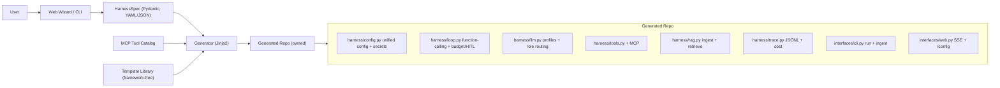

# HarnessForge 立项方案 (MVP)

> 配套背景见 [00-research-and-feasibility.md](./00-research-and-feasibility.md)。

## 1. 定位与差异化

一句话:**create-next-app for agent harnesses,但 framework-free + own-your-code。**

调研结论(2026):harness = `Agent = Model + Harness` 里除模型外的一切(编排循环/上下文工程/工具执行/沙箱/记忆/护栏/可观测)。术语在 2026 年才标准化,趋势是"模型越强、harness 越薄"。

竞品空位:`create-agent-app` 绑 LangGraph、`create-google-adk-agent` 绑 ADK、`full-stack-ai-agent-template` 多框架且静态模板;无代码平台(Arahi/MindStudio/Vellum)托管且隐藏 harness。**没有"framework-free + 可视化配置 + 生成你拥有的薄 harness 代码"的对位项目。** 这是 HarnessForge 必须打透的三个差异点:
- framework-free:生成代码零 LangGraph/LangChain 依赖,循环是你自己的。
- own-your-code(eject 即所得):产出独立仓库,可读可删改。
- 配置即生成:Web 向导/CLI 采集 spec → 一键渲染。

## 2. MVP 范围(已确认 py_min)

纳入 MVP:
- 单 agent + **原生 function-calling** 循环(TAO/ReAct 语义,用 API 的 tool_calls),带停止条件/最大步数/错误处理。
- **多 LLM profile + 角色路由**:可定义多个命名 profile(provider/base_url/model/temperature/max_tokens/reasoning_effort),按角色绑定不同 profile(`generation` 生成 / `compaction` 上下文压缩 / `embedding` 检索,角色集合可扩展);底座用 **openai 官方 SDK + base_url**(provider-agnostic),embedding 走 embeddings 端点。
- **安全密钥管理**:API key / base_url 等敏感项不入 `config.yaml`、不入 `harness.spec.yaml`、不进 git;config 只存 **env 引用名**(如 `api_key_env: OPENAI_API_KEY`),真值放 `.env`(gitignored,默认 0600)或 OS keyring;Web 配置面板对密钥**只写不回显**(write-only,GET 不返回明文)。
- **上下文管理可配置**:`max_context_tokens` + 超限策略(`truncate` 滑窗 / `summarize` 用 `compaction` profile 压缩 / `offload` 大输出落盘+引用)+ 保留头尾 token。
- MCP 工具:从精选 **静态 catalog** 选择 + 手动添加,**同时支持 stdio(本地)与 HTTP/SSE(远程)** 传输,allowlist 控制启用哪些 tool。
- 基础 RAG(可选开关):**含最小 ingest 闭环**(导入文档 → chunk → 用 `embedding` profile 嵌入 → 入库 → 检索注入),本地 sqlite-vec 存储。
- **统一配置管理**:单一 `config.yaml`(密钥仅以 env 引用名出现),启动时读取+校验;生成产物 Web 自带 `/config` 面板,可查看/编辑/热重载(非密钥项;密钥只写不回显)。
- **轻量可观测性**:每次 run 输出 JSONL trace(步骤/工具/耗时)+ token/成本计数(harness 核心能力,成本极低)。
- **轻量护栏**:高风险工具(shell/写文件等)调用前 HITL 人工确认 + 每次 run 的步数/时间/成本预算停止条件。
- 生成产物自带 **CLI(Typer)+ Web(FastAPI + SSE + 极简聊天页 + 配置面板)** 两种调用接口。
- **可复现**:生成用的 spec 拷一份进产物(`harness.spec.yaml`);一次性生成,重跑会警告不覆盖用户改动。
- 随项目附 **2 个 preset 配方**("代码助手""RAG 调研助手")+ 1 个空白示例 spec。
- 生成仓库含 tests / README / AGENTS.md / LICENSE(MIT)/ .env.example。

放入 v2(不在 MVP):沙箱(Docker/microVM)、多 agent 范式(plan-execute / supervisor-worker)、完整可观测性/tracing UI、跨会话记忆持久化、评测 harness、更多 RAG 策略、联网 MCP registry、`forge add/regenerate` 增量改写。

## 3. 设计原则:可扩展性 + 统一配置

**可扩展性(生成代码必须便于二次开发)**——这是核心卖点之一,优先级与 framework-free 同级:
- 薄抽象、清晰模块边界:loop / llm / tools / rag / context 各单一职责,可独立替换。
- 工具用注册表(registry/装饰器)注册:新增 tool = 加一个函数 + 注册,无需改循环。
- 生命周期 Hooks:`before_step / after_step / before_tool / after_tool / on_error`,二次开发挂护栏/日志/缓存不动核心代码。
- LLM / embedding / 向量存储走 Protocol 接口,可替换实现(本地模型、其他 provider/store)。
- 关键扩展点内联注释 + `AGENTS.md` 专章"如何加工具 / 换模型 / 插 hook / 改循环"。

**统一配置管理(初始化读取 + Web 热加载/修改)**:
- 单一来源:非密钥配置集中在 `config.yaml`(llms / roles / context / rag / tools / interfaces),密钥在 `.env`;`harness/config.py` 启动时加载并经 Pydantic 校验,作为全局唯一入口。
- 运行时可改:生成产物 Web 自带 `/config` 面板,查看/编辑/热重载(profile 切换、temperature、context 策略、tool allowlist 等)无需重启或改码。
- 概念对齐:生成期的 `HarnessSpec` 与运行期的 `config.yaml` 字段一一对应,降低认知负担。

**多 LLM profile + 角色路由 + 密钥安全**:
- `llms`:命名 profile 注册表,每个含 `id / provider / base_url / model / temperature / max_tokens / reasoning_effort / api_key_env`(只存 env 引用名,不存真值)。
- `roles`:角色→profileId 路由表,默认含 `generation / compaction / embedding`,可新增(如 `judge`);`harness/llm.py` 提供 `client_for(role)` 解析,代码处处按角色取客户端而非硬编码模型。
- 密钥安全:真值只在 `.env`(gitignored、默认 0600)或 OS keyring;`config.yaml`/`harness.spec.yaml`/git 永不含明文;`/config` 面板对密钥只写不回显,GET 返回 `***` 掩码;README/AGENTS.md 标注安全约定。

## 4. 架构

两层:**生成器(HarnessForge 本体)** 与 **生成产物(独立 harness 仓库)**。

生成器目录(仓库根 `/home/s1yu/HarnessForge`,独立 git repo,MIT;支持 `uvx harnessforge new` 免安装一次性运行):
- `harnessforge/spec.py` — `HarnessSpec` Pydantic 模型(llms[profiles] / roles[路由] / secrets[backend] / context / rag / tools / interfaces / observability / guardrails),带 `version` 字段。
- `harnessforge/generator.py` — 加载 spec → 渲染模板 → 写出仓库 + 拷入 `harness.spec.yaml` + `git init`;重跑检测到已存在则警告不覆盖。
- `harnessforge/cli.py` — Typer 入口(`harnessforge new`、`--spec spec.yaml`、`--preset <name>`、交互模式)。
- `harnessforge/wizard/` — FastAPI + 单页静态前端(vanilla JS + Tailwind CDN,无构建步骤),分区表单产出 spec。
- `harnessforge/catalog/mcp_servers.yaml` — 精选静态 MCP server 目录(github/filesystem/fetch 等),标注来源与更新日期。
- `harnessforge/presets/` — 2 个 preset spec(coding-assistant / rag-research)+ 空白示例。
- `harnessforge/templates/` — 生成产物的 Jinja2 模板(见下)。

生成产物仓库骨架(framework-free):
- `pyproject.toml` — 最小依赖:`openai`、`mcp`、`pydantic`、`pydantic-settings`、`pyyaml`、`sqlite-vec`、`fastapi`、`uvicorn`、`typer`;`keyring` 列为可选 extra;**断言无 langchain/langgraph**。
- `config.yaml` + `harness.spec.yaml` — 运行期统一配置(含 `llms` profiles + `roles` 路由,密钥仅 env 引用名)+ 生成期 spec 快照(无明文密钥);`.env`/`.env.example` 放真值;`LICENSE`(MIT)。
- `src/<pkg>/harness/config.py` — 启动加载 `config.yaml`+`.env`,Pydantic 校验,全局唯一入口 + 热重载(区分可热改/需重启字段)+ 密钥解析(`secrets.backend`=env|keyring,统一接口、env 回退,GET 掩码)。
- `src/<pkg>/harness/loop.py` — 原生 function-calling 循环(用 `generation` profile)+ Hooks 调用点 + 预算停止(步数/时间/成本)+ 高风险工具 HITL 确认。
- `src/<pkg>/harness/hooks.py` — 生命周期 hook 接口与默认空实现(扩展点)。
- `src/<pkg>/harness/llm.py` — openai SDK 适配 + profile 注册表 + `client_for(role)` 角色路由(Protocol 接口,base_url 兼容多 provider)。
- `src/<pkg>/harness/tools.py` — 工具注册表(装饰器)+ MCP client(stdio + HTTP/SSE)+ allowlist + 风险标记。
- `src/<pkg>/harness/context.py` — 消息历史 + 按配置的预算管理(truncate / summarize 用 `compaction` profile / offload)。
- `src/<pkg>/harness/rag.py` — 可选:ingest(chunk + 用 `embedding` profile 嵌入 + 入库)+ 检索注入,sqlite-vec,Protocol 接口。
- `src/<pkg>/harness/trace.py` — 每次 run 的 JSONL trace + token/成本计数。
- `src/<pkg>/harness/prompts.py` — 系统提示拼装。
- `src/<pkg>/interfaces/cli.py` — 含 `run` 对话 + `ingest` 文档入库命令。
- `src/<pkg>/interfaces/web.py` — `/chat`(SSE)+ `/config`(查看/改/热重载)+ HITL 确认交互。
- `tests/` + `README.md` + `AGENTS.md`(含扩展指南)+ `.env.example`。

## 5. 验证标准(完成门槛)

- 黄金快照测试:用一份示例 spec 生成项目 → 该项目 `uv sync && pytest` 全绿 → 用 **mock LLM** 跑通一次 function-calling 循环(含一次工具调用)。
- 断言生成的 `pyproject.toml` 不含 `langchain`/`langgraph`。
- 生成项目 CLI 一问一答 + Web `/chat` SSE 能流式返回(mock 后端)。
- 配置链路:启动读取 `config.yaml`+`.env` 校验通过;`/config` 改 temperature/context 策略后热重载生效(测试覆盖)。
- 多 profile 路由:`client_for(generation/compaction/embedding)` 解析到正确 profile;切换角色绑定后生效(mock client 断言)。
- 密钥安全:`GET /config` 不泄露明文(返回掩码);`config.yaml`/`harness.spec.yaml` 不含密钥明文的断言。
- 扩展点:用 hook + 新注册一个 demo tool 的测试,验证无需改核心代码即可生效。
- 上下文策略:context 预算管理三种策略(truncate/summarize/offload)各有单测。
- RAG:ingest 一篇样例文档 → 检索命中 → 注入上下文的端到端测试(mock embedding)。
- 护栏:预算停止(步数/时间/成本超限即停)单测 + 高风险工具触发 HITL 确认的测试。
- 可观测:一次 run 产出结构正确的 JSONL trace + token/成本计数断言。
- 2 个 preset 均能成功生成并通过各自生成项目的 pytest。
- 生成器自身:spec 校验、模板渲染单测、`uvx harnessforge new` 冒烟;`ReadLints` 无新增告警。

## 6. 已确认决策(用户拍板)

- 名称:**HarnessForge**;生成器包/CLI `harnessforge`,产物默认包名 `agent_harness`(可由 spec `project_slug` 覆盖)。
- 仓库:`/home/s1yu/HarnessForge`,独立 git repo,**MIT** 许可;GitHub `EpisodeYu/HarnessForge`。
- LLM 底座:**openai 官方 SDK + base_url**(provider-agnostic)。
- **多 LLM profile + 角色路由**:generation / compaction / embedding 可分别绑定不同 profile;密钥只存 env 引用名,Web 只写不回显。
- **密钥存储**:默认 `.env`(gitignored、0600),**可选切换 OS keyring**(`keyring` 库,跨平台);`config.py` 按 `secrets.backend` 解析(keyring 优先、回退 env),两种后端统一接口。
- 循环:**原生 function-calling**(非文本解析 ReAct)。
- MCP:**stdio + HTTP/SSE 双传输**;工具目录走**手策静态 catalog**。
- RAG:**含最小 ingest 闭环**,默认 sqlite-vec + OpenAI 兼容 embedding。
- 接受的增强:轻量可观测(JSONL trace+成本)、内嵌 spec+一次性生成警告、2 个 preset、HITL+预算停止、`uvx` 一次性运行。

自主细节(可在实现时调整):
- 模板引擎 Jinja2;spec 用 Pydantic v2 + YAML(`version` 字段);运行期配置 pydantic-settings。
- Python 3.11+ / uv / Typer;Web 走"无构建"单页(Tailwind CDN)。
- context 默认策略 `summarize`;热重载范围 = LLM 参数/context 策略/tool allowlist/系统提示可热改,结构性改动(加 RAG/换接口)需重启或重生成。

## 7. 命名(已定)

- 项目名:**HarnessForge** —— 寓意"锻造你自己的 harness",最贴合 eject/生成 + 自有的差异化定位。
- 生成器 CLI/包:`harnessforge`;PyPI/仓库名同名(发布前需查重)。

## 8. 主要风险

- scope 蔓延:严格守 MVP 边界,沙箱/多范式/registry/增量改写坚决推迟到 v2。
- 差异化锐度:README 与向导文案必须强调 framework-free + eject + own-your-code。
- RAG/MCP 版本漂移:依赖 pin 版本,catalog 标注来源与更新日期。
- 增强项带来的复杂度:HITL/预算/trace 要尽量薄,默认可关,避免侵蚀"薄 harness"卖点。
- sqlite-vec 安装兼容性:需在生成产物 README 标注平台要求,必要时提供 numpy 余弦兜底。
- HITL 与 Web SSE 的交互时序:确认/暂停需要前后端约定事件,实现时单独验证。
- 密钥安全是硬约束:任何路径(spec 快照、git、Web GET、日志、trace)都不得出现明文密钥,需逐项核对。
- keyring 在无头/容器环境可能无可用后端:需在 `.env` 回退路径上保证可用,并在 README 标注。

## 9. 路线图(MVP 任务清单)

按依赖顺序推进:

1. **bootstrap-spec** — 定义 `HarnessSpec` Pydantic 模型(含 llms[profiles] / roles[路由] / secrets / context / rag / tools / interfaces 全字段)+ 示例 spec.yaml + 校验单测。
2. **generator-engine** — Jinja2 生成引擎:加载 spec → 渲染 → 写出仓库 + 拷入 `harness.spec.yaml` + `git init` + 重跑警告不覆盖;含渲染单测。
3. **template-core** — 生成产物核心模板(framework-free):config.py(统一配置/热重载/密钥解析掩码)+ hooks.py + llm.py(openai SDK + profile 注册表 + `client_for(role)` 路由)+ loop.py(原生 function-calling)+ tools.py(注册表)+ context.py(truncate/summarize/offload)+ prompts.py + pyproject(无 langchain/langgraph)。
4. **mcp-tools** — MCP 集成与静态 catalog:mcp_servers.yaml + 生成产物 MCP client(stdio + HTTP/SSE)+ tool allowlist + 风险标记。
5. **rag-module** — 基础 RAG 模板(可选):最小 ingest 闭环(chunk+embed+sqlite-vec 入库)+ 检索注入,含 CLI ingest 命令。
6. **guardrails-trace** — 护栏与可观测:loop 内预算停止(步数/时间/成本)+ 高风险工具 HITL 确认 + trace.py 输出 JSONL trace 与 token/成本计数。
7. **interfaces** — 生成产物调用接口:Typer CLI(run + ingest)+ FastAPI Web(/chat SSE + /config 热重载/profile 切换/密钥只写不回显 + HITL 确认交互)。
8. **frontdoor-wizard** — 生成器入口:Typer CLI(new/--spec/--preset/交互)+ 轻量 Web 向导(单页表单,字段对齐 HarnessSpec)产出 spec。
9. **presets-packaging** — 2 个 preset spec(coding-assistant / rag-research)+ 空白示例;打包支持 `uvx harnessforge new` 免安装运行。
10. **golden-test** — 黄金快照测试:示例/preset spec 生成项目 → pytest 全绿 + mock LLM 跑通循环 + 断言无框架依赖 + 覆盖配置热重载/多 profile 角色路由/密钥不泄露/hook 加 tool/context 三策略/ingest/预算停止/HITL/trace。
11. **docs** — 生成器 README/quickstart + 生成产物 README/AGENTS.md(扩展指南),突出 framework-free + eject + own-your-code 差异化。
