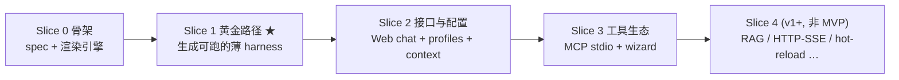

# 02·00 - 开发规划总览

> Plan 第 3 部分(开发)的入口。本目录按**垂直切片(vertical slice)**拆分,每个切片是一个端到端可生成 + 可跑 + 测试绿的增量。
>
> 本项目采用 **vibe coding 模式**:Agent 主导执行、人主导决策与节奏。协作硬约束见项目根 `CLAUDE.md`;定位 / 范围 / 决策见 `docs/01-project-plan.md`。下文"开发者要做 X"一律理解为"Agent 要做 X,由人按切片门禁验收"。

## 0. Agent 入场指南

1. 读完 `CLAUDE.md` + `docs/01-project-plan.md`。任一条不清楚,停下问人。
2. 以**代码 / 测试的实际状态**确认当前进展,不要只信文档默认描述。
3. 找到当前切片(见 §2):上一个切片门禁未全绿 → 从它继续;已完成且下一个没开始 → 主动问人"要不要进下一片"。
4. 在该切片子文档里挑 1 个未完成"交付物"作为本次任务。
5. 按 `CLAUDE.md §7` 的 plan → implement → self-verify → handoff 循环走,完成后输出 §8 完成报告。

> **不要**一次把所有子文档读完当上下文。每次只读当前切片相关的那一两份。

## 1. 为什么用垂直切片(而非瀑布式横向模块)

- 本项目是**生成器 + 薄产物**,最大风险是"集成留到最后才炸 / 复杂度失控"。垂直切片让每片都端到端跑通,**最早验证差异化**(无 agent 框架 + own-your-code + 可运行)。
- 不按 `loop / llm / tools / rag / web` 横向逐个堆完再集成。每个切片纵向穿过"spec → 生成 → 产物可跑 → 测试绿"。
- 切片之间有**完成门禁**:上一片门禁不全绿,不进下一片(除非某任务独立且人明确允许)。门禁内部的任务拆分与排序由 Agent 自主决定。

## 2. 切片路线图与完成门禁



| 切片 | 子文档 | 主交付物 | 完成门禁(全绿才算完成) | 必须人审的决策点 |
|------|--------|----------|--------------------------|------------------|
| **Slice 0** 骨架 | [`01-slice-0-scaffold.md`](./01-slice-0-scaffold.md) | `HarnessSpec` 最小字段 + Jinja2 生成引擎 + 写出仓库 / 拷 spec / `git init` / 重跑警告 | spec 校验 + 渲染单测绿;能生成一个空壳仓库;`ReadLints` clean | spec 最小字段集是否合理 |
| **Slice 1** 黄金路径 ★核心里程碑 | [`02-slice-1-golden-path.md`](./02-slice-1-golden-path.md) | 薄模板核心(config/llm/loop/tools/hooks/trace/prompts/mock)+ 原生 function-calling(Chat Completions)+ 工具注册表 + 预算停止 + CLI `run` + JSONL trace + 可运行性保障(uv 契约 + 默认 Docker + 冒烟自检)+ coding-assistant preset。**状态:✅ 已完成(38 fast + 3 golden;ReadLints clean;§4 人审已签字)** | `01-project-plan.md §8` **全部 blocker** 通过(黄金快照、无框架断言、生成后冒烟、Docker 冒烟、CLI、tool+hook、trace、预算停止、密钥不入 git、`uvx` 冒烟、preset 生成并 pytest)✅ | **立项假设成立——人已签字 ✅** |
| **Slice 2** 接口与配置 | [`03-slice-2-interfaces-and-config.md`](./03-slice-2-interfaces-and-config.md) | 极简 Web chat(FastAPI + SSE)+ 多 LLM profile 角色路由 + context(truncate,可选 summarize)+ 第 2 个 preset 骨架 | 对应 non-blocker 测试绿:`/chat` SSE 流式(mock)、`client_for(role)` 路由、context 策略单测、第 2 个 preset 生成并 pytest | Web / UX 一眼是否可用 |
| **Slice 3** 工具生态 | [`04-slice-3-tools-ecosystem.md`](./04-slice-3-tools-ecosystem.md) | MCP **stdio** + 静态 catalog + allowlist;生成期 Web wizard(单页表单产 spec) | MCP stdio 工具调用测试绿;wizard 产出合法 spec 并能生成项目 | catalog 选哪些 server(安全审);wizard 字段是否齐 |
| **Slice 4** v1+ | (暂不立子文档) | RAG ingest + sqlite-vec、HTTP/SSE 远程 MCP、`/config` 热重载、keyring、完整 HITL Web、context offload、**单 agent 多范式**(见下) | 各项做到即验(见 `01 §7 Non-blocker`) | **不在 MVP**;进入前需人决定排期 |

> **循环范式(候选,后续 slice)**:默认 loop 是单一原生 function-calling(ReAct/TAO),这是"薄 + 无框架"的核心卖点。若要支持多范式,**只走"生成期 spec 开关 → 渲染不同的 `loop.py` 模板"**(如 plan-execute、reflection/self-critique),用户拿到的仍是一份具体、可读、无运行期抽象层的 loop——不引入运行期"范式选择/编排策略"层(那会变成被定位红线禁止的"框架抽象层")。**multi-agent 维持"不做"**(`01 §6`、本文 §7):纳入它是定位级变更,须先改 `01-project-plan.md §6` 与路线图、经人审。

**Agent 行为提示**:

- 切片之间不要"偷跑":Slice 1 门禁没勾完不要开 Slice 2(除非任务独立且人明确允许)。
- 每片"必须人审的决策点"由人 approve,Agent 不能自行通过(`CLAUDE.md §6` 触发条件)。
- Slice 1 是核心里程碑:**它绿了,才证明这个项目方向成立**;它没绿之前,Slice 2/3 的价值都打折。

## 3. 全局决策总表(唯一口径)

> 子文档若出现不同写法,以本表为准并同步修订。改本表 = 改全局决策,走 `CLAUDE.md §6` 人审。详见 `01-project-plan.md §6`。

| 决策项 | 统一口径 |
|--------|----------|
| 名称 / 包 | 项目 `HarnessForge`;生成器包/CLI `harnessforge`;产物默认包名 `agent_harness`(spec `project_slug` 可覆盖) |
| 许可 / 仓库 | MIT;`/home/s1yu/HarnessForge`,GitHub `EpisodeYu/HarnessForge` |
| LLM 底座 | openai 官方 SDK + `base_url`(provider-agnostic) |
| **LLM API 面** | **Chat Completions + `tools`,不用 Responses**(兼容第三方 / 本地 OpenAI 兼容端点) |
| 循环 | 原生 function-calling(非文本解析 ReAct) |
| 模板 / spec | Jinja2;`HarnessSpec` = Pydantic v2 + YAML,带 `version`;运行期 pydantic-settings |
| Python / 工具 | Python 3.11+;`uv`(lock + 自动管 Python + 隔离 venv) |
| **可运行性契约** | 产物随仓库带 `uv.lock` + `.python-version`;**默认生成 `Dockerfile` + `.devcontainer`**;生成器**默认对新仓库冒烟自检**;`requirements.txt` 作 pip 兜底 |
| 安全(轻量,本地自用) | 密钥不入 git(`config.yaml`/`harness.spec.yaml` 只存 env 引用名,真值放 `.env`);高风险工具(shell/写文件)默认关,仅 allowlist 显式开;沙箱 / keyring / 全链路 redaction 推迟 |
| MCP | MVP 仅 **stdio 本地**传输 + 手策静态 catalog;HTTP/SSE 远程 + 联网 registry 推迟到 L3/v2 |
| context 默认 | `truncate`(summarize 为 L2 可选;offload 为 L3) |

## 4. 目录骨架

> 详见 `01-project-plan.md §5`。

```
HarnessForge/                      # 生成器本体(本仓库)
├── CLAUDE.md                      # Agent 守则
├── README.md
├── pyproject.toml                 # 生成器依赖(typer/jinja2/pydantic/pyyaml + dev: pytest)
├── docs/
│   ├── 00-research-and-feasibility.md
│   ├── 01-project-plan.md
│   └── 02-development/            # 本目录
├── harnessforge/
│   ├── spec.py                    # HarnessSpec
│   ├── generator.py               # 渲染 + 写仓库 + uv lock + 冒烟自检
│   ├── cli.py                     # new / --spec / --preset / doctor / --no-verify
│   ├── catalog/mcp_servers.yaml   # (Slice 3) 静态 MCP catalog
│   ├── presets/                   # coding-assistant / rag-research 骨架 / 空白示例
│   ├── wizard/                    # (Slice 3) FastAPI 单页表单
│   └── templates/                 # 生成产物 Jinja2 模板(见下)
└── tests/                         # 生成器单测 + 黄金快照测试

# 生成产物骨架(由 templates/ 渲染,用户拥有):
<pkg>/
├── pyproject.toml                 # 最小依赖;断言无 langchain/langgraph/adk
├── config.yaml + harness.spec.yaml + .env.example + LICENSE
├── uv.lock + .python-version + requirements.txt
├── Dockerfile + .dockerignore + .devcontainer/
├── src/<pkg>/harness/             # config/loop/llm/tools/trace/prompts/hooks (+context L2, +rag L3)
├── src/<pkg>/interfaces/          # cli.py (run) (+web.py SSE L2)
└── tests/ + README.md + AGENTS.md
```

## 5. 命名约定

- Python 包:生成器 `harnessforge`,产物 `<project_slug>`(默认 `agent_harness`),统一 snake_case。
- spec 文件:生成期 `harness.spec.yaml`;运行期 `config.yaml` + `.env`。
- 角色名:`generation` / `compaction` / `embedding`(可扩展)。
- 测试:`tests/test_*.py`;黄金快照测试单独标记(慢测,可 `-m golden`)。

## 6. 开发规则

- **Conventional Commits**;`main` **不受保护**,门禁全绿后 Agent 可直接 commit + push `main`(不 `--force`、测试未绿不推;见 `CLAUDE.md §8`)。
- **测试硬门槛**:黄金路径 + 可运行性自检,见 `CLAUDE.md §5`。生成器项目的"完成"以**生成产物能跑通**为准,不是"生成器代码写完"。
- **薄优先 + 两层心智**:见 `CLAUDE.md §2 / §4`。任何给默认产物加依赖的冲动,先回看 §3 决策表与 `CLAUDE.md §6`。

## 7. 本期不做(提醒)

> 出现冲动时回看。来自 `01-project-plan.md §6`。

不做:生产级权限系统、云托管、工作流编排 DSL、框架抽象层、在线 MCP registry、沙箱、多 agent、跨会话长期记忆;以及 L3 项(RAG / HTTP-SSE MCP / `/config` 热重载 / keyring / 完整 HITL Web / context offload)在 MVP 内不做。

## 8. 完成报告模板(每个任务完成后输出)

```markdown
## 任务:<goal>(Slice N)

### 交付物
- <文件/模块/模板/测试变更点>

### 自验证结果
- [x] 黄金路径:示例/preset 生成 → `uv sync && pytest` 全绿 → mock 跑通一次工具调用
- [x] 无框架断言:生成的 pyproject 不含 langchain/langgraph/adk
- [x] 生成后冒烟自检:通过
- [x] (大改动)Docker 冒烟 / `uvx harnessforge new` 冒烟:通过
- [x] ReadLints:clean

### 留给人审的项
- <生成产物是否够薄/可读;UX;命名是否对外可读>

### 自主决策记录(CLAUDE.md §5.3)
- <一句话:选了什么 / 理由>

### 剩余风险 / 已知问题
- <记入 TODO 而非本任务范围的项>

### 下一步建议
- <自然的下一任务>
```

> 没有这份报告 → 任务未结束。5 段都不能空,但越简短越好。

## 9. 阅读顺序

`CLAUDE.md` → `01-project-plan.md` → 本文(`00-overview.md`)→ 当前切片子文档(只读相关那份)。
