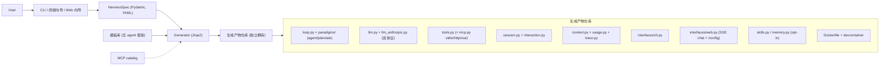

# HarnessSmith 设计与决策总览

> 本目录是 HarnessSmith 的开发与设计参考。本文是入口与「唯一口径」：定位、范围、设计原则、架构、关键技术决策、能力路线图、命名与红线。各能力的详细设计见同目录下的切片子文档。
>
> 协作硬约束见项目根 [`CLAUDE.md`](../../CLAUDE.md)。

## 1. 定位与差异化

一句话：**create-next-app for agent harnesses —— 无 agent 框架锁定 + own-your-code。**

**harness 是什么。** 当下共识浓缩为一个等式：**`Agent = Model + Harness`**。模型负责推理；harness 是让 agent 真正可用的其余一切——编排循环、上下文工程、工具执行、会话状态、记忆、护栏、可观测性。一个标准 harness 的组成：编排循环（ReAct / TAO 状态机）、上下文管理、工具执行层（MCP 是事实标准）、沙箱、状态与记忆、护栏与验证、可观测性、生命周期 hooks。趋势是**模型越强、harness 越薄**——这正是本项目踩中的潮流。

**HarnessSmith 是这层 harness 的生成器。** 通过 Web 向导、终端交互向导、preset 或手写 YAML 采集一份规格（`HarnessSpec`），渲染出一个**完整、独立的 Python 仓库**——可读、可改、可测试、可独立运行；生成即脱离，产物运行期与 HarnessSmith 没有任何关系。

**三个必须打透的差异点：**

- **无 agent 框架锁定（不是「无依赖」）**：生成代码对任何 agent 编排框架（LangChain / LangGraph / ADK）零依赖，循环是你自己的。底座只用通用库（OpenAI SDK / Pydantic / Typer / FastAPI），它们不接管控制流，不构成锁定。
- **own-your-code（eject 即所得）**：产出独立、可读、可删改的仓库；生成后不再依赖 HarnessSmith。
- **配置即生成**：CLI / 向导采集 spec → 一键渲染；关闭的功能不留任何痕迹（无模块、无依赖、无死代码）。

**竞品空位。** 三类赛道：① 无代码 / 托管平台（锁定、隐藏 harness）；② 代码脚手架生成器（`create-agent-app` 绑 LangGraph、`create-google-adk-agent` 绑 ADK、`full-stack-ai-agent-template` 静态模板多框架）；③ 轻量框架 / 教学仓库（是框架或示例，非生成器）。**没有「无 agent 框架锁定 + 可视化配置 + 生成你拥有的薄 harness 代码」的对位项目。** 差异化窗口窄，必须把上述三点打透。

**可行性。** 整体可行，核心不难，难在「做全 + 做好」。核心循环（原生 function-calling）走 Chat Completions + tools（provider-agnostic），150–300 行可讲完；代码生成引擎（Jinja2 + spec）、可运行性（uv 契约 + Docker + 冒烟自检）、轻量可观测与护栏均为低中难度。主要风险是 scope 蔓延、差异化不够锐、异构环境跑不起来——对策是按垂直切片推进 + uv/Docker 兜底（见 §7）。

## 2. 范围与能力

### 核心能力（始终生成）

| 能力 | 说明 |
|---|---|
| Agent 循环 | 原生 function-calling 循环（TAO/ReAct 语义，走 `tool_calls`）+ 范式分发 + 生命周期 hooks + 优雅停止 |
| LLM 层 | profile 注册表 + 角色路由（`generation`/`compaction`，可选 `title`/`memory`/`embedding`）+ 按 profile 采样参数 + 超时/重试/fallback + 双协议客户端（OpenAI 兼容 + 原生 Anthropic） |
| 工具注册表 | 装饰器注册 + 风险分级；高风险工具（shell/写文件）默认关，仅 allowlist 显式开 |
| 范式 | `harness/paradigms/` 薄注册表 + 内置 `agent`（默认）/`plan`/`ask`（只读）；`@register_paradigm` 运行期可自加、每轮可切 |
| 会话 | 本地 JSON 持久化、`--continue`/`--resume`、`chat` REPL、崩溃安全检查点 |
| 交互 | `ask_question` 结构化澄清 + HITL 工具确认，CLI/Web 共用一套交互往返底座 |
| 上下文 | 触发条件 / 策略双注册表、工具结果截断、溢出自救 |
| 预算 | 按 LLM 持久 cost 账本（`UsageLedger` → `.harness/usage.json`），per-profile 单价 + `cost_limit` block_stop |
| 提示词 | 系统提示拼装 + 全局 rule 文件（`AGENTS.md`/`CLAUDE.md`/`.cursor/rules` 模式）每轮注入 |
| 可观测性 | 每次 run 的 JSONL trace + token/cost 计数；可选仅本地 debug 日志 |
| CLI | `run`、`chat`、`info`、`test-llm`、`set-key`、`usage`（启用对应模块时另有 `serve`、`mcp`、`memory`） |
| 可运行性 | `uv.lock` + `.python-version`、Dockerfile + `.dockerignore` + devcontainer、`requirements.txt` pip 兜底、mock LLM 测试套件、一键启动脚本 |

### 可选模块（spec 开关；关闭 = 代码与依赖中均不存在）

| 模块 | 说明 |
|---|---|
| Web 界面（`interfaces.web`） | FastAPI + SSE 流式 chat + 分页双语（中/英）`/config` 面板（LLM/Context/Tools/MCP/Paradigms/Prompts/Budget/Observability/System）+ 会话侧栏 + MCP 管理页。改动即时生效并回写 `config.yaml`（保留注释） |
| 产物 TUI（`interfaces.tui`） | 基于 Textual 的全屏终端 agent，与 Web `/config` 全字段对齐（已规划，见 [`13-slice-13-product-tui.md`](./13-slice-13-product-tui.md)） |
| MCP 工具（`mcp.enabled`） | MCP 客户端（stdio / HTTP / SSE）+ allowlist + 风险标记 + 精选 catalog 预填 + 运行期 server 管理（健康探测 + 热重连） |
| Agent Skills（`skills.enabled`） | `SKILL.md` 开放标准发现 + 元数据注入 + 按需加载 |
| 长期记忆（`memory.enabled`） | 自维护 markdown 笔记 + 工具驱动写入 + 整理压缩 + 薄 `@register_memory` 后端注册表 |

### v1+ backlog（不在当前范围）

`forge add` 增量再生成 + 模板升级（结构性护城河，详见 [`14-forge-add-incremental-regeneration.md`](./14-forge-add-incremental-regeneration.md)）、内置极薄 eval / golden-task harness、更多 preset + spec 分享、supervisor multi-agent（agent 即 tool，固定拓扑，opt-in）、任务清单跟踪、周期预算（天/周/月配额，复用现有 cost 账本）、LLM 支持线剩余项（structured outputs 默认路径、滚动摘要/microcompaction/缓存友好压缩，详见 [`15-llm-robustness-and-context.md`](./15-llm-robustness-and-context.md)）、RAG ingest + sqlite-vec、联网 MCP registry、发布拓扑「`/config` 与公开面隔离」、`/config` 热重载进阶、keyring、配置级 shell hook、context offload、sandbox-aware shell 工具 wrapper、自定义 slash command / 插件 marketplace。

## 3. 设计原则

**生成器能力 ≠ 默认产物模板**（化解「薄 harness」与「功能多」的张力）：

- **薄优先**：默认产物模板保持极薄（核心循环目标 150–300 行）；RAG / MCP / context 高级策略 / Web / 记忆等通过 spec 开关按需生成，不塞进默认产物。用户拿到的是「够用且能通读」的最小 harness。
- **可扩展（与无框架同级的核心卖点）**：薄抽象、清晰模块边界（loop / llm / tools / context 各单一职责，可独立替换）；工具、范式、上下文策略/条件、记忆后端都走**同款薄注册表 + 装饰器**（`@tool`/`@register_paradigm`/`@register_strategy`/`@register_condition`/`@register_memory`）——新增 = 写函数 + 注册 + 配 `config.yaml`，不改核心循环；生命周期 hooks（`before_step`/`after_step`/`before_tool`/`after_tool`/`on_error`）挂护栏/日志不动核心；关键扩展点经 `info` / `GET /registries` 可发现。
- **生成器 / 产物分离**：你写的是生成器，它渲染独立产物仓库；任何时候分清在改哪一层。
- **统一配置**：单一 `config.yaml`（非密钥）+ `.env`（密钥真值，gitignored）；`config.yaml` 只存 env 引用名。`harness/config.py` 启动加载 + Pydantic 校验，全局唯一入口。

**配方 vs 活旋钮（控制面边界）**：`spec` = 生成什么 + 初值；`config.yaml` = 运行期**权威**源。行为性配置（模型/profile、prompt、预算数值、启用工具、context 参数、定价…）全部运行期可改；**结构性配置**（有无某接口/模块、范式拓扑 = 决定生成哪些代码）只能重新生成或将来 `forge add`。运行期配置面板**生成进产物自身的 Web 接口**（产物自持），HarnessSmith 不做中心化配置管理/托管——守「生成后不再依赖 HarnessSmith」。

## 4. 权限与控制面（两轴）

把「配方 vs 活旋钮」显式拆成两条正交的轴。生成器的价值锚点在**结构轴（代码 / 能力的有无）**，不在行为轴的「值」。

- **结构轴（生成期 / 代码 / 生成器拥有 = 能力天花板）**：哪些工具被编译进产物、有无 `/config` 面板及其可编辑范围、接口 / 模块 / 范式拓扑。只能重新生成或将来 `forge add` 改，运行期改不了。**安全相关的「能力面」属这一轴。**
- **行为轴（运行期 / 值 / `config.yaml` + `/config` 拥有 = 天花板内调参）**：同一段代码怎么调——prompt、预算数值、采样旋钮、定价、已编译工具里此刻 enable 哪些。可改，且改了不构成安全边界。
- **allowlist 只收窄、不扩张**：运行期 tool allowlist 只能在已编译进的集合内收窄，永远 enable 不了一段没生成进来的代码。要锁死某能力 = 生成期就不编译进去（用「缺席」强制）。
- **天花板 vs 地板**：生成器能设能力天花板（靠缺席强制），但设不了地板（无论谁跑都至少拦住 Y）——因为代码所有者可改源码。**own-your-code 与「对代码所有者强制权限」天然互斥。**
- **两种威胁模型**：A 护栏（可信但会手滑）= 生成期能力天花板 + 危险工具默认不编译/默认关 + 预算上限 + HITL 确认，由生成器负责；B 强制（不可信 / 对手）= harness 自身做不到，须靠外部沙箱 / 容器（Docker 一等公民）、自托管或后端凭证作用域。守「不做生产级权限系统」红线。
- **部署拓扑决定运行期配置安不安全**：① 分发仓库——每个收件人都是代码所有者（模型 B），只有天花板没有地板；② 管理员托管 + 接口发布（更常见）——终端用户在网络接口另一侧、够不着代码与 `config.yaml`，此时边界 = 网络接口，管理员能对终端用户强制地板，运行期配置可改也安全。**前提：管理面（`/config`、`/mcp/*`）必须与公开面隔离**（鉴权 / 绑 localhost / 生成期开关），且为单租户；隔离本体见 §8 v1+ backlog。

## 5. 架构与目录

两层：**生成器（HarnessSmith 本体）** 与 **生成产物（独立 harness 仓库）**。



spec 决定**结构**（哪些能力被编译进产物）；产物 `config.yaml` 是行为的**运行期权威**，全部可在不重新生成的前提下调整。

**生成器目录**（仓库根，独立 git repo，MIT；支持 `uvx harnessmith new` 免安装运行）：

- `harnessmith/spec.py` — `HarnessSpec`（Pydantic v2 + YAML，带 `version`，`extra="forbid"`）。字段：`version` / `project_slug` / `display_name`（人类可读显示名，渲染进产物 UI 标题与 README，空则回落 slug；wizard 由它派生 slug）/ `language`（产物 web 默认 UI 语言 `en`/`zh`）/ `llms`（每 profile 含 `provider: openai|anthropic`，默认 `openai`）/ `roles` / `prompts`（`system` + `rules_files` 种子）/ `tools` / `paradigms`（多选 `Literal["agent","plan","ask"]`，默认 `["agent"]`）/ `interfaces`（`cli`/`web`/`tui`）/ `mcp.enabled` / `skills.enabled` / `memory.enabled` / `observability` / `context`（种子）/ `rag` / `secrets` 预留。
- `harnessmith/generator.py` — 渲染模板（含按 spec 条件渲染）→ 写出仓库 + 拷入 `harness.spec.yaml` 快照 + `git init` + `uv lock` + 重跑警告不覆盖 + 生成后冒烟自检。
- `harnessmith/cli.py` — Typer 入口（`new` / `--spec` / `--preset` / 交互模式 / `wizard` / `doctor` 预检 / `--no-verify`）。
- `harnessmith/scaffold.py` — 生成器与 CLI 向导共享的烤默认 / catalog 策展 / slug 派生（纯 stdlib，不引 FastAPI）。
- `harnessmith/cli_wizard.py` — 终端交互向导（questionary）。
- `harnessmith/wizard/` — Web 向导（FastAPI + 单页静态表单，`[wizard]` extra，绝不进入产物）。
- `harnessmith/catalog/mcp_servers.yaml` — 精选静态 MCP catalog（wizard/CLI 预填数据源）。
- `harnessmith/presets/` — 现有 `coding-assistant`（rag-research / example 为 backlog）。
- `harnessmith/templates/` — 生成产物 Jinja2 模板。

**生成产物骨架**（无 agent 框架）：

- `pyproject.toml` — 最小依赖：`openai`、`anthropic`、`pydantic`、`pydantic-settings`、`pyyaml`、`typer`；`fastapi`/`uvicorn`/`ruamel.yaml`（web/tui）、`mcp`（mcp）、`textual`（tui）按 spec 开关进出；**断言无 langchain/langgraph/adk**。
- `config.yaml` + `harness.spec.yaml` + `.env.example` + `LICENSE`（+ `RULES.md` 当 `prompts.rules_files` 种子化时）。
- 可运行性文件：`uv.lock` + `.python-version` + `requirements.txt` + `Dockerfile` + `.dockerignore` + `.devcontainer/` + `<显示名>.{sh,bat}` 一键启动脚本。
- `src/<pkg>/harness/` — `config` / `loop` / `llm` / `llm_anthropic` / `tools` / `trace` / `usage` / `debuglog` / `prompts` / `hooks` / `session` / `interaction`（+ `context`、`paradigms/`、`mcp.py` opt-in、`skills.py` opt-in、`memory.py` opt-in、`rag.py` v1+）。
  - `usage.py` = 按 LLM 持久 cost 账本（`UsageLedger` → `.harness/usage.json`，cost 由单价派生，`cost_limit` 到达 block_stop）。
  - `debuglog.py` = 可选本地 debug 日志（`observability.debug` 运行期开关，只记名称/计数/耗时，绝不记内容/参数/密钥，绝不上传）。
- `src/<pkg>/interfaces/` — `cli.py`（`run` / `chat` / …，+`--mode`）（+ `web.py` SSE chat + `/config` + 范式下拉，opt-in）（+ `tui.py` 全屏终端 agent，opt-in）。
- `tests/` + `README.md` + `AGENTS.md`（扩展指南）。

## 6. 关键技术决策（唯一口径）

> 子文档若出现不同写法，以本表为准并同步修订。改本表 = 改全局决策，走 `CLAUDE.md §6` 人审。

| 决策项 | 统一口径 |
|--------|----------|
| 名称 / 包 | 项目 `HarnessSmith`；生成器包/CLI `harnessmith`；产物默认包名 `agent_harness`（spec `project_slug` 可覆盖）。命名取 harness + smith（仿 locksmith/wordsmith），寓意「打造你自己 harness 的工匠」。产物**显示名**走 spec `display_name`（人类可读，用于 UI 标题/README） |
| 许可 / 仓库 | MIT；GitHub `EpisodeYu/HarnessSmith` |
| LLM 底座 | openai 官方 SDK + `base_url`（provider-agnostic） |
| LLM API 面 | **Chat Completions + `tools`，不用 Responses**（兼容第三方 / 本地 OpenAI 兼容端点）。**原生 OpenAI+Anthropic 双规范 = 内建第二条**：`LLMProfile.provider: openai\|anthropic`（默认 `openai`），`anthropic` profile 走原生 Messages（`harness/llm_anthropic.py`，双向映射进/出 loop 的 OpenAI 形状；adaptive thinking + `effort`、Opus 系静默跳过被禁采样参数）；每个产物恒带两个 client + `anthropic` 依赖，运行期 `/config` / 手改 yaml 即切（openai-only 运行不 import anthropic SDK）。配套 provider-neutral 思考流通道（`on_thinking` / Web `event: thinking`）。详见 [`125-slice-12-anthropic-dual-spec.md`](./125-slice-12-anthropic-dual-spec.md)；再改本面需人签 `CLAUDE.md §6.4` |
| 循环 | 原生 function-calling（非文本解析 ReAct） |
| 模板 / spec | Jinja2；`HarnessSpec` = Pydantic v2 + YAML，带 `version`；运行期 pydantic-settings |
| Python / 工具 | Python 3.11+；`uv`（lock + 自动管 Python + 隔离 venv） |
| 可运行性契约 | 产物随仓库带 `uv.lock` + `.python-version`；默认生成 `Dockerfile` + `.devcontainer`；生成器默认对新仓库冒烟自检；`requirements.txt` 作 pip 兜底 |
| 安全（轻量，本地自用） | 密钥不入 git（`config.yaml`/`harness.spec.yaml` 只存 env 引用名，真值放 `.env`）；高风险工具（shell/写文件）默认关，仅 allowlist 显式开；沙箱 / keyring / 全链路 redaction 推迟。产物提供 write-only `.env` 助手（CLI `set-key` + Web `POST /env`/LLM tab）把 key 真值只写本地 gitignored `.env`、不回显、不进 git/spec/trace。**例外**：wizard 产物对「高风险工具默认关」基线有意松动——默认启用 desktop-commander（shell + 全盘文件读写）并默认 `confirm: high`（对所有 `risk=high` 工具走 HITL 逐次确认），安全由 HITL 兜底（威胁模型 A，非安全边界；真隔离仍靠 Docker / 生成期不编译）。仅限 wizard 产物；`coding-assistant` preset / CLI 默认仍维持高风险默认关。**MCP 管理面增删/编辑 server = 新安全面**（网页可让产物 spawn 任意本地命令），按本地可信定位，勿对公网暴露 `/config`/`/mcp`/`/fs`（`/fs/list` 目录浏览同属本地可信，仅列目录名、不读文件内容） |
| MCP | **stdio 本地 + 远程 HTTP/SSE 传输**；生成期只决定 on/off（`spec.mcp.enabled` + `mcp` 依赖），server/tool/传输全运行期 `config.yaml`（用户可自带 server，无白名单；安全闸 = tool allowlist + 风险标记 + 密钥按 env 名）。catalog = MCP 预设静态精选 + wizard/CLI 预填数据源（非编译进产物、非安全闸）；**因产物无内置实用工具，MCP 预设兼做「基线能力来源」**（`fetch` / `ddg-search` / `git` / Desktop Commander，离线靠生成期预热 + Docker 烤镜像），海量扩展走 marketplace 文档 + Composio 式 remote MCP。联网 MCP registry / `forge add` 仍 v1+ |
| 范式 / multi-agent | 默认 `agent`（ReAct 式 tool-calling 循环）；生成期多选 Agent/Plan/Ask（对齐 Cursor 三件套）渲染共存薄循环、运行期每轮选一种（CLI `--mode` + Web 下拉；`enabled`+`default` 进 `config.yaml`，首项种默认）；Plan/Ask 只读（只 offer 非高风险工具 + 执行期拒绝集合外调用）。**范式可扩展 = 与 tools 同款薄注册表 + `@register_paradigm`**，运行期用户可自加；内置范式各自自包含、互不 import；注册表始终存在。反思不作独立范式（agent 已在线自纠；Reflexion 作 `AGENTS.md` 用户扩展范例，需真实成功信号）。**一种 supervisor multi-agent（agent 即 tool，固定拓扑，生成为自有代码，opt-in）排 v1+**；禁通用多 agent 编排框架 / 工作流 DSL / 动态图引擎 / 运行期范式抽象层 |
| 系统提示 / 全局 rule | 产物 `prompts.rules_files` 列出的 markdown 文件注入每轮系统提示（开放 `AGENTS.md`/`CLAUDE.md`/`.cursor/rules` 模式；根目录 `CLAUDE.md` 自动识别注入，`AGENTS.md` 故意不自动注入）。运行期活旋钮（`config.yaml` 权威），`spec.prompts.rules_files` 仅种子；`prompts.py` 始终带机制（空=零效果）。rule 常驻（每轮全文）vs SKILL 按需（相关才加载）。配置级 shell hook = v1+ backlog（代码级 `Hooks` 已覆盖同等扩展） |
| 对话级工作目录（issue #3） | **每 session 选一个工作目录，仅作上下文注入系统提示供 LLM 参考、非围栏**。`build_system_prompt(config, working_dir=None)` 拼一条独立注记（"Working directory (for reference): …; a hint, NOT a restriction"），不设=逐字节 no-op、与 `spec.mcp` 门控解耦。**不动 `HarnessSpec` schema**（纯运行期/session 级，默认进程 cwd，不命中 `CLAUDE.md §6.1`）；**始终注入但默认 no-op**（更简、广泛有用）。**不 `os.chdir`、不做路径围栏/沙箱**（Web 单进程多 session 靠每轮按 session 注入避免串台）。透传链：CLI `--cwd` / `chat` 的 `/cwd`、Web `/chat?cwd=` → `loop.run(working_dir=)` → 三范式 → `build_system_prompt`；随 session 落盘（`session.cwd_of`，老 session 无字段安全回落）。Web 目录浏览 `GET /fs/list`（仅列子目录名、本地可信、勿公网暴露）。红线：真隔离仍靠 Docker / 生成期不编译，本片不引入任何访问限制 |
| 技能 | 支持 **Agent Skills 开放标准**（`SKILL.md` + 渐进披露 L1 发现注入 / L2 文件工具或 `read_skill` 读正文 / L3 脚本经工具跑），`spec.skills.enabled` 门控、不引框架；技能脚本 = 高风险默认关。**扩展可发现性**：产物 `GET /registries` + CLI `info` 内省注册表（`PARADIGMS`/`STRATEGIES`/`CONDITIONS`/`memory backends`），Web 配置页据此渲染下拉/勾选列表、对未注册名字标 ⚠ |
| context 默认 | strategy `summarize` + 触发条件 `triggers`；**默认触发 usage 驱动的 `window_pct: 0.85`**（真实上一步 `prompt_tokens` ÷ 该 profile 的 `context_window`；`context_window` 默认不填 → 该条件不触发，靠工具结果截断 + 溢出自救兜底，不误伤大窗口模型），另有 `max_tokens`（绝对值，真实 usage 优先、字符估算兜底首调用）、`max_turns`。条件可组合（`combine: or/and`），策略/条件走薄注册表（`@register_strategy`/`@register_condition`，运行期可自加，非抽象层；自定义条件旧 2 参签名向后兼容）。`summarize` 无 compaction 角色时回落首个 profile。`max_tool_result_chars`（默认 100k，0=关）为入历史前第一道闸。offload 仍 v1+ |
| 记忆 / 长期记忆 | 跨会话长期记忆 = spec 开关式可选模块（`spec.memory.enabled`，默认关、关闭零痕迹）。内置 `file` 后端 = 一份自维护 markdown 笔记（`.harness/memory.md`，不落密钥），每轮注入系统提示；工具驱动写入（`memory_read`/`append`/`write`，read=safe、写=high）。可扩展 = 薄注册表 `@register_memory`，后端契约 `recall`/`record`（必需）+ `tools()`/`on_session_end`/`on_compact`（可选）。记忆 ≠ RAG。人工管理：CLI `memory`（show/clear/path/consolidate）+ Web Memory 配置 tab。整理（`consolidate`/`auto_consolidate`）用专用 `memory` 角色（未设回落首个 profile）、走会话边界/手动、不进回复 hot path。红线：不得演变为云托管记忆服务/agent 框架 |
| 预算 | **按 LLM 持久 cost 账本 + 限额**：产物 `harness/usage.py` 的 `UsageLedger` 按 profile name 把 token 用量持久累计到 `.harness/usage.json`（跨 run/重启；统计口径 = 主 generation + compaction，经 `Trace.add_usage` 记账；title/memory 不计），cost 由各 profile 当前单价派生（`input/output/cached_input_cost_per_million`）。每 profile `cost_limit`（同币种，0=不限）；累计 cost ≥ cost_limit → 调用前阻止该 LLM 并优雅停本轮（`stop_reason="llm_budget"`）+ 提醒（block_stop，不自动 fallback）。单价 + 限额 = 运行期活旋钮（Web Budget 页唯一入口 / CLI `usage`），spec 无 budget 块；清空手动。天/周/月周期配额仍 v1+（复用同账本） |
| 配置控制面 | spec = 配方（生成什么 + 初值）；`config.yaml` = 运行期权威活旋钮（行为性配置全可改）；结构性变更（接口/模块/范式拓扑 = 代码）需重新生成或 `forge add`。运行期配置面板生成进产物自身 Web（产物自持），HarnessSmith 不做中心化配置/托管 |
| 权限 / 控制面两轴 | 详见 §4。结构轴（生成期 = 能力天花板）vs 行为轴（运行期 = 天花板内调参）；安全相关「能力面」属结构轴，allowlist 只收窄不扩张；威胁模型 A 护栏由生成器负责、B 对手强制靠容器 / 自托管 / 后端凭证作用域 |

## 7. 可运行性保障与验证标准

目标：让生成产物在用户各异的环境中开箱即跑。原则：复用 uv + 容器两条成熟路径，不自造环境/依赖/版本管理层，也不为减依赖而手写 Web/SSE 轮子。

1. **uv 作为唯一环境契约**：产物随仓库带 `pyproject.toml` + `uv.lock` + `.python-version`；uv 自动下载匹配 Python + 建隔离 venv，`uv sync` 一键就绪。
2. **依赖最小化由 spec 决定**：默认产物只含纯 Python / 通用 wheel 依赖；Web/MCP/RAG 等按 spec 开关进出——「生成什么才依赖什么」。
3. **生成期锁定**：写完仓库后跑 `uv lock`（universal resolution，跨平台），避免解析漂移。
4. **生成后冒烟自检（默认开）**：`uv sync` → import 自检 → mock LLM 跑一步 function-calling → `pytest -q`，全绿才报「可运行」；`--no-verify` 可关；另提供 `harnessmith doctor` 预检。
5. **Docker 一等公民（默认生成）**：每个产物默认生成 `Dockerfile` + `.dockerignore` + `.devcontainer/`（基于官方 uv 镜像），是「环境实在各异 / 不想动本机」用户的最强兜底。
6. **pip 兜底**：`uv export` 同时产出 `requirements.txt`，README 提供 `python -m venv` + `pip install -e .` 备选。
7. **原生依赖兜底（v1+）**：`sqlite-vec` 落地时配 numpy 余弦纯 Python 兜底。

**验证标准（blocker）**：黄金快照（preset spec 生成 → `uv sync && pytest` 全绿 → mock 跑通一次 function-calling）；生成后冒烟自检通过；Docker `build` + `run` 跑通 mock 一步；断言生成的 `pyproject.toml` 不含 langchain/langgraph/adk；扩展点（新注册 tool + 挂 hook 无需改核心）；JSONL trace + token/cost 计数正确；预算停止单测；密钥不入 git；生成器自身（spec 校验、模板渲染、`uvx harnessmith new` 冒烟）；`ReadLints` 无新增告警。可选模块（Web/MCP/范式/context/记忆等）做到即验。

## 8. 能力路线图（切片地图）

> 本目录按**垂直切片**组织：每片是一个端到端可生成 + 可跑 + 测试绿的内聚能力。下图是能力地图，详细设计见各切片子文档。


| 切片 | 子文档 | 主交付物 |
|------|--------|----------|
| **Slice 0** 骨架 | [`01-slice-0-scaffold.md`](./01-slice-0-scaffold.md) | `HarnessSpec` 最小字段 + Jinja2 生成引擎 + 写出仓库 / 拷 spec / `git init` / 重跑警告 |
| **Slice 1** 黄金路径 | [`02-slice-1-golden-path.md`](./02-slice-1-golden-path.md) | 薄模板核心 + 原生 function-calling + 工具注册表 + 预算停止 + CLI `run` + JSONL trace + 可运行性保障 + coding-assistant preset |
| **Slice 2** 路由 + 上下文 | [`03-slice-2-routing-and-context.md`](./03-slice-2-routing-and-context.md) | 多 LLM profile + `client_for(role)` + context `truncate`/`summarize` |
| **Slice 3** 产物 Web | [`04-slice-3-product-web.md`](./04-slice-3-product-web.md) | FastAPI + SSE token 级流式 chat + 运行期 `/config` 面板（回写 `config.yaml` 保留注释）+ 按 spec 条件渲染文件机制 |
| **Slice 4** MCP 工具 | [`05-slice-4-mcp-tools.md`](./05-slice-4-mcp-tools.md) | MCP client（stdio + 远程 HTTP/SSE）+ allowlist + 风险标记；生成期只 on/off，server/tool/传输全运行期 |
| **Slice 5** 多范式 | [`06-slice-5-paradigms.md`](./06-slice-5-paradigms.md) | 生成期多选 Agent/Plan/Ask → 共存薄循环 + 运行期每轮切 + `@register_paradigm` 用户可自加；Plan/Ask 只读 |
| **Slice 6** 工具基线 + SKILL | [`07-slice-6-tools-and-skills.md`](./07-slice-6-tools-and-skills.md) | MCP 预设做基线（fetch/ddg-search/git/Desktop Commander）+ catalog + 离线/Docker；标准 Agent Skills（`SKILL.md` 渐进披露） |
| **Slice 6B** 全局 rule | [`075-slice-6b-global-rules.md`](./075-slice-6b-global-rules.md) | `prompts.rules_files` 注入每轮系统提示；根 `CLAUDE.md` 自动识别 |
| **Slice 7** wizard + 分页配置 | [`08-slice-7-wizard.md`](./08-slice-7-wizard.md) | 生成器 Web/CLI 向导（结构-only + 行为性烤默认）+ 产物分页双语 `/config` + `display_name`/`language` spec 字段 + 写入式 `.env` 助手 + 一键启动脚本 |
| **Slice 8** 会话持久化 | [`09-slice-8-sessions.md`](./09-slice-8-sessions.md) | 会话落盘（`.harness/sessions/<id>.json`）+ CLI `--continue`/`--resume` + `chat` REPL + Web 续聊 + 会话侧栏 + LLM 自动起标题 |
| **Slice 8B** 跨会话记忆 | [`095-slice-8b-memory.md`](./095-slice-8b-memory.md) | 自维护 markdown 长期笔记 + 工具驱动写入 + 薄 `@register_memory` 后端 + 整理压缩（专用 `memory` 角色） |
| **Slice 9** 停止/继续/重问 | [`10-slice-9-stop-resume-reask.md`](./10-slice-9-stop-resume-reask.md) | 协作式取消（停止）+ 崩溃安全续接（per-step write-ahead + status + 修复悬挂 tool_use）+ Web 重问破坏式截断重生 |
| **Slice 10** HITL + ask_question | [`11-slice-10-hitl-and-ask.md`](./11-slice-10-hitl-and-ask.md) | 交互往返底座（`interaction.py`）+ ask_question 内置工具 + HITL 工具确认（`confirm` none/high/all/名，四档 allow）；非交互 fail-closed |
| **Slice 11** MCP 健康/管理 | [`12-slice-11-mcp-management.md`](./12-slice-11-mcp-management.md) | 产物 Web MCP 管理页（增删改 + 红绿点 + 热重连）+ Tools 页大复选框 + CLI `mcp status` + SSE 传输 + 常驻 manager 三方一致性 |
| **Slice 12** Anthropic 双规范 | [`125-slice-12-anthropic-dual-spec.md`](./125-slice-12-anthropic-dual-spec.md) | 原生 Anthropic Messages client（双向映射）+ 双协议内建 + 推理流式 UX（思考流通道 + Web 四态可视化） |
| **Slice 13** 产物 TUI | [`13-slice-13-product-tui.md`](./13-slice-13-product-tui.md) | 基于 Textual 的全屏终端 agent（连续对话 + 与 Web `/config` 全字段对齐 + 未配 LLM 引导）；opt-in、关掉零痕迹（已规划） |
| **v1+** | [`14-forge-add-incremental-regeneration.md`](./14-forge-add-incremental-regeneration.md)、[`15-llm-robustness-and-context.md`](./15-llm-robustness-and-context.md) | `forge add` 增量再生成 / eval harness / 更多 preset / supervisor multi-agent / RAG / 联网 MCP registry / 发布拓扑隔离 等 |

## 9. 命名约定

- Python 包：生成器 `harnessmith`，产物 `<project_slug>`（默认 `agent_harness`），统一 snake_case。
- spec 文件：生成期 `harness.spec.yaml`；运行期 `config.yaml` + `.env`。
- 角色名：`generation` / `compaction` / `title` / `memory`（记忆管理，仅 memory 开启时）/ `embedding`（可扩展）。所有非 generation 角色未设时回落第一个 profile。
- 测试：`tests/test_*.py`；黄金快照测试单独标记（慢测，可 `-m golden`）。

## 10. 开发规则与红线

- **Conventional Commits**；`main` 不受保护，门禁全绿后 Agent 可直接 commit + push `main`（不 `--force`、测试未绿不推；见 `CLAUDE.md §8`）。
- **测试硬门槛**：黄金路径 + 可运行性自检（见 `CLAUDE.md §5`）。生成器项目的「完成」以生成产物能跑通为准。
- **薄优先 + 两层心智**：见 `CLAUDE.md §2 / §4`。任何给默认产物加依赖的冲动，先回看 §6 决策表与 `CLAUDE.md §6`。

**明确不做（保护定位）**：生产级权限系统、云托管、通用多 agent 编排框架 / 工作流编排 DSL / 动态图引擎 / 运行期范式抽象层、在线 MCP registry、沙箱、HarnessSmith 侧中心化配置/托管。

> multi-agent 不是一刀切禁掉——红线是「通用编排框架」。允许 v1+ 做一个具体、固定拓扑、生成为自有代码的 supervisor 模式（opt-in）。跨会话长期记忆不在红线之列——它做成薄 + spec 开关 + 不落密钥 + 薄注册表，但不得演变为云托管记忆服务。

## 11. 完成报告模板（每个任务完成后输出）

```markdown
## 任务:<goal>(Slice N)

### 交付物
- <文件/模块/模板/测试变更点>

### 自验证结果
- [x] 黄金路径:示例/preset 生成 → `uv sync && pytest` 全绿 → mock 跑通一次工具调用
- [x] 无框架断言:生成的 pyproject 不含 langchain/langgraph/adk
- [x] 生成后冒烟自检:通过
- [x] (大改动)Docker 冒烟 / `uvx harnessmith new` 冒烟:通过
- [x] ReadLints:clean

### 留给人审的项
- <生成产物是否够薄/可读;UX;命名是否对外可读>

### 自主决策记录(CLAUDE.md §5.3)
- <一句话:选了什么 / 理由>

### 剩余风险 / 已知问题
- <记入 TODO 而非本任务范围的项>

### 下一步建议
- <自然的下一任务>
```

> 没有这份报告 → 任务未结束。5 段都不能空,但越简短越好。

## 12. 阅读顺序

`CLAUDE.md` → 本文（`00-overview.md`）→ 当前切片子文档（只读相关那份）。
