# 02·00 - 开发规划总览

> Plan 第 3 部分(开发)的入口。本目录按**垂直切片(vertical slice)**拆分,每个切片是一个端到端可生成 + 可跑 + 测试绿的增量。
>
> 本项目采用 **vibe coding 模式**:Agent 主导执行、人主导决策与节奏。协作硬约束见项目根 `CLAUDE.md`;定位 / 范围 / 决策见 `docs/01-project-plan.md`。下文"开发者要做 X"一律理解为"Agent 要做 X,由人按切片门禁验收"。

## 0. Agent 入场指南

1. 读完 `CLAUDE.md` + `docs/01-project-plan.md`。任一条不清楚,停下问人。
2. 以**代码 / 测试的实际状态**确认当前进展,不要只信文档默认描述。
3. 找到当前切片(见 §2):上一个切片门禁未全绿 → 从它继续;已完成且下一个没开始 → 主动问人"要不要进下一片"。
4. 在该切片子文档里挑 1 个未完成"交付物"作为本次任务。
5. 按 `CLAUDE.md §7` 的 plan → implement → self-verify → handoff 循环走,完成后输出 §8 完成报告。

> **不要**一次把所有子文档读完当上下文。每次只读当前切片相关的那一两份。

## 1. 为什么用垂直切片(而非瀑布式横向模块)

- 本项目是**生成器 + 薄产物**,最大风险是"集成留到最后才炸 / 复杂度失控"。垂直切片让每片都端到端跑通,**最早验证差异化**(无 agent 框架 + own-your-code + 可运行)。
- 不按 `loop / llm / tools / rag / web` 横向逐个堆完再集成。每个切片纵向穿过"spec → 生成 → 产物可跑 → 测试绿"。
- 切片之间有**完成门禁**:上一片门禁不全绿,不进下一片(除非某任务独立且人明确允许)。门禁内部的任务拆分与排序由 Agent 自主决定。

## 2. 切片路线图与完成门禁

```mermaid
graph LR
    S0["Slice 0 骨架<br/>spec + 渲染引擎"] --> S1["Slice 1 黄金路径 ★<br/>生成可跑的薄 harness"]
    S1 --> S2["Slice 2 路由+上下文<br/>profiles/role + context"]
    S2 --> S3["Slice 3 产物 Web<br/>chat SSE + /config 面板"]
    S3 --> S4["Slice 4 MCP 工具<br/>stdio + 远程 + allowlist"]
    S4 --> S5["Slice 5 多范式<br/>注册表 + 运行期切/扩展"]
    S5 --> S6["Slice 6 工具基线+SKILL<br/>MCP fetch/git/DC + Agent Skills"]
    S6 --> S6B["Slice 6B 全局 rule<br/>AGENTS.md/CLAUDE.md 注入"]
    S6B --> S7["Slice 7 wizard<br/>表单产 spec"]
    S7 --> S8["Slice 8 会话持久化 ★必做<br/>session 落盘 + resume/--continue"]
    S8 --> S8B["Slice 8B 跨会话记忆 ★必做<br/>长期笔记落盘 + 跨会话续跑"]
    S8B --> S9["Slice 9 停止/继续/重问 ★必做<br/>会话时间旅行(基于 sessions;原文件级 Checkpoints 撤销)"]
    S9 --> S10["Slice 10 HITL + ask_question ★必做<br/>交互确认 + 模型主动问(共用一套交互底座)"]
    S10 --> S11["Slice 11 MCP 健康/管理 ✅<br/>mcp status + 面板增删改/热重连 + SSE"]
    S11 --> S12["Slice 12 Anthropic 双规范 ✅<br/>原生 Messages + 推理流式"]
    S12 --> V["v1+ (Slice 13+)<br/>forge add / eval / presets / multi-agent / RAG / …"]
```



> **切分说明(人已定向,2026-06)**:原"Slice 2 接口与配置 / Slice 3 工具生态"过胖,已按中粒度重切为每片 = 一个内聚能力。**2026-06-05 再切**:原 Slice 5(wizard+范式+MCP 基线)过大,拆为 **Slice 5 多范式 / Slice 6 工具基线+SKILL / Slice 7 wizard**(原"Slice 6+ v1+"顺延为 Slice 8+)。旧子文档 `03-slice-2-interfaces-and-config.md` / `04-slice-3-tools-ecosystem.md` / `06-slice-5-wizard-and-paradigms.md` 已被取代(细节见 git 历史)。**2026-06-07(人定向)**:MVP(S0–S7)收口后,把对标 2026 事实标准 harness 找出的三个标配缺口立为 **v1 必做** 切片 **Slice 8 会话持久化 / Slice 9 Checkpoints / Slice 10 HITL 交互确认**(原 Slice 8+ v1+ 顺延为 Slice 11+;HITL 确认从原 Slice 8+ 内嵌登记升格独立;**注:Slice 9 Checkpoints 后于 2026-06-08 评估撤销,见下方②**);并把**跨会话全局记忆**从 v2 上移 v1(记入 Slice 11+,排期/拆片实现前细化)。对标分析见 [`../03-feature-landscape-and-proposals.md`](../03-feature-landscape-and-proposals.md),头号差异化 `forge add`/增量再生成的详设见 [`../04-forge-add-incremental-regeneration.md`](../04-forge-add-incremental-regeneration.md)。子文档 8/9/10 在各自实现前再细化。**2026-06-07(人定向排期)**:对 v1 后续做了一次优先级与配对排期——① **跨会话记忆**从 Slice 11+ 上移为紧接 Slice 8 的 **Slice 8B**(共用会话落盘基础设施,沿用 Slice 6B 的插入式编号、不重排已锁的 9/10);② **Slice 9 Checkpoints + Slice 10 HITL 确认**原确认为**一组"工具护栏对"相邻一起做**(共用 `before_tool` 挂点 + Web SSE 审批管道);**但 Slice 9 Checkpoints(文件级 git 快照)于 2026-06-08 评估撤销**(git 只盖产物仓库工作树、盖不住 MCP/绝对路径写,做对即需整套 workspace 子系统违"薄";改由用户自管 git + HITL + Docker 覆盖,详见 [`../03-feature-landscape-and-proposals.md`](../03-feature-landscape-and-proposals.md) §3 T1-C),**护栏对解除**;同日(人定向)**Slice 9 槽位重新定义为"停止 / 继续 / 重问"(会话级时间旅行,建在 Slice 8 sessions 之上,与文件级回滚是两个层面)**,Slice 10 HITL 独立(详见 [`10-slice-9-stop-resume-reask.md`](./10-slice-9-stop-resume-reask.md));③ **MCP 健康/管理**从 v1+ backlog 升格为 **Slice 11**(三件套+记忆之后的首要方向);④ **原生 Anthropic 双规范 + 推理流式 UX** 升格为 **Slice 12**,§6.4 具体方案已先写出待人签,见 [`../05-llm-dual-spec-anthropic.md`](../05-llm-dual-spec-anthropic.md);⑤ 原 "Slice 11+" v1+ backlog 顺延为 **Slice 13+**(forge add / eval / presets / supervisor multi-agent / RAG 等仍在其中)。**2026-06-09(人定向)**:Slice 10 并入 **ask_question 内置工具**(模型主动澄清,对齐 Cursor AskQuestion),与 HITL 确认**共用一套交互往返底座**(`harness/interaction.py` + CLI/Web asker + 前端结构化卡片 + `POST /chat/{run_id}/respond`,复用 Slice 9 run 注册表);**先做 ask_question、HITL 抒后**;HITL 触发改为不绑 risk 的放行清单(`tools.confirm` none/high/all/名,对齐 Claude/Cursor fail-closed、只读默认豁免)。详见 [`11-slice-10-hitl-and-ask.md`](./11-slice-10-hitl-and-ask.md)。

| 切片 | 子文档 | 主交付物 | 完成门禁(全绿才算完成) | 必须人审的决策点 |
|------|--------|----------|--------------------------|------------------|
| **Slice 0** 骨架 | [`01-slice-0-scaffold.md`](./01-slice-0-scaffold.md) | `HarnessSpec` 最小字段 + Jinja2 生成引擎 + 写出仓库 / 拷 spec / `git init` / 重跑警告 | spec 校验 + 渲染单测绿;能生成一个空壳仓库;`ReadLints` clean | spec 最小字段集是否合理 |
| **Slice 1** 黄金路径 ★核心里程碑 | [`02-slice-1-golden-path.md`](./02-slice-1-golden-path.md) | 薄模板核心(config/llm/loop/tools/hooks/trace/prompts/mock)+ 原生 function-calling(Chat Completions)+ 工具注册表 + 预算停止 + CLI `run` + JSONL trace + 可运行性保障(uv 契约 + 默认 Docker + 冒烟自检)+ coding-assistant preset。**状态:✅ 已完成(38 fast + 3 golden;ReadLints clean;§4 人审已签字)** | `01-project-plan.md §8` **全部 blocker** 通过(黄金快照、无框架断言、生成后冒烟、Docker 冒烟、CLI、tool+hook、trace、预算停止、密钥不入 git、`uvx` 冒烟、preset 生成并 pytest)✅ | **立项假设成立——人已签字 ✅** |
| **Slice 2** 路由 + 上下文 | [`03-slice-2-routing-and-context.md`](./03-slice-2-routing-and-context.md) | 多 LLM profile + `client_for(role)`(generation/compaction/embedding),loop 按角色取 client;context `truncate`(默认)+ 可选 `summarize`(走 compaction 角色)。**状态:✅ 已完成(38 fast + 3 golden;产物自带测试 14;ReadLints clean)** | non-blocker 测试绿:`client_for(role)` 路由(mock)、context 策略单测;关 summarize 时仍薄 ✅ | 角色集合/默认 context 策略是否合理(软确认,无硬门槛) |
| **Slice 3** 产物 Web(自持) | [`04-slice-3-product-web.md`](./04-slice-3-product-web.md) | 产物 `interfaces/web.py`:FastAPI + **SSE chat,默认 token 级流式、可选**(`llm.stream`+`loop.run(on_delta)`,仍 Chat Completions)+ **运行期 `/config` 配置面板**(决策④:行为性配置全可改,进程内即时生效 + **回写 `config.yaml`** 保留注释,2026-06-09 改判,见子文档 §4);spec 开关 `interfaces.web`,关掉则零 Web 痕迹、不含 fastapi/uvicorn/ruamel。生成器新增**按 spec 条件渲染文件**机制。**状态:✅ 已完成,门禁全绿(41 fast + 4 golden);§4 两项人审 2026-06-03 经真实 LLM(`mimo-v2.5-pro`)验收已签字通过** | `/chat` token 流 / 非流(mock)测试 ✅;`/config` 改运行期配置生效 ✅;关 Web 时 `pyproject`/`lock`/`req` 不含 fastapi/uvicorn(薄验证)✅ | Web/UX 一眼是否可用 ✅;配置面板可改字段范围 ✅(2026-06-03 人已签字) |
| **Slice 4** MCP 工具 | [`05-slice-4-mcp-tools.md`](./05-slice-4-mcp-tools.md) | 产物 MCP client(**stdio + 远程 HTTP/SSE**,人 2026-06-03 定向)+ allowlist + 沿用 Slice 1 风险标记。**生成期只决定 on/off**(`spec.mcp.enabled` + `mcp` 依赖,关掉零痕迹);**server/tool/传输全运行期** `config.yaml`(tool allowlist 可经 Slice 3 `/config` 当场改)。catalog(预设便捷数据源)挪 Slice 5 wizard。**状态:✅ 已完成,门禁全绿(45 fast + 5 golden;新增 mcp 端到端真实 stdio 工具调用);`mcp.py` 147 行代码薄;关 MCP 字节一致零痕迹** | MCP stdio 工具调用测试(本地 stdio mock server)✅ + 远程传输路径覆盖 ✅;非 allowlist tool 不注册 ✅;关 MCP 时 `pyproject`/`uv.lock`/`req` 不含 `mcp` ✅ | ① 新增 `mcp.enabled` spec 字段(§6.1)**人 2026-06-05 签字方案 A ✅**;② 远程 HTTP/SSE 纳入 MVP(改全局决策,**人 2026-06-03 已定向 ✅**) |
| **Slice 5** 多范式 + 注册表 | [`06-slice-5-paradigms.md`](./06-slice-5-paradigms.md) | 生成期**多选**范式 **Agent/Plan/Ask**(对齐 Cursor 三件套) → 渲染**共存**的薄循环(各自自包含、互不 import),**产物运行期每轮可切一种**(类 Cursor agent/ask/plan;CLI `--mode`+Web 下拉;清单+默认进 `config.yaml`)**且用户可自加范式**(`harness/paradigms/` 薄注册表 + `@register_paradigm`,同 tools 扩展);Plan/Ask 只读。重塑核心 `loop.py` 为薄分发入口 + 范式注册表(始终存在)。**状态:✅ 已完成(2026-06-05;范式集 `agent/plan/ask` 修订版,见子文档 §4②′)。门禁全绿:生成器快测 54 + 多范式产物自带测试 30 + golden 6(含多范式/uvx/Docker);本机 LiteLLM(`mimo-v2.5-pro`)agent/plan/ask 真实冒烟全跑通;ReadLints clean** | ✅ 多范式生成 `uv sync && pytest` 绿 + 运行期切;✅ 用户自加范式可跑且不改内置/注册表核心;✅ 内置范式互不 import;✅ Plan/Ask 只读不触发高风险;✅ agent-only 行为与 Slice 1–4 一致(非逐字)+ 无新增依赖 | ①–⑪ 人 2026-06-05 定稿;**②′ 当日修订范式集 react/plan/ask/reflection → agent/plan/ask**(调研:Cursor/Claude 只有 Agent/Ask/Plan、无 reflection 开关;reflection 靠真实信号条件触发或被推理模型内化 → 删独立 reflection 范式,Reflexion 作用户扩展范例) |
| **Slice 6** 工具基线 + 标准 SKILL | [`07-slice-6-tools-and-skills.md`](./07-slice-6-tools-and-skills.md) | **MCP 预设做基线**(产物无内置实用工具→能力全由 MCP 提供、不自写 built-in):`ddg-search`(免 key 联网搜索)+ `fetch` 默认开 + `git` 读开/写关 + Desktop Commander 预填一键开(写/shell 默认关,且无启用工具不被启动);`catalog/mcp_servers.yaml`(新建)+ CLI `--mcp-server`/preset `mcp_prefill.yaml` 预填 `config.yaml`(不进 spec/快照);**按工具风险分级**(`safe_tools`→只读范式可用);**系统提示注入环境感知**(OS/shell + 预置但禁用能力如何开,守 §6 不破红线;含 Windows OS 提示);离线靠**生成期预热 + Docker 烤镜像(`UV_OFFLINE=1`)**;海量扩展走 marketplace 文档 + Composio 式 remote MCP。**标准 SKILL**:Agent Skills 开放标准(`SKILL.md` + 渐进披露)——`skills.py` 发现+注入(L1)+ `read_skill`/文件工具读正文(L2)+ 脚本经工具跑(L3);`spec.skills.enabled` 门控、目录走运行期 `config.yaml skills.dirs`。**状态:✅ 已完成(2026-06-05)。Part A(工具基线,commit `d83a85a`)+ Part B(标准 SKILL)门禁全绿:快测 70 + 产物 25/24 + golden 8 + docker 2(MCP 离线基线)** | 基线开箱可用(fetch/git 读默认开、DC 预填默认关)✅ + 离线/Docker 可用 ✅;catalog 落 `config.yaml`✅;极薄 example 仍薄 ✅;SKILL 发现+注入+加载并遵循(mock)✅ + 关 SKILL 零痕迹 ✅ | ① MCP 预设做基线 ✅;② 官方 git 预置 ✅;③ 标准 SKILL 放本片 ✅;④ `spec.skills`=仅 `enabled`、dirs 走运行期(B)✅;⑤ 风险按工具分级(B)✅;⑥ split 推进 ✅(人 2026-06-05) |
| **Slice 6B** 全局 rule | [`075-slice-6b-global-rules.md`](./075-slice-6b-global-rules.md) | 产物 `prompts.rules_files`:列出的 markdown 文件(开放 `AGENTS.md`/`CLAUDE.md`/`.cursor/rules` 模式)注入**每轮**系统提示;`prompts.py` 始终带机制(空列表零效果),`spec.prompts.rules_files` 仅作种子(运行期权威);seed `RULES.md` 时条件生成 starter 文件;零新增依赖。与 Slice 6 SKILL 同源但 **rule 常驻 / SKILL 按需**。**状态:✅ 已完成(2026-06-05;快测 75 + 产物自带 +2 + golden 8 + docker 2;ReadLints clean)** | ✅ 黄金路径(seed rules 的 preset 生成 → `uv sync && pytest` 绿含 rule 注入测试 → mock 跑通);✅ rule 注入生效 + 缺文件跳过;✅ thin 不落 RULES.md / `rules_files: []` / 无新增依赖;✅ 种子进快照;✅ 大改动回归(golden 全量 + Docker) | ① 做薄版全局 rule、排小 slice ✅(人 2026-06-05);② spec 加 `prompts.rules_files` 种子 ✅(人 2026-06-05,触发 §6 改 spec 已签) |
| **Slice 7** wizard + 产物分页配置 | [`08-slice-7-wizard.md`](./08-slice-7-wizard.md) | ① **生成器 wizard**(`harnessforge/wizard/`,FastAPI + 无构建**精简**单页,`[wizard]` extra):**首项选语言(中/英)+ 输入显示名自动派生 slug**,**只采集结构选项**(`paradigms`/`interfaces.web`/`mcp.enabled`+catalog/`skills.enabled`);行为性字段(llms/prompts/budget/tools…)后端**烤默认值**、不在向导露出 → `POST /spec` 校验产合法 spec + 可选一键 `generate()`;只采集 env 名、不进产物。② **产物分页配置页**:把 Slice 3 的 `/config` 重组成**按功能 tab**(LLM/Context/Budget/Tools/Prompts/Paradigms/Observability)+ **中英切换**,**作为 LLM/prompts/budget 等行为性配置的正式入口**(产物**不做 wizard/首启**)。新增 `spec.display_name`(纯标签)+ `spec.language`(产物 web 默认 UI 语言,**wizard 语言选择贯穿至此**;Agent 回答语言靠模型按输入自动判断 / 产物 Prompts 改);`spec.context` 起种子化 `config.yaml`。**状态:✅ 已完成(2026-06-06;快测 99 + golden wizard 端到端;ReadLints clean)** | wizard 产合法 spec 能 `generate` 出可跑产物(golden);结构-only 表单经烤默认产物开箱即跑;不泄密/不进产物(核心 `dependencies` 无 fastapi/uvicorn);catalog 预填落 `config.yaml`;display_name 渲染进标题/README;产物配置分页 + 中英;字段对外可读(人审②) | ① 全覆盖+按功能分页 ✅(人 2026-06-05);② **2026-06-06 细化**:语言优先+双语贯穿、显示名派生 slug(加 `display_name`,§6.1 已签)、**wizard 瘦身为结构-only + 行为性烤默认(决策 B,行为性配置交产物配置页)**、产物只分页配置不做 wizard、LLM 维持 provider-agnostic + **原生双规范登记 v1+** ✅;③ 对外可读(实现后真实验收) |
| **Slice 8** 会话持久化 ★v1 必做 | [`09-slice-8-sessions.md`](./09-slice-8-sessions.md) | 产物**会话落盘 + 续聊**:一次对话的消息正文落本地(`.harness/sessions/<id>.json` 单文件,**不落密钥**——key 只在 `.env`、永不入 messages)+ CLI `run --continue`/`--resume <id>` **+ `chat` 多轮 REPL** + Web `/chat?session=<id>` 续聊 + 会话列表。**零新增依赖(`json`+`Path`)**;续聊历史预置进所选 paradigm 的初始 `messages`(存正文去 system,system 每轮重建);`RunResult` 带回 `messages`。**状态:✅ 已完成(2026-06-07;快测 117 + golden 11 含 docker + 产物 test_sessions/test_web 全绿;ReadLints clean)。后续增强(同日,对标 Google AI Studio):Web 改全高度双栏壳(左 session 侧栏 + 右全屏)、会话首轮 LLM 自动起标题(可配置 `title` role,缺省回落 generation,`sessions.auto_title` 开关,Web 专属)、空草稿不新建/不持久化、侧栏会话重命名/删除(`PATCH`/`DELETE /sessions/{id}`,路径防穿越)——见子文档 §4b** | 多轮会话存取(mock)绿;续聊历史正确预置;**会话文件不含密钥断言**;`sessions.enabled=false` 仍薄、零新增依赖;Web 续聊(`/chat?session=`→`/sessions/{id}` 回放);`uv sync && pytest` 黄金路径绿 | ① 默认落盘 + `.harness/sessions/<id>.json` 单文件、`--continue` 接最近 **✅ 人 2026-06-07**;② `run --continue/--resume` + `chat` REPL **都做 ✅ 人 2026-06-07**;③ Web 续聊纳入本片 **✅ 人 2026-06-07** |
| **Slice 8B** 跨会话记忆 ★v1 必做 | [`095-slice-8b-memory.md`](./095-slice-8b-memory.md) | **跨会话续跑的持久长期记忆/笔记**:agent 写/读一份**少量、自维护**的 markdown 长期笔记(`.harness/memory.md`,**不落密钥**),每轮注入系统提示;薄注册表 `@register_memory`(同 tools/context/budget/paradigms)让用户写自己的记忆后端(向量库/mem0/…),后端契约 `recall`/`record` + 可选 `tools()`/`on_session_end`/`on_compact`,在各生命周期阶段主动管理记忆。内置 `file` 后端默认;工具驱动写入(`memory_read`/`append`/`write`);CLI `memory show/clear/path` + Web `GET/POST/DELETE /memory`;**生成器向导(wizard)能力组新增"启用长期记忆"开关(默认勾选)**。**与 RAG 严格区分**。对标 Hermes 两层记忆的薄简化版(去 Provider 重协议/云托管)。**状态:✅ 已完成(2026-06-07);后续增量 2026-06-08:补 Web 记忆配置 tab(read_only 开关/后端下拉/容量/`policy` 策略提示/笔记编辑+整理+清空)+ 修复 memory_* 工具误归「你的工具」(归入内置)+ 新增 `policy`/`auto_consolidate` 与 `consolidate`(用 compaction 角色、走会话边界/手动、不进回复 hot path;对标 LangMem/Mem0/Letta);门禁全绿(快测 124 + golden 11 含 docker)** | ✅ 记忆写入/读取/跨会话注入(mock)绿;✅ **记忆文件不含密钥断言**;✅ 关闭零痕迹(memory.py/test 不渲染、config/prompts/context/范式/cli/web 逐字一致)、零新增依赖;✅ 可扩展(自定义后端 + 生命周期钩子);✅ 黄金路径绿 + 大改动回归(golden 全量 + Docker) | ① 存储=markdown 笔记 ✅;② 写入=工具驱动 ✅;③ 默认关+关闭零痕迹 ✅;④ 扩展=薄 `@register_memory` ✅;⑤ 后端契约=中档(recall/record+可选 tools/on_session_end/on_compact)✅(人 2026-06-07 选择器签) |
| **Slice 9** 停止 / 继续 / 重问 ★v1 必做(**槽位 2026-06-08 由撤销的文件级 Checkpoints 重定义为会话级时间旅行**) | [`10-slice-9-stop-resume-reask.md`](./10-slice-9-stop-resume-reask.md) | 建在 Slice 8 sessions 之上的交互控制三件:**停止**(回合中途喊停,连 LLM 思考/输出一并终止;协作式取消令牌穿 loop→`client.stream`,流式逐 chunk `close()`,工具批次跑完不中途打断)+ **继续**(停止/Ctrl+C/断网中断后把进行中 `messages` 存到合法边界,下次发送即带全部上下文续上,LLM 知道之前在做什么;无独立"继续"按钮)+ **重问**(Web 点历史提问就地编辑→内联确认丢后续→从该点截断重生)。**Web 显式 `POST /chat/{run_id}/stop`**;**CLI = SIGINT 停止/继续,不做重问**(对标 Claude CLI:重问靠复杂 rewind TUI,按"支持但复杂→不做")。继续做到**崩溃安全(Tier B)**:per-step 原子 write-ahead + 会话 `status` 标记 + resume 修复悬挂 `tool_use`(对标 Claude Code/LangGraph)。零新增依赖(`threading`/`signal` stdlib),不改 spec/LLM API 面。**状态:✅ 已实现(2026-06-09);门禁全绿(快测 122 + golden 10 + Docker;产物自带停止/取消/checkpoint/崩溃修复/重问测试;ReadLints clean)** | **均人 2026-06-08 签字**:① 步/chunk 边界取消(接受,对标 Cursor);② 显式 stop 端点 + 断连兜底;③ Tier B 崩溃安全(write-ahead+status+修复悬挂 tool_use,不强制注入提示);④ CLI 不做重问;⑤ 破坏式截断(非 fork) |
| **Slice 10** HITL 交互确认 + ask_question ★v1 必做(独立做;2026-06-09 人定向并入 ask_question,两者**共用一套交互往返底座**) | [`11-slice-10-hitl-and-ask.md`](./11-slice-10-hitl-and-ask.md) | **人在环交互层(两能力共用底座)**:① **ask_question 工具(先做)**——模型主动调的内置工具,弹选择题/文本输入卡片澄清,答案回 `tool_result`(对齐 Cursor AskQuestion;默认内置开启);② **HITL 工具确认(后做)**——工具执行边界拦截弹 **allow_once / reject / allow_session / allow_always**(记本会话或写回 `config.yaml`),**触发用不绑 risk 的放行清单** `tools.confirm`=`none`(默认零痕迹)/`high`/`all`/工具名(对齐 Claude/Cursor fail-closed,只读默认豁免),**非交互 / Web 公开面默认拒绝**,让危险工具敢"预置不放行"。**共享底座** `harness/interaction.py`(`Asker` 协议 + contextvar 注入)+ CLI/Web 两实现 + 前端结构化卡片 + Web `POST /chat/{run_id}/respond`(复用 Slice 9 run 注册表);**不改 `before_tool` 语义**(确认走 `interaction.ask()`)。**状态:✅ 共享底座 + 计划 A(ask_question)+ 计划 B(HITL 工具确认)均已完成(2026-06-09;生成器快测 132 + golden 10 + Docker 2 全绿;产物自带 interaction/ask_question/HITL 四档/触发口径/persist_confirm/Web approval 往返测试;ReadLints clean);决策点①②③④全签** | ask_question 弹→回传→答案进 `tool_result`(CLI/Web,mock)绿;HITL allow_once/reject/session/always 四态 + **非交互默认拒绝断言**;`confirm: none` 关闭零痕迹不破坏 golden;**文档讲清"护栏≠安全边界"**(威胁模型 A;锁能力仍靠生成期不编译,`01 §4`) | ① ask_question 不动 spec ✅(人 2026-06-09);② allow 4 档 allow_once/reject/allow_session/allow_always、不加 allow_all_readonly、不放会话级全放行逐次档 ✅(人 2026-06-09);③ 持久度由 session/always 两档表达、默认 session、不另设 remember 旋钮 ✅(人 2026-06-09);④ **是否据此把 shell 默认开**:实现保持默认不动 ✅(确认是额外闸,高危工具仍默认 `enabled: false`、`confirm: none`,未触 `01 §6`) |
| **Slice 11** MCP 健康/管理(三件套+记忆后首要方向,人 2026-06-07 定向;**设计 2026-06-09 定稿**) | [`12-slice-11-mcp-management.md`](./12-slice-11-mcp-management.md) | **MCP server 健康自检 + 管理面 + 三方一致性**:① **产物 Web MCP 管理页**——server 列表 + 连接状态红绿点 + transport + 工具计数/错因,可**增删/编辑** stdio(`command`/`args`/`env名`)与远程(`url`/`auth_env名`/`transport`)server(= 触安全面)+ 热重连;② `<pkg> mcp status`——probe 连通性 + 工具计数 + 不可达标红 + 缺 launcher(Node/uv)提示(产物无 `doctor`;那是生成器脚手架命令);③ **新增 SSE 传输**(`transport: stdio/http/sse`,兼容老 server);④ **三方一致性**(底座:web 进程**常驻 `McpManager` 作唯一真相源** + 保存即**热重连** + **工具注册表重同步**)——Tools 页 MCP 工具状态↔server 真实连接态↔下发给 LLM 的工具集严格一致、及时刷新;⑤ **Tools 页每 MCP 一个"大复选框"**(该 server 全部工具 allowlist 总开关 = server 启停);⑥ **wizard 默认启用 desktop-commander + 默认 `confirm: high`**(高风险默认关基线有意松动,安全靠 HITL 兜底)。**复用** Slice 3 MCP 自动发现(`/mcp/discover`)、`ruamel` 回写、Slice 10 HITL;不改 spec schema、`loop`/`active_names` 语义。**状态:✅ 已实现(2026-06-09);门禁全绿(生成器快测 124 + 产物自带 170 + golden 10 + Docker 2);CLI `mcp status` 与 Web MCP 管理页浏览器实测;ReadLints clean** | `mcp status` 连通性+工具计数+不可达标红(真实 stdio)✅;`/mcp/servers` 增删 → 回写 config.yaml(注释保留)+ 热重连 + registry 重同步 ✅;启用先前未注册的 MCP 工具 → 进 `active_names`/下发 LLM ✅;server 掉线即红 ✅;SSE 传输选择 + header 注入 ✅;不泄密(只 env 名)✅;关 MCP 零痕迹 ✅;大改动回归(golden 全量 + Docker)✅ | **均人 2026-06-09 签字**:① **DC 默认启用 + 默认 `confirm: high`**(触 `01 §6` 安全基线,仅 wizard 产物,HITL 兜底);② 热重连失败 = per-server 失败隔离标红 + 可重试、新 manager 起成功再关旧;③ server 启停 = Tools 页大复选框(不加 per-server `enabled` 字段);④ SSE = 显式 `transport` 字段;⑤ 编辑范围 = 全功能(stdio+远程)+ 文档限定本地可信、纳入 Slice 13+ `/config` 隔离保护;⑥ 架构 = 常驻 manager 唯一真相源 + 热重连 + 注册表重同步,CLI `mcp status` 入本片 |
| **Slice 12** 原生 Anthropic 双规范 + 推理流式 UX(人 2026-06-07 升格 + §6.4 方案待签) | [`../05-llm-dual-spec-anthropic.md`](../05-llm-dual-spec-anthropic.md) | **`llm.py` 第二个 client 走原生 Anthropic Messages**(顶层 `system` / content blocks / `tool_use`+`tool_result` / `effort`+adaptive thinking / Opus 4.7/4.8 禁 `temperature`·`top_p`·`top_k` / prompt caching `cache_control` / structured outputs),把 loop 的消息·工具格式映射进/出;**双协议内建(2026-06-11 人定向,推翻初版"spec 开关/关闭零痕迹"口径):每个产物恒带两个 client + `anthropic` 依赖,`config.yaml` 每 profile 显式 `provider:`(默认 `openai`),运行期 `/config` 面板下拉或手改 yaml 即切,无需重新生成**。同时把 **reasoning/thinking 阶段做成显式流式提示**(`event: thinking` / 思考流推送,治 2026-06-03 真实 LLM 验收发现的"无反应等待")。**状态:✅ 已实现(2026-06-10;人当日签字放行 §6.4 方案,按文档默认口径执行)。门禁全绿:映射纯函数 + 流式拼装产物自带测试(`tests/test_llm_anthropic.py`,不需真 key,恒渲染、随每个产物 pytest 跑);双协议内建断言(`test_default_product_ships_dual_protocol`);anthropic golden(生成 → `uv sync` → 产物 pytest → mock);思考流 mock 测试(harness + web SSE);全量 golden + Docker + uvx 回归。真实端点验收 ✅(2026-06-11,人提供 key):MiMo `mimo-v2.5` + DashScope `qwen3.6-flash` + DeepSeek `deepseek-v4-flash` 三家 Anthropic 兼容端点全通——complete/流式/真实 `tool_use` 往返/`input_json_delta` 工具参数累积/CLI `· thinking …`/Web `event: thinking` 真实思考增量/`reasoning_effort: low`(adaptive+effort),详见 05 文档"真实端点验收"** | 双规范 client 消息/工具格式映射往返(mock)绿 ✅;默认 provider-agnostic 路径不变(默认 `provider: openai`,openai-only 运行不 import anthropic SDK)✅;推理流式提示(mock)绿 ✅;`uv sync && pytest` 黄金路径绿 ✅ | ① **改 LLM API 面 = `CLAUDE.md §6.4`,人 2026-06-10 签字放行**("开始规划并实现"=批准文档方案及其默认口径:`provider: openai\|anthropic` 默认 `openai`、Opus 4.7/4.8 静默跳过被禁采样参数);② 思考流 = **独立 `event: thinking` + provider-neutral `on_thinking` 回调**(OpenAI 兼容端点 `reasoning_content` 透传进同一通道),CLI 一行灰色 "· thinking …" 提示;③ **双协议内建(人 2026-06-11 定向,推翻初版门控/零痕迹)**:`anthropic` SDK 成为产物默认运行期依赖(`CLAUDE.md §6.2` 人签),`/config` 面板 LLM 卡片恒有 provider 下拉(name/model/provider 三列),wizard 无需 anthropic 选项 |
| **Slice 13+ (v1+)** | (暂不立子文档;差异化两项见 `04-forge-add` / `03 §6 D-2`) | **`forge add` / 增量再生成 + 模板升级**(D-1,**唯一结构性护城河**,先做 Phase 1 安全子集;详设见 [`../04-forge-add-incremental-regeneration.md`](../04-forge-add-incremental-regeneration.md))、**内置极薄 eval / golden-task harness**(D-2,spec 开关,补"验证"支柱、可拥有 eval 的差异化空位;详见 `03 §6 D-2`)、**更多 preset + spec 分享**(D-3,`deep-research`/`customer-support`/`data-analyst` 等,低成本低风险、可随时插)、**supervisor multi-agent**(agent 即 tool,固定拓扑,opt-in)、**任务清单跟踪**(TodoWrite 式,`03 §4 T2-F`)、**周期预算持久化层**(天/周/月配额 + 跨 run 累计 = 持久用量账本,spec 勾选的可选模块;per-run 条件/时间窗/注册表已于 2026-06-07 落地)、**LLM 健壮性 + 上下文工程缺口包**(对标探索详见 [`../06-llm-robustness-and-context.md`](../06-llm-robustness-and-context.md);**P0+P1 + LLM 配置丰富化已于 2026-06-11 实现**——A1 工具结果截断·A2 真实 usage 触发·B1 per-profile `context_window`+`window_pct`(默认不填,不误伤大窗口模型)·B2 溢出自救·B3 超时/重试/fallback·B4 cached/reasoning usage 计费,采样旋钮 top_p/freq/presence/seed/stop+通用 `extra_body` 透传;**全部运行期旋钮不改 spec、零新增依赖、未改 LLMClient Protocol**;门禁全绿。**仍剩 backlog**:P2 structured outputs 提前默认路径;P3 滚动摘要合并·microcompaction·缓存友好压缩约束)、RAG ingest + sqlite-vec、**联网 MCP registry**(对齐"不自建在线 registry"红线,靠 marketplace 文档 + remote MCP;MCP 健康/管理本体已升格 Slice 11)、**发布拓扑:`/config` 与公开面隔离**(管理面鉴权 / 绑 localhost / 生成期开关,使"管理员托管 + 接口发布"时 `/config` 不可被终端用户访问;人 2026-06-05 登记,见 `04-slice-3-product-web.md §4`;**Slice 11 面板改 `mcp` 落地前需此前提**)、`/config` 热重载进阶、keyring、**配置级 shell hook**(Claude Code/Cursor 风格:`config.yaml` 声明事件→shell 命令、`PreToolUse` 可 veto / `PostToolUse` 跑 formatter;**代码级 `Hooks`(Slice 1)已覆盖同等能力**,且与 Slice 10 HITL 确认重叠、引入"配置可间接 exec 任意命令"新安全面,故缓做;人 2026-06-05 登记,见 `075-slice-6b-global-rules.md §5`)、context offload、sandbox-aware shell 工具 wrapper(`03 §4 T2-H`,谨慎、先文档)、自定义 slash command / 插件 marketplace(`03 §5`,低优先) | 各项做到即验(见 `01 §7 Non-blocker`) | **不在 MVP**;进入前需人决定排期 |

> **循环范式 / multi-agent(候选,人已定向)**:默认 loop 是单一原生 function-calling(ReAct/TAO),薄+无框架的核心卖点。扩展走 **wizard 生成期多选 + 产物侧薄范式注册表**(人 2026-06-05 定向,Slice 5):① **单 loop 范式集 Agent(默认)/ Plan / Ask**(对齐 Cursor 三件套;`agent` = ReAct 式 tool-calling 循环,**初版 react/plan/ask/reflection 当日修订为此**,见子文档 §4②′)——生成期**多选**进产物**共存**,**产物运行期每轮选一种**(类 Cursor agent/ask/plan;CLI `--mode` + Web 下拉;运行期清单 + 默认进 `config.yaml`,首项种默认);**Plan/Ask 只读**(只 offer 只读/低风险工具、禁 write/shell;Plan 对齐 Cursor 只产只读计划不动手,Build 切换推迟)。**反思**不作独立范式:agent 循环已"在线自纠"(工具报错喂回→重试),事后 Reflexion(验证器门控重试)作 `AGENTS.md` 用户扩展范例。**② 范式可扩展(核心卖点)**——产物 `harness/paradigms/` 持**与 tools 同款的薄注册表 + `@register_paradigm` 装饰器**,**运行期用户可自加范式**(写函数+注册+配 `enabled`);**内置范式各自自包含、互不 import**(改 agent 不影响 ask);**注册表始终存在**(连只选 agent 也有)→ 默认产物不再与 Slice 1–4 逐字一致(门禁改"行为一致+无新增依赖");**扩展性/解耦优先于薄**。运行期"每轮选范式" + "范式注册表" **实现为已注册模式集的写死按名分发(own-code),不是被禁的"运行期范式抽象层"/动态图/DSL/编排引擎**。③ **一种 supervisor multi-agent 模式**(agent 即 tool,固定拓扑,生成为自有代码,opt-in)——**排 v1+(Slice 13+)**;用户自写 multi-agent 范式属其 own-code。**红线**:不做通用多 agent 编排框架 / 工作流 DSL / 动态图引擎 / 运行期范式抽象层(`01 §6`)。详见 `06-slice-5-paradigms.md`。
>
> **工具基线 + 标准 SKILL(Slice 6,人 2026-06-05 定向)**:产物无内置实用工具 → 基线能力**全由 MCP 预设提供、不自写 built-in**(`fetch` 默认开 / `git` 读开写关 / Desktop Commander 预填一键开,离线靠生成期预热 + Docker 烤镜像;海量扩展走 marketplace 文档 + Composio 式 remote MCP,**不做联网 registry**)。并支持 **Agent Skills 开放标准**(`SKILL.md` 渐进披露:发现+注入 → 文件工具/`read_skill` 读正文 → 脚本经工具跑),`spec.skills.enabled` 门控、不引框架。详见 `07-slice-6-tools-and-skills.md`。

> **周期预算(候选,v1+;人已定向)**:per-run 预算已重做为**可组合条件 + tumbling 时间窗 + `@register_budget_condition` 注册表**(2026-06-07,产物 `harness/budget.py`;详见决策表"预算"行)。**仍排 v1+ 的只剩"持久化"那层**:"X/天·周·月"配额(及跨 run/会话累计)需**跨 run 持久化用量账本**(本地 JSON,上 Web/多进程再换 sqlite+锁),**做成 spec 勾选的可选模块**(默认不生成,保持薄),与 Web/护栏一并做,不进当前 MVP 核心;届时复用同一条件/注册表模型,只把 `BudgetTracker` 的计量后端从 per-run 内存换成持久账本。

**Agent 行为提示**:

- 切片之间不要"偷跑":Slice 1 门禁没勾完不要开 Slice 2(除非任务独立且人明确允许)。
- 每片"必须人审的决策点"由人 approve,Agent 不能自行通过(`CLAUDE.md §6` 触发条件)。
- Slice 1 是核心里程碑:**它绿了,才证明这个项目方向成立**;它没绿之前,Slice 2/3 的价值都打折。

## 3. 全局决策总表(唯一口径)

> 子文档若出现不同写法,以本表为准并同步修订。改本表 = 改全局决策,走 `CLAUDE.md §6` 人审。详见 `01-project-plan.md §6`。

| 决策项 | 统一口径 |
|--------|----------|
| 名称 / 包 | 项目 `HarnessForge`;生成器包/CLI `harnessforge`;产物默认包名 `agent_harness`(spec `project_slug` 可覆盖) |
| 许可 / 仓库 | MIT;`/home/s1yu/HarnessForge`,GitHub `EpisodeYu/HarnessForge` |
| LLM 底座 | openai 官方 SDK + `base_url`(provider-agnostic) |
| **LLM API 面** | **Chat Completions + `tools`,不用 Responses**(兼容第三方 / 本地 OpenAI 兼容端点)。**原生 OpenAI+Anthropic 双规范 = 内建第二条(Slice 12,✅ 2026-06-10 实现;2026-06-11 人定向改为内建)**:`LLMProfile.provider: openai\|anthropic`(默认 `openai`),`anthropic` profile 走原生 Messages(`harness/llm_anthropic.py`,双向映射进/出 loop 的 OpenAI 形状;adaptive thinking+`effort`、Opus 4.7/4.8 静默跳过被禁采样参数);**每个产物恒带两个 client + `anthropic` SDK 依赖**,默认 `provider: openai`,运行期 `/config` 面板/手改 yaml 即切(openai-only 运行不 import anthropic SDK)。接 Claude 也仍可走兼容端点 / LiteLLM(运行期选择)。配套 provider-neutral 思考流通道(`on_thinking` / Web `event: thinking`)。详见 [`../05-llm-dual-spec-anthropic.md`](../05-llm-dual-spec-anthropic.md);再改本面仍需人签 `CLAUDE.md §6.4` |
| 循环 | 原生 function-calling(非文本解析 ReAct) |
| 模板 / spec | Jinja2;`HarnessSpec` = Pydantic v2 + YAML,带 `version`;运行期 pydantic-settings |
| Python / 工具 | Python 3.11+;`uv`(lock + 自动管 Python + 隔离 venv) |
| **可运行性契约** | 产物随仓库带 `uv.lock` + `.python-version`;**默认生成 `Dockerfile` + `.devcontainer`**;生成器**默认对新仓库冒烟自检**;`requirements.txt` 作 pip 兜底 |
| 安全(轻量,本地自用) | 密钥不入 git(`config.yaml`/`harness.spec.yaml` 只存 env 引用名,真值放 `.env`);高风险工具(shell/写文件)默认关,仅 allowlist 显式开;沙箱 / keyring / 全链路 redaction 推迟。**产物提供 write-only `.env` 助手**(Slice 7:CLI `set-key` + Web `POST /env`/LLM tab)把 key 真值**只写本地 gitignored `.env`、不回显、不进 git/spec/trace**——`.env` 本就是放真值处,合规;真·密钥库(keyring/OS 凭证)仍 v1+。生成器 wizard 始终不收 key。**实现说明(Slice 11,人 2026-06-09 签字)**:**wizard 产物**对"高风险工具默认关"基线**有意松动**——默认启用 desktop-commander(shell + 全盘文件读写)并默认 `confirm: high`(对所有 `risk=high` 工具走 **HITL 逐次确认**,Slice 10),安全由 HITL 兜底(威胁模型 A:可信会手滑;HITL 非安全边界,真隔离仍靠 Docker / 生成期不编译,见 `01 §4`)。**仅限 wizard 产物**;`coding-assistant` preset / CLI 默认仍维持高风险默认关。详见 `12-slice-11-mcp-management.md §4①`。**MCP 管理面增删/编辑 server = 新安全面**(网页可让产物 spawn 任意本地命令),按本地可信定位,勿对公网暴露 `/config`/`/mcp`,"托管+发布"拓扑须 `/config`(含 `/mcp/*`)与公开面隔离(Slice 13+) |
| MCP | **stdio 本地 + 远程 HTTP/SSE 传输都做**(人 2026-06-03 定向,取代原"仅 stdio");**生成期只决定 on/off**(`spec.mcp.enabled` + `mcp` 依赖),**server/tool/传输全运行期** `config.yaml`(用户可自带 server,无白名单;安全闸=tool allowlist + 风险标记 + 密钥按 env 名)。catalog(Slice 6)= MCP 预设的静态精选 + wizard/CLI 预填数据源(非编译进产物、非安全闸);**因产物无内置实用工具,Slice 6 起 MCP 预设兼做"基线能力来源"**(`fetch` 默认开 + `git` 读开/写关 + Desktop Commander 预填默认关,不自写 built-in;离线靠生成期预热 + Docker 烤镜像),海量扩展走 marketplace 文档 + Composio 式 remote MCP。**联网 MCP registry / `forge add` 仍推迟 v1+** |
| 范式 / 技能 扩展 | **范式(Slice 5)**:生成期多选 Agent/Plan/Ask(对齐 Cursor;初版 react/plan/ask/reflection 已修订,见子文档 §4②′)+ 产物侧薄注册表(`@register_paradigm`)运行期可自加、每轮可切;详上"循环范式"行 + 决策表无重复。**标准 SKILL(Slice 6)**:支持 **Agent Skills 开放标准**(`SKILL.md` + 渐进披露 L1 发现注入 / L2 文件工具或 `read_skill` 读正文 / L3 脚本经工具跑),`spec.skills.enabled` 门控、不引框架;技能脚本=高风险默认关。**两者都是 own-code 薄扩展点,禁框架/动态图/DSL**。**扩展可发现性(2026-06-07)**:产物 `GET /registries` + CLI `<pkg> info` 内省注册表(`PARADIGMS`/`STRATEGIES`/`CONDITIONS`),Web Context/Paradigms 配置页据此渲染下拉/勾选列表(注册成功即现)、对 config 里未注册的名字标 ⚠ |
| 系统提示 / 全局 rule(Slice 6B,人 2026-06-05) | 产物 `prompts.rules_files` 列出的 markdown 文件注入**每轮**系统提示(开放 `AGENTS.md`/`CLAUDE.md`/`.cursor/rules` 模式)。**运行期活旋钮**(`config.yaml` 权威),`spec.prompts.rules_files` 仅种子;`prompts.py` 始终带机制(空=零效果)、零新增依赖。**rule 常驻**(每轮全文)vs **SKILL 按需**(相关才加载)。非安全边界(行为轴)。**配置级 shell hook**(Claude Code/Cursor 风格 = 事件→shell 命令)**= v1+ backlog**;代码级 `Hooks`(Slice 1)已覆盖同等扩展 |
| context 默认 | **strategy `summarize` + 触发条件 `triggers`**;**默认触发 2026-06-11 改为 usage 驱动的 `window_pct: 0.85`**(取代原 `max_tokens: 192000` 字符估算):内置 `window_pct`(真实上一步 `prompt_tokens` ÷ 该 profile 的 `context_window`,**`context_window` 默认不填→该条件不触发**,靠 A1 单工具结果截断 + B2 溢出自救兜底,不误伤大窗口模型)、`max_tokens`(绝对值,真实 usage 优先、字符估算兜底首调用)、`max_turns`。**条件可组合**(`combine: or/and`)、**策略/条件走薄注册表**(`@register_strategy`/`@register_condition`,运行期可自加、按名分发,**非抽象层**;自定义条件旧 `(messages, threshold)` 2 参签名仍向后兼容)。`summarize` 无 compaction 角色时**回落首个 profile**(实现说明 2026-06-08,RT-1;摘要开销计入 trace/预算 RT-2);`strategy: none` 或空 `triggers` = 不压。**A1 `max_tool_result_chars`(默认 100k,0=关)**为入历史前的第一道闸。offload 仍 v1+ |
| 配置控制面 | **spec = 配方(生成什么 + 初值);`config.yaml` = 运行期权威活旋钮(行为性配置全可改)**;结构性变更(接口/模块/范式拓扑=代码)需重新生成或 `forge add`。运行期配置面板**生成进产物自身 Web**(产物自持),**HarnessForge 不做中心化配置/托管**(守"生成后不再依赖 HarnessForge") |
| **权限 / 控制面两轴**(人 2026-06-03 定向) | **结构轴(生成期 = 能力天花板,生成器拥有)vs 行为轴(运行期 = 天花板内调参,`config.yaml`/`/config` 拥有)**。安全相关"能力面"属**结构轴**:tool allowlist 运行期只能**收窄不能扩张**,锁某能力 = 生成期**不编译进去**(缺席强制);`/config` 关工具是便利收窄、**非安全保证**。own-code 下生成器只能设**天花板**、设不了对代码所有者的**地板**。威胁模型 **A 护栏**(可信会手滑)= 生成器搞定;**B 对手强制** = 靠容器 / 自托管 / 后端凭证作用域,**守"不做生产级权限系统"**。**拓扑(2026-06-05 补)**:① 分发仓库 = 代码所有者 = 只有天花板没地板;② 管理员托管 + 接口发布(更常见)= 边界在网络接口 = 能对终端用户**强制地板**、运行期配置可改也安全,**前提 `/config` 须与公开面隔离**(见 §2 Slice 13+ backlog;**Slice 11 面板改 `mcp` 落地前需此前提**)。详见 `01 §4` |
| 范式 / multi-agent | 默认 Agent(ReAct 式);扩展走 wizard **生成期多选** + 产物侧**薄范式注册表**(人 2026-06-05 定向,Slice 5):范式集 **Agent/Plan/Ask**(对齐 Cursor 三件套;初版 react/plan/ask/reflection 当日修订,见子文档 §4②′)多选进产物**共存**、**运行期每轮选一种**(类 Cursor agent/ask/plan;CLI `--mode`+Web 下拉;运行期 `enabled`+`default` 进 `config.yaml`、首项种默认;**Plan/Ask 只读**=排高风险工具,Plan 只产只读计划、Build 推迟)。**反思不作独立范式**:agent 在线自纠 + Reflexion(验证器门控)作用户扩展范例。**范式可扩展(核心卖点)= 与 tools 同款薄注册表 + `@register_paradigm` 装饰器,运行期用户可自加范式**;内置范式各自自包含、互不 import;**注册表始终存在**(默认产物不再与 Slice 1–4 逐字一致,改"行为一致");**扩展/解耦优先于薄**。注册表/切换 = **已注册模式集的写死按名分发(own-code),非"运行期范式抽象层"**。**一种 supervisor multi-agent(agent 即 tool,固定拓扑,生成为自有代码,opt-in)排 v1+**;**禁**通用多 agent 编排框架 / 工作流 DSL / 动态图引擎 / 运行期范式抽象层 |
| 记忆 / 长期记忆(Slice 8B,人 2026-06-07) | **跨会话长期记忆 = spec 开关式可选模块**(`spec.memory.enabled`,默认关、**关闭零痕迹**,同 mcp/skills)。内置 `file` 后端 = 一份**自维护 markdown 笔记**(`.harness/memory.md`,不落密钥),每轮注入系统提示;**工具驱动写入**(`memory_read`/`append`/`write`,read=safe、写=high)。**可扩展 = 薄注册表 `@register_memory`**(同 tools/context/budget/paradigms,按名分发非引擎),后端契约 `recall`/`record`(必需)+ `tools()`/`on_session_end`/`on_compact`(可选,默认空)。**记忆 ≠ RAG**(记忆=自维护少量笔记;RAG=语料检索,v1+)。对标 **Hermes** 两层记忆的薄简化版(去其 9 钩子 Provider 协议/线程池/云托管)。人工管理:CLI `memory`(show/clear/path/**consolidate**)+ Web **Memory 配置 tab**(read_only 开关/后端下拉/容量/`policy` 策略提示/笔记编辑+整理+清空,2026-06-08 增量)。**整理**(`consolidate`/`auto_consolidate`)用专用 **`memory` 角色**(记忆管理 LLM,未设回落第一个 profile、Web Roles 可下拉)、走会话边界/手动、**不进回复 hot path**(对标 LangMem/Mem0/Letta 的 background formation);可选 `policy` 注入塑形"记什么"。**红线:不得演变为云托管记忆服务/agent 框架** |
| 预算 | **per-run 预算 = 薄条件注册表**(2026-06-07 重做,同 tools/context):`config.yaml budget.conditions`(已注册条件名→阈值)+ `combine`(or/and,`or`=任一命中即停,护栏安全默认);内置 `max_steps`/`max_seconds`/`max_tokens`/`max_cost`,每条件可带 `window_seconds` 变**速率**(tumbling 窗,留空=累计);用户可 `@register_budget_condition` 自加(产物 `harness/budget.py`),经 `GET /registries` + CLI `info` 内省、Web Budget 页据此渲染。条件值标量简写=`{threshold: N}`。**scope=per-run(每轮重置)**;**持久周期配额(天/周/月 + 跨 run 累计)= spec 勾选的可选持久化模块**,默认不生成,**排 v1+**(届时复用同模型,只换 `BudgetTracker` 计量后端为持久账本)|

## 4. 目录骨架

> 详见 `01-project-plan.md §5`。

```
HarnessForge/                      # 生成器本体(本仓库)
├── CLAUDE.md                      # Agent 守则
├── README.md
├── pyproject.toml                 # 生成器依赖(typer/jinja2/pydantic/pyyaml + dev: pytest)
├── docs/
│   ├── 00-research-and-feasibility.md
│   ├── 01-project-plan.md
│   └── 02-development/            # 本目录
├── harnessforge/
│   ├── spec.py                    # HarnessSpec
│   ├── generator.py               # 渲染(+按 spec 条件渲染)+ 写仓库 + uv lock + 冒烟自检
│   ├── cli.py                     # new / --spec / --preset / doctor / --no-verify
│   ├── catalog/mcp_servers.yaml   # (Slice 6) MCP 基线 + wizard/CLI 预填清单(fetch/git/DC...)
│   ├── presets/                   # 现有仅 coding-assistant(Slice 6 升级为 MCP 基线);example / rag-research 为 backlog（见 03 §D-3）
│   ├── wizard/                    # (Slice 7) FastAPI 单页表单(harnessforge[wizard] extra)
│   └── templates/                 # 生成产物 Jinja2 模板(见下)
└── tests/                         # 生成器单测 + 黄金快照测试

# 生成产物骨架(由 templates/ 渲染,用户拥有):
<pkg>/
├── pyproject.toml                 # 最小依赖;断言无 langchain/langgraph/adk
├── config.yaml + harness.spec.yaml + .env.example + LICENSE  (+RULES.md when prompts.rules_files seeds it, Slice 6B)
├── uv.lock + .python-version + requirements.txt
├── Dockerfile + .dockerignore + .devcontainer/
├── src/<pkg>/harness/             # config/loop/llm/tools/trace/debuglog/prompts/hooks (+context L2, +mcp.py Slice 4 opt-in, +paradigms/ Slice 5 始终, +skills.py Slice 6 opt-in, +rag L3)。debuglog = 可选本地 debug 日志(2026-06-10,observability.debug 运行期开关,只记名称/计数/耗时,绝不记内容/参数,绝不上传;详见 01 §5)
├── src/<pkg>/interfaces/          # cli.py (run, +--mode Slice 5) (+web.py SSE chat + /config + 范式下拉,Slice 3/5,opt-in)
└── tests/ + README.md + AGENTS.md
```

## 5. 命名约定

- Python 包:生成器 `harnessforge`,产物 `<project_slug>`(默认 `agent_harness`),统一 snake_case。
- spec 文件:生成期 `harness.spec.yaml`;运行期 `config.yaml` + `.env`。
- 角色名:`generation` / `compaction` / `title` / `memory`(记忆管理,仅 memory 开启时) / `embedding`(可扩展)。所有非 generation 角色未设时回落第一个 profile。
- 测试:`tests/test_*.py`;黄金快照测试单独标记(慢测,可 `-m golden`)。

## 6. 开发规则

- **Conventional Commits**;`main` **不受保护**,门禁全绿后 Agent 可直接 commit + push `main`(不 `--force`、测试未绿不推;见 `CLAUDE.md §8`)。
- **测试硬门槛**:黄金路径 + 可运行性自检,见 `CLAUDE.md §5`。生成器项目的"完成"以**生成产物能跑通**为准,不是"生成器代码写完"。
- **薄优先 + 两层心智**:见 `CLAUDE.md §2 / §4`。任何给默认产物加依赖的冲动,先回看 §3 决策表与 `CLAUDE.md §6`。

## 7. 本期不做(提醒)

> 出现冲动时回看。来自 `01-project-plan.md §6`。

不做:生产级权限系统、云托管、**通用多 agent 编排框架 / 工作流编排 DSL / 动态图引擎 / 运行期范式抽象层**、在线 MCP registry、沙箱、**HarnessForge 侧中心化配置/托管**;以及 L3/v1+ 项(RAG / 联网 MCP registry / `/config` 热重载 / keyring / ~~完整 HITL Web~~(已落地 Slice 10,2026-06-09)/ context offload / **一种 supervisor multi-agent** / 周期预算 / ~~**跨会话全局记忆**~~(非红线,人 2026-06-07 定向上移 v1 必做、紧接会话持久化记为 **Slice 8B**;**✅ 已于 2026-06-07 完成**,见 §2 与 `095-slice-8b-memory.md`)/ **会话持久化·停止/继续/重问·HITL 确认**(已升格为 v1 必做 Slice 8/9/10;**✅ 三片均已完成**——8/8B 2026-06-07、9/10 2026-06-09;**Slice 9 原为文件级 Checkpoints,2026-06-08 撤销后槽位重定义为"停止/继续/重问"会话时间旅行**,见 §2 与 `../03-feature-landscape-and-proposals.md` §3 T1-C)/ ~~**MCP 健康/管理**(升格 Slice 11)~~(**✅ 已于 2026-06-09 完成**,见 §2 与 `12-slice-11-mcp-management.md`)/ ~~**原生 Anthropic 双规范 + 推理流式**(升格 Slice 12)~~(**✅ 已于 2026-06-10 完成**,人当日签字放行 §6.4,见 §2 与 `../05-llm-dual-spec-anthropic.md`))在 MVP 内不做。(注:**多范式(单 loop Agent/Plan/Ask)已进 Slice 5、工具基线 + 标准 SKILL 进 Slice 6**——它们不是被禁项;被禁的是"通用多 agent 编排框架 / 范式抽象层"。MCP 远程 HTTP/SSE 传输已于 2026-06-03 提前进 Slice 4/L2。)

> **注**:multi-agent 不是一刀切禁掉——红线是"通用编排框架"。允许 v1+ 做**一个具体、固定拓扑、生成为自有代码的 supervisor 模式**(opt-in),详见 `01-project-plan.md §6`。

## 8. 完成报告模板(每个任务完成后输出)

```markdown
## 任务:<goal>(Slice N)

### 交付物
- <文件/模块/模板/测试变更点>

### 自验证结果
- [x] 黄金路径:示例/preset 生成 → `uv sync && pytest` 全绿 → mock 跑通一次工具调用
- [x] 无框架断言:生成的 pyproject 不含 langchain/langgraph/adk
- [x] 生成后冒烟自检:通过
- [x] (大改动)Docker 冒烟 / `uvx harnessforge new` 冒烟:通过
- [x] ReadLints:clean

### 留给人审的项
- <生成产物是否够薄/可读;UX;命名是否对外可读>

### 自主决策记录(CLAUDE.md §5.3)
- <一句话:选了什么 / 理由>

### 剩余风险 / 已知问题
- <记入 TODO 而非本任务范围的项>

### 下一步建议
- <自然的下一任务>
```

> 没有这份报告 → 任务未结束。5 段都不能空,但越简短越好。

## 9. 阅读顺序

`CLAUDE.md` → `01-project-plan.md` → 本文(`00-overview.md`)→ 当前切片子文档(只读相关那份)。
