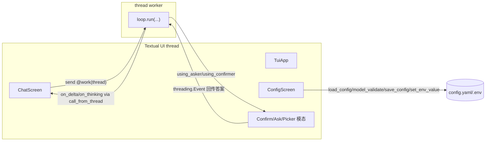

# 02·13 - Slice 13:产物 TUI(全屏终端 agent)

> 目标:给生成产物加一个**可选的、自持的全屏终端 TUI 接口**——基于 **Textual**,对标 Claude Code CLI / Cursor CLI / OpenCode:**默认进连续对话**、内置一个**与 Web `/config` 全字段对齐**的配置面板、**未配 LLM 时引导进入 config 配 LLM**。spec 开关 `interfaces.tui` 控制是否生成,**关掉则产物零 TUI 痕迹、不含 textual 依赖**。属 `01-project-plan.md` 的 **L2**,与 `interfaces.web` 同级;**默认产物仍是 Slice 1 的薄核心**(`coding-assistant` preset / example 保持 `tui: false`)。
>
> 前置:Slice 12 门禁全绿(已 ✅)。
>
> **状态:📋 已规划(待实现,2026-06-11)。** 本文档为实现前的计划落地(退出门禁 §3 全部未勾)。规模上对标现有 `interfaces/web.py`(另一个 opt-in 产物接口)且更大——TUI 同时承载连续对话 + 全字段配置面板 + HITL/ask 模态 + 会话/范式切换。
>
> **红线提醒**:Textual 是**通用终端 UI 库**(Rich 作者出品的 TUI 框架),**非 agent 编排框架**(`01 §1`),不违定位红线;且仅在 `interfaces.tui=true` 时进产物依赖。**本片改 `HarnessSpec.interfaces` schema(新增 `tui` 字段)= `CLAUDE.md §6.1`;给默认产物外的可选接口加重依赖 `textual` = `CLAUDE.md §6.2`——两项均经人 2026-06-11 定向签字**(选 Tier C 全屏 TUI + 与 Web /config 全字段对齐 + opt-in 终端优先,见 §4)。

## 0. 边界与口径(开工前先对齐)

- **第三个可选接口**:`interfaces`(`cli` / `web` / **`tui`**)互不强制;`cli` 恒在(`run` 单轮 + `chat` 纯文本 REPL 作回退),`web`/`tui` 各自 opt-in。**默认产物(全关结构)仍是薄 CLI**。
- **TUI 内只有连续对话**(人 2026-06-11):TUI 启动即进持久 chat,**不做单轮模式**;单轮 `run` 仍由 CLI 提供(脚本/管道用)。保留纯文本 `chat`/`run` 作 TUI 不可用(哑终端 / 无 TTY)时的回退。
- **复用产物 harness 层、不走 HTTP/SSE**:TUI 直接回调驱动 `harness.loop.run`(`on_delta`/`on_thinking`/`cancel`/`checkpoint`),复用 `harness.config`(`load_config`/`Config.model_validate`/`save_config`/`set_env_value`)、`harness.session.*`、`harness.llm.ClientRouter`、`harness.interaction`(`using_asker`/`using_confirmer`/`ToolConfirmer`)、`harness.mcp`、`harness.extensions`/`hooks`。
- **线程模型(对标 OpenCode)**:agent loop 跑在 **Textual 线程 worker**(`@work(thread=True)`),UI 线程只渲染 / 收输入;`on_delta`/`on_thinking` 经 `call_from_thread` 推 UI;HITL / `ask_question` 模态经 `threading.Event` 跨线程阻塞 worker 等用户答复。
- **配置面板 = 与 Web `/config` 全字段对齐**(人 2026-06-11 选 `full_parity`):LLM(profile + 采样 advanced + pricing + 写 key/base_url 到 `.env` + 测连通)/ roles / context / budget / tools(本地 + MCP allowlist)/ MCP server 增删改 / prompts + rule files / paradigms / observability / memory。改完 `Config.model_validate` 校验 + `save_config` **保注释**写回 `config.yaml`。
- **未配 LLM 判据**复用 Web 的 `any(p.model.strip() for p in cfg.llms)`(实现说明:Web 门控在 `web_index.html` 的 `hasLLM`,服务端等价于 CLI `_profile_preflight` 的 `model` 非空检查)→ TUI 显示 banner **引导进 config 配 LLM**(人 2026-06-11:不做引导式问答,只提示进配置页)。
- **启动优先级 `tui > web > chat`**(人 2026-06-11 选终端优先):一键脚本与裸命令在 `interfaces.tui=true` 时默认进 TUI,即使同时开了 web 也以 TUI 为先(web 仍可手动 `serve`)。

## 1. 交付物

生成器侧(`harnessforge/`):

- `spec.py` — `Interfaces` 新增 `tui: bool = False`(仿 `web`;`extra="forbid"` 不变,`HarnessSpec.interfaces` 不改)。
- `generator.py` — `CONDITIONAL_TEMPLATES` 新增 `src/__project_slug__/interfaces/tui.py.j2`、`tests/test_tui.py.j2`(谓词 `spec.interfaces.tui`);`_build_context` 已传 `interfaces`,无需改。
- `pyproject.toml.j2` — `` 加 **textual**(实现时用 uv 添加最新版,不臆造版本);`ruamel.yaml` 门控由 `` 改为 ``(TUI 配置写回需要)。
- `src/__project_slug__/harness/config.py.j2` — `save_config`/`_deep_merge_into` 门控由 `` 改为 ``。
- `src/__project_slug__/interfaces/cli.py.j2` — `` 加 `@app.command() def tui(...)` 启动 App;`_main` 回调改 `invoke_without_command=True`,无子命令且 tui 开启时进 TUI(裸命令默认)。
- `__launch_name__.{sh,bat}.j2` — action 优先级 `tuiserve --openchat`。
- `README.md.j2` / `AGENTS.md.j2` — 加 TUI 启动说明 + layout 里 `tui.py` + 能力提及(各扩展点的 TUI 入口)。
- wizard:`wizard/static/index.html`(+ i18n)与 `cli_wizard.py` 加 `interfaces.tui` 开关;`wizard/app.py` 一键 launch 仍仅 web(TUI 不能在浏览器后台 job 跑,tui-only 产物保持 render-only,由用户跑启动脚本进 TUI)。
- `cli.py`(生成器)— `new` 的 debug 日志加 `tui=`(仿 `web=`)。
- `examples/spec.yaml` / `presets/coding-assistant/spec.yaml` — 显式 `tui: false`(守薄默认)。

生成产物侧(`harnessforge/templates/`,`interfaces.tui` 门控):

- `src/<pkg>/interfaces/tui.py` — Textual App:
  - `ChatScreen`(默认):流式消息区 + 输入框 + 状态栏(model / paradigm / steps / tokens / cost)+ 工具调用内联渲染 + 未配 LLM banner(引导进 config);slash 命令(`/config /sessions /new /model /mode /mcp /help /quit`)或命令面板;Stop(Esc)接 `cancel`;session resume + checkpoint。
  - `ConfigScreen`(全字段对齐 Web /config):LLM/roles/context/budget/tools/MCP/prompts+rules/paradigms/observability/memory;`Config.model_validate` + `save_config` 写回;`set_env_value` 写 `.env`(write-only)。
  - 模态:HITL 确认(`ToolConfirmer`)、`ask_question`(`TextualAsker`)、session/model/mode picker。
- `tests/test_tui.py`(tui 门控)— 用 Textual `App.run_test()` pilot + MockLLM(`mock=True`,无 key/网络):启动进 ChatScreen、未配 LLM banner、开 config 面板、mock 跑通一轮流式、(选)HITL/ask 模态往返。
- `README.md` / `AGENTS.md` — TUI 用法 + "textual 仅 `tui: true` 时存在"。

## 2. 任务拆解

### 2.1 门控与依赖(生成器)
- `CONDITIONAL_TEMPLATES` 加两条(`tui.py.j2` / `test_tui.py.j2`,谓词 `spec.interfaces.tui`);`pyproject.toml.j2` 加 `textual`(tui)+ `ruamel.yaml` 门控扩到 `web or tui`;`config.py.j2` 的 `save_config` 同步扩门控。
- **门禁硬要求**:`tui=false` 时 `pyproject`/`uv.lock`/`requirements.txt` 三处均**不含** `textual`,无 `interfaces/tui.py`、无 `tests/test_tui.py`,CLI 无 `def tui`(沿用 web 的洁净断言风格)。

### 2.2 TUI 骨架 + ChatScreen(线程模型)

- worker 跑 sync `loop.run`,流式经 `call_from_thread` 推进消息区;状态栏显示 model/paradigm/steps/tokens/cost;Stop 设 `cancel` 令牌(复用 Slice 9 协作式取消)。
- session resume / checkpoint 直接用 `harness.session`;paradigm 切换走 `config.paradigms`;slash 命令 / 命令面板路由到各 action。
- 未配 LLM:`any(p.model.strip() for p in cfg.llms)` 为假时显 banner + 禁输入,引导 `/config`。

### 2.3 跨线程模态(HITL + ask_question)
- `TextualConfirmer` / `TextualAsker` 实现 `harness.interaction` 的协议:被 worker 线程调用时 `call_from_thread` 推模态,`threading.Event`/队列阻塞 worker 等 UI 回传答案(对齐 Slice 10 的 asker/confirmer 底座)。
- session/model/mode picker 同款模态。

### 2.4 ConfigScreen 全字段对齐
- 各 section 对应 Web `/config` 的同名分区(见 `04-slice-3-product-web.md §4` 的字段范围 + Slice 7 分页 + Slice 11 MCP 管理 + Slice 8B memory tab);改完统一 `Config.model_validate` → `save_config(updates, path)` 保注释写回;key/base_url 经 `set_env_value` 写 `.env`(不回显);MCP server 增删改复用 Slice 11 的 `save_config` + 热重连路径。

### 2.5 入口 / 启动脚本 / 裸命令
- `cli.py.j2` 加 `tui` 子命令 + `invoke_without_command=True` 裸命令默认(仅 tui 产物);`__launch_name__.{sh,bat}.j2` 优先级 `tui > web > chat`;README/AGENTS 同步。

## 3. 退出门禁(对应 `01 §8` Non-blocker;⬜ 待实现并自验证)

- [ ] **开 TUI 可跑(黄金路径)**:`interfaces.tui=true` 生成 → `uv lock` → `uv sync && pytest` 全绿(含 `test_tui.py` 用 `App.run_test()` pilot + mock 跑通一轮流式)→ 冒烟自检通过;`uv.lock` 含 `textual` + `ruamel`。
- [ ] **关 TUI 零痕迹**:`interfaces.tui=false` 产物不含 `interfaces/tui.py` / `tests/test_tui.py`,`pyproject`/`uv.lock`/`requirements.txt` 不含 `textual`,CLI 无 `def tui`,启动脚本默认 `chat`(或 web 时 `serve --open`);与 Slice 1/2 行为一致、零新增依赖。
- [ ] **未配 LLM 引导**:`hasLLM` 为假时 ChatScreen 显 banner + 禁输入并指向 `/config`;配好 model(+key)后对话可流式。
- [ ] **配置面板全字段**:各 section 改值 → `Config.model_validate` 校验(非法拒)→ `save_config` **保注释**回写 `config.yaml`(重启后保留);`set_env_value` 写 `.env`(write-only,不回显);**面板/事件/trace/日志均不出现明文 key**。
- [ ] **HITL / ask_question 模态**:TUI 中弹出 → 回传 → 答案进 loop / `tool_result`(mock 可测,headless pilot)。
- [ ] **启动优先级**:`tui` 产物一键脚本 + 裸命令默认进 TUI(`tui > web > chat`);web+tui 同开时脚本仍以 tui 为先。
- [ ] **大改动回归**(改 schema + 跨 ≥3 文件,§5.2):golden 全量(示例 + 每 preset)+ Docker 冒烟 + `uvx harnessforge new` 冒烟全绿;无框架断言(pyproject/lock 无 langchain/langgraph/adk)。
- [ ] `ReadLints` clean。
- [ ] **对外可读(人审)**:真起 `<pkg> tui` 走查——对话流式 / 工具内联 / config 全字段改并写回 / 未配 LLM 引导 / HITL/ask 模态 / 中英文案,对非作者用户友好。

## 4. 必须人审的决策点

- [x] **① 技术栈 = Textual 全屏 TUI(Tier C)**——人 2026-06-11 选定(在"引导式 config / 部分字段 / 全屏 TUI"三档中选全屏 TUI,目标"真的像 Claude CLI / Cursor CLI / OpenCode")。
- [x] **② 新增 `HarnessSpec.interfaces.tui`(改 schema,`CLAUDE.md §6.1`)**——人 2026-06-11 定向签字(opt-in、默认关、关掉零痕迹,与 `web` 同模式)。
- [x] **③ 产物加重依赖 `textual`(`CLAUDE.md §6.2`)**——人 2026-06-11 定向签字(仅 `tui: true` 时进产物依赖;`ruamel` 门控随之扩到 `web or tui`)。
- [x] **④ 配置面板 = 与 Web `/config` 全字段对齐**——人 2026-06-11 选 `full_parity`(而非 LLM-only / LLM+少数)。**代价已知**:`tui.py` 体量大 + 与 Web /config 的**双面字段一致性维护**承诺。
- [x] **⑤ 入口 = opt-in + 终端优先**——人 2026-06-11 选 `optin_tui_first`:启用后一键脚本/裸命令默认进 TUI,保留 `chat`/`run` 回退,web+tui 同开时脚本以 tui 为先。
- [x] **⑥ TUI 内只连续对话**——人 2026-06-11 定向(无单轮模式;单轮仍由 CLI `run` 提供)。
- [x] **⑦ 未配 LLM = 提示进 config**——人 2026-06-11 定向(不做引导式问答,只 banner 引导进配置页配 LLM)。
- [ ] **⑧ 对外可读(实现后真实验收)**:真起 TUI 点一遍,确认覆盖、观感、中英措辞对非作者用户友好。

## 5. 本 slice 注意

- **薄**:默认产物(`tui: false`)必须与开此片前完全一致、零新增依赖、零 TUI 文件;`tui.py` 作为 **opt-in 接口**允许较大体量(类比 `web.py`,且会更大),但不引 agent 编排框架(`CLAUDE.md §2`)。
- **双面维护**:TUI 配置面板与 Web `/config` 全字段对齐 = 一项**双 UI 一致性维护**承诺;后续 spec/config 字段演进时两面同步(同 wizard 与 web 的关系)。
- **跨线程是主风险**:worker 跑 sync loop、`call_from_thread` 推流、HITL/ask 用 `Event` 阻塞 worker 等答复——本片首要工程风险,先打通对话主链路再铺配置面板。
- **密钥红线**(`CLAUDE.md §6.5`):配置面板、模态、trace、日志任一路径出现明文 key 即失败;面板只可见 env 引用名,key/base_url 经 `set_env_value` 只写 `.env`、不回显。
- **不绑框架**:Textual 是通用 TUI 库,**非 agent 编排框架**(`01 §1`),仅在 `tui=true` 时进产物。
- **配方 vs 活旋钮**(决策④,`01 §4`):TUI config 改的是运行期行为性配置(`config.yaml` 域);接口有无 / 模块 / 范式拓扑是结构性的,只能重新生成或 `forge add`。
- **测试 headless 可跑**:Textual `App.run_test()` pilot 无需真 TTY,`smoke_check` 的 `pytest` 在生成仓库内可跑(CI 友好)。
- **发布拓扑**:TUI 是本地终端接口,不涉公网发布;Web 的「`/config` 与公开面隔离」(Slice 14+ backlog)与本片无关。
