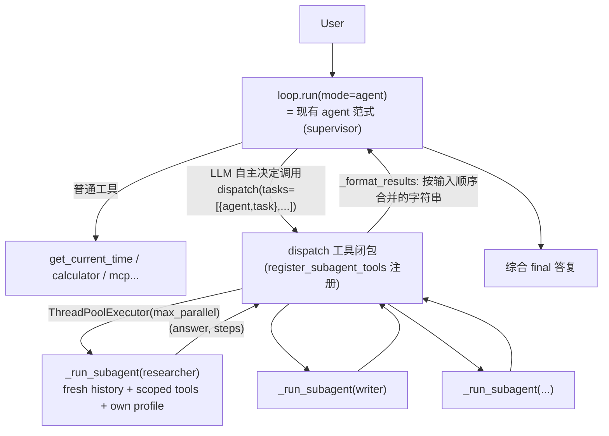

# 02·16 - Slice 14:multi-agent 子代理(subagents / agent-as-tool)

> 目标:给生成产物补上「multi-agent」能力——**orchestrator-worker / agent-as-tool** 模式(2026 生产部署 #1,占比约 70%;成熟 harness 如 Claude Code `Task`、Anthropic Sub-agents、OpenAI agent-as-tool 都用它)。主 agent(就是默认 `agent` 范式)在**合适时机自行判断**,通过一个 `dispatch` 工具把独立子任务**并行**委派给作用域受限的 worker 子代理,每个 worker 在**独立上下文**里跑、回结构化结果,主 agent 负责综合。
>
> **形态结论(经人审确认)**:成熟 harness **不把 multi-agent 做成用户可选的「模式 / 范式」**,而是暴露成一个工具,由主 agent 自主触发。所以本切片**不新增范式、不改核心循环**——委派只是一个工具。
>
> **薄 / 红线**:零新增运行期依赖(stdlib `concurrent.futures` 线程池 + 自有薄内层循环);spec 开关式可选模块,**关闭零痕迹**(同 mcp/skills/memory);**固定拓扑、深度 1**(worker 永不持有 `dispatch`,不能再起 subagent);**严禁**任何 agent 编排框架 / 工作流 DSL / 动态图引擎。

## 0. 边界与口径

- **supervisor = 现有 `agent` 范式**:没有新范式,`spec.paradigms` 不变;supervisor 自主调用 `dispatch` 工具来委派。CLI/Web 无新模式开关。
- **上下文隔离 = 核心红利**:每个 worker 用**全新 history**(`[system=worker prompt, user=task]`),不带主对话上下文、不带全局 rules/memory/skills;只拿到自己的作用域工具与自己的任务文本。
- **作用域工具**:worker 的 `tools` 是它**自己的 allowlist**(已注册工具的子集),经 `registry.active_names(set(worker.tools), allow_high_risk=worker.allow_high_risk)` 过滤;**`dispatch` 始终被剔除**(深度 1,带兜底:`run_tool` 的 `allowed` 也不含 dispatch)。
- **并行 fan-out**:一次 `dispatch(tasks=[...])` 列多个 `{agent, task}` → `ThreadPoolExecutor(max_workers=max_parallel)` 并发;结果按**输入顺序**(非完成顺序)合并返回。单任务跳过线程池。
- **非交互 worker**:worker 线程不继承 HITL confirmer/asker 的 ContextVar(`confirm_tool` 无 confirmer = 放行;`ask` 无 asker = 「无人可问」降级),即 worker 不弹 HITL、不挂起。supervisor 自身的工具仍走 HITL。
- **预算 / runaway**:worker 花费经共享 `UsageLedger`(自带锁,线程安全)汇入 `.harness/usage.json`,受各 profile `cost_limit` 约束;worker 自身步数受 `max_steps` 上限;主回合受 supervisor `max_steps`/`cost_limit`。
- **trace 隔离**:worker 用 `Trace(enabled=False)`(不写父 JSONL,避免并发抢写),但挂共享 ledger 让花费照常累计。
- **关闭零痕迹**:`spec.subagents.enabled` 默认 `false` → 不渲染 `subagents.py`/`test_subagents.py`,config/prompts/cli/web 的所有片段全部门控 → 关掉时产物与无 subagents 生成逐字一致;无新增依赖。

## 1. 关键决策

- **① 形态 = opt-in spec 模块 + agent-as-tool**(非范式)。`dispatch` 是唯一新增工具,`risk=safe`。
- **② 并行优先**:首版即并行 fan-out(stdlib 线程池),不改薄核心循环(并行只在 `dispatch` 工具内部)。
- **③ 固定拓扑、深度 1**:worker 不能再起 subagent(规避无限委派 / runaway,符合生产建议「数量小、拓扑浅」)。
- **④ roster = 运行期活旋钮**:worker 名单 / 提示词 / 工具 / profile 在 `config.yaml subagents:` 里配置;spec 只决定模块有无(`subagents.enabled`)。空 roster = 移除 `dispatch` 工具。
- **⑤ 复用基建,不复制核心**:内层 worker 循环复用范式共享 plumbing(`generate`/`run_tool`/`assistant_message`),不 import 任何范式文件;client 按 worker `role` 经 `client_for_profile_name` 新建(mock 模式新建 `MockLLM`,避免并行共享可变状态)。

## 2. 交付物

### 新增模块(条件渲染)
- 产物 `harness/subagents.py`(仅 `spec.subagents.enabled` 时渲染)— `register_subagent_tools(config, registry, *, mock, ledger)` 注册 `dispatch` 工具 + 内层 `_run_subagent`(隔离上下文 / 作用域工具 / 深度 1)+ `subagents_section(config)`(系统提示注入)+ `dispatch` 批量并行工具。
- 产物 `tests/test_subagents.py`(仅启用时渲染)。

### spec / 生成器 / 向导
- `spec.py` — `class Subagents(enabled: bool=False)` + `HarnessSpec.subagents`(同 Mcp/Skills/Memory 风格;改 schema = spec 开关,已走 §6 人审)。
- `generator.py` — `CONDITIONAL_TEMPLATES` 加 `subagents.py.j2` / `test_subagents.py.j2`。
- 向导(CLI `cli_wizard.py` + Web `wizard/static/index.html`)— 能力组新增「启用多 agent 子代理」开关(**默认不勾**,属进阶能力);`build_spec` 写 `subagents.enabled`;Web JS 写 `spec.subagents`。

### 运行期配置
- 产物 `harness/config.py` — `SubagentDef(name, description, prompt, role="generation", tools=[], allow_high_risk=False, max_steps=12)` + `SubagentsConfig(max_parallel=4, agents=[])`(门控)+ `Config.subagents`。
- 产物 `config.yaml` — `subagents:` 块(门控,种 `researcher`/`writer` 两个示例 worker)+ `tools:` 里 `dispatch` allowlist 条目。

### 接线(全部门控)
- `harness/prompts.py` — `build_system_prompt` 在 memory 之后注入 `subagents_section(config)`(列出 roster + 「独立子任务一次性并行委派、你负责综合」)。
- `interfaces/cli.py` — `_setup_subagents(config, mock)` 接入 `run`/`chat`/`serve`;`info` 注册 `dispatch` 以便上报。
- `interfaces/web.py` — `create_app` 注册;`POST /config` + `PUT`(config-import)后**重绑** `dispatch`(闭包在注册期捕获 config,Budget 页改了 worker 模型/价后需重绑)。

## 3. 退出门禁

- [x] 黄金路径:subagents-enabled spec 生成 → `uv sync && pytest`(含 `test_subagents.py`)绿 → mock 跑通一次 function-calling(`test_golden_subagents_enabled_generates_and_smoke_passes`)。
- [x] 上下文隔离 + 作用域工具 + 深度 1:worker 系统提示 = 自己的 prompt(无 supervisor 上下文)、只被 offer 自己的工具、永不被 offer `dispatch`(产物 `test_subagents.py` 断言)。
- [x] 并行 fan-out:`dispatch` 多任务返回全部结果;worker 能执行自己的工具;未知 agent 报错不崩。
- [x] 成本汇入共享 ledger(mock);端到端:supervisor 调 `dispatch` → worker 离线跑 → 综合 final。
- [x] 无框架断言:生成的 `pyproject.toml` / `uv.lock` 不含 langchain/langgraph/adk。
- [x] 关闭零痕迹:`subagents.enabled=false` 不渲染 `subagents.py`、`config.yaml` 无 `subagents:`/`dispatch`、prompts/cli/web 逐字与无 subagents 一致;零新增依赖。
- [x] 大改动回归(动 `HarnessSpec` + 新模块 + 跨 ≥3 文件):全量 golden(示例 + preset + web/mcp/skills/memory/多范式/anthropic/wizard)+ Docker build/run mock + `uvx harnessmith new` 冒烟。
- [x] `ReadLints`:clean。

## 4. 留待 backlog(本切片明确不做)

- **并行内 HITL**:worker 当前非交互(并行 + 逐次确认体验复杂);需要时再设计经 ContextVar 传递 confirmer。
- **Web Subagents `/config` 页**:roster 当前经 `config.yaml` 编辑 + 重启 /(PUT)config-import 生效;可视化编辑 roster 留 backlog(MVP 不进 `_EDITABLE_FIELDS`)。
- **多级 / 嵌套拓扑、handoff、debate**:固定深度 1 之外的拓扑均不在范围(避免滑向通用编排框架红线)。

---

## 5. 实现细节(具体实现文档)

> 本节是 subagents 功能的代码级实现说明。代码全部在产物模板 `harnessmith/templates/src/__project_slug__/harness/subagents.py.j2`(渲染后 = `harness/subagents.py`),仅 `spec.subagents.enabled` 时生成。

### 5.1 数据流

口径:**一次 `loop.run` = 一个 `RunResult`**;subagent 全程藏在 supervisor 的一次 `dispatch` 工具调用里,对 loop / 会话 / trace 是「一个工具往返」。

### 5.2 `dispatch` 工具(并行 fan-out)

- **schema**:`{ tasks: [ {agent: str, task: str}, ... ] }`(`_DISPATCH_SCHEMA`,`additionalProperties:false`)。`description` 由 `_dispatch_description(roster)` 动态拼出,**枚举可用 subagent 名 + 描述**,并提示「列多个 = 并行」。`risk=safe`。
- **闭包捕获**:`register_subagent_tools(config, registry, *, mock, ledger)` 把 `agents`(name→`SubagentDef`)、`max_parallel`、`shared_ledger`、`_client(role)` factory 闭包进 `dispatch`。
- **并行**:`tasks` 规范化(只留 dict)→ 单任务走快路径(不开线程池);多任务 `with ThreadPoolExecutor(max_workers=min(max_parallel, len(items))) as pool: results = list(pool.map(_run_one, items))`。`pool.map` 保证**结果按输入顺序**(非完成顺序)。
- **容错**:`_run_one` 里未知 agent / 空 task / worker 抛错都转成 `ERROR: ...` 字符串(单个 worker 失败不崩 supervisor);结果经 `_format_results` 合并为 `Dispatched N subagent task(s).` + 每 worker 一个 `--- [name] (k steps) ---\n<answer>` 块。

### 5.3 `_run_subagent`(隔离内层循环)

每个 worker 一次调用 = 一个薄内层 agent 循环,**复用范式共享 plumbing**(`from .paradigms import assistant_message, generate, run_tool`),不 import 任何范式文件:

1. `profile = config.profile_for(agent_def.role)`(worker 自选模型,未设回落首 profile)。
2. **作用域工具 + 深度 1**:`active = [n for n in registry.active_names(set(agent_def.tools), allow_high_risk=agent_def.allow_high_risk) if n != DISPATCH_TOOL]`;`allowed=set(active)`;`schemas = registry.schemas(active)`。`dispatch` 被显式剔除 → worker **拿不到委派工具**(兜底:`run_tool(..., allowed=allowed)` 在执行边界再拒一次)。
3. **上下文隔离**:`messages = [{"role":"system","content":agent_def.prompt}, {"role":"user","content":task}]` —— **全新 history**,不带 supervisor 对话 / 全局 system / rules / memory / skills。
4. **trace 隔离**:`trace = Trace(enabled=False)`(不写父 JSONL,规避并发抢写);`trace.ledger = ledger`(花费照常累计)。
5. **循环**:`while True:` 先 `max_steps` 上限(到顶 break,`answer="(subagent stopped after N steps)"`)→ `ledger.ensure_within(profile)`(预算 block_stop)→ `generate(client, messages, schemas or None, config=config, fallback_name=profile.fallback)`(`context_cfg=None` 故关闭溢出救援,保留 fallback)→ `trace.add_usage` → 无 tool_calls 则 `answer=content` break;否则 `assistant_message` + 逐个 `run_tool(...)` + 追加 tool 结果 → `steps += 1`。
6. 返回 `(answer, steps)`。

### 5.4 client factory(并行安全 + mock)

`_client(role)`:`mock=True` 返回**新 `MockLLM()`**;否则 `client_for_profile_name(config, config.profile_for(role).name)` 建**新真实 client**。**每个 worker 一个新 client** → 并行 worker 永不共享可变状态(尤其 `MockLLM._step`);真实 provider client 本就并发安全。

### 5.5 线程安全

- **UsageLedger**:`record()`/`clear()` 已自带 `threading.Lock` + 原子替换写盘 → 多 worker 共享一个 ledger 实例时记账线程安全(本切片**未改** `usage.py`)。
- **Trace**:worker 用各自的 `Trace(enabled=False)`,不写盘 → 无 JSONL 抢写。
- **HITL ContextVar 不跨线程**:`ThreadPoolExecutor` 不传 contextvars → worker 线程里 `confirm_tool` 无 confirmer = 放行、`ask` 无 asker = 「无人可问」降级 → **worker 非交互、不挂起**;supervisor 自身工具仍走 HITL。

### 5.6 提示注入与接线(全部以 `spec.subagents.enabled` 门控)

- `prompts.py` `build_system_prompt`:memory 之后注入 `subagents_section(config)`(列 roster + 「独立子任务一次性并行委派、你负责综合」)。**只进 supervisor 提示**(worker 用自己的 prompt,不经 `build_system_prompt`)。
- `interfaces/cli.py`:`_setup_subagents(config, mock)` → `register_subagent_tools`,接入 `run`/`chat`/`serve`;`info` 也注册以便上报 `dispatch`。
- `interfaces/web.py`:`create_app` 注册;`POST /config` 与 `PUT`(config-import)后**重绑** `dispatch`(闭包在注册期捕获 config,Budget 页改 worker 模型/价后需重绑)。

### 5.7 配置模型(`config.py`,门控)

- `SubagentDef(name, description="", prompt, role="generation", tools=[], allow_high_risk=False, max_steps=12)`。
- `SubagentsConfig(max_parallel=4, agents=[])` + `Config.subagents`。
- `config.yaml` 种 `researcher`/`writer` 两个示例 worker + `tools:` 里 `dispatch` allowlist 条目。空 roster → `register_subagent_tools` 返回 `[]` 并 `unregister(dispatch)`。

## 6. 真实验证(mimo-v2.5-pro,非 mock)

> 用真实 LLM `mimo-v2.5-pro`(OpenAI 兼容端点)+ 真实生成产物(`harnessmith new --spec`,subagents 开)跑了一套覆盖式真实测试,10/10 通过(多次重跑稳定;偶发为端点瞬时 5xx,重跑即绿)。复现:生成 subagents-enabled 产物 → 配 `MIMO_*` 的 `.env` → `uv run agent_harness test-llm` 验连通 → 跑覆盖脚本(逐项断言)。

| # | 验证项 | 真实结果 |
|---|--------|----------|
| 1 | **上下文隔离(结构)** | wrap 真实 client 录制:worker 实际收到的 messages = `[system=worker prompt, user=task]`(len=2),supervisor 系统提示「You are a helpful assistant.」**不在**其中 → 证明无上下文泄漏 |
| 2 | **上下文隔离(提示面)** | supervisor `build_system_prompt` 含 `dispatch`/roster;worker prompt 不含 |
| 3 | **深度 1** | worker 即便把 `dispatch` 列进自己 `tools`,真实跑时被 offer 的工具只有 `['get_current_time']`,**无 `dispatch`** → 不能再起 subagent |
| 4 | **worker 无限循环兜底** | `never_done` 工具永远「未完成」,真实模型持续调用 → `max_steps=3` 精确截断(steps==3,返回「stopped after 3 steps」),不挂起 |
| 5 | **supervisor max_steps 兜底** | 真实模型被引导反复调 `never_done` → `config.max_steps=3` 干净停,`stop_reason="max_steps"` |
| 6 | **预算 block_stop** | 预置账本超 `cost_limit` → 下一次 LLM 调用前被拒,`stop_reason="llm_budget"`、steps==0(不发起调用) |
| 7 | **并行 fan-out(返回)** | 一次 `dispatch` 4 任务 → 4 个 `[slowpoke]` 结果块全部返回 |
| 8 | **并行 fan-out(真并发)** | `slow_step` 工具内并发计数器观测到 **max overlap = 4 / 4**(顺序执行恒为 1)→ 证明 worker 真并行;墙钟 ~7.7s |
| 9 | **成本累计** | 真实 worker token 汇入共享 `UsageLedger`(mimo `total_tokens` ≈ 9k+) |
| 10 | **端到端委派** | supervisor **自主**调一次 `dispatch`(并行批量 2 任务:researcher 月球事实 + writer 咖啡店标语)→ 综合 final 答复;trace 中可见 `dispatch` tool_call |

红线复核:生成 `pyproject.toml` / `uv.lock` 无 langchain/langgraph/adk;零新增运行期依赖(仅 stdlib `concurrent.futures`/`threading`);默认产物(subagents 关)逐字无痕迹。
